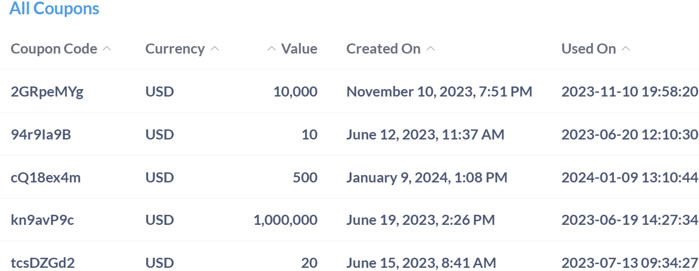
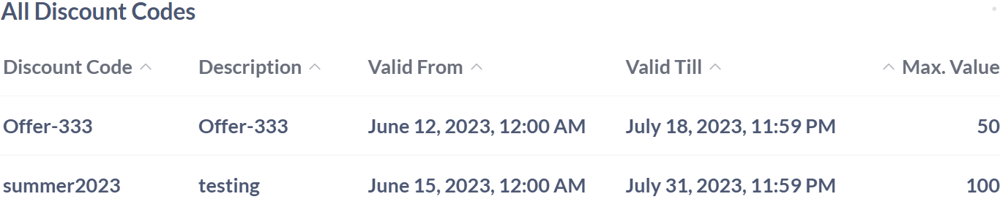
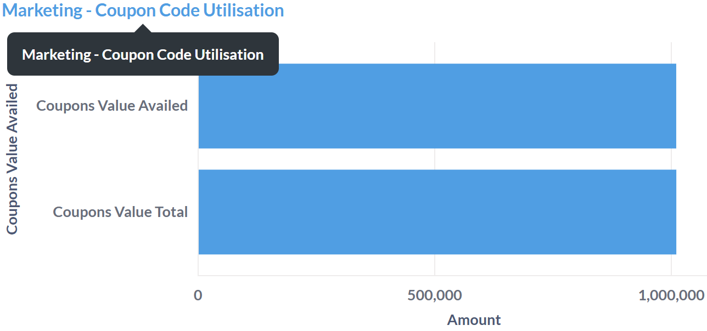
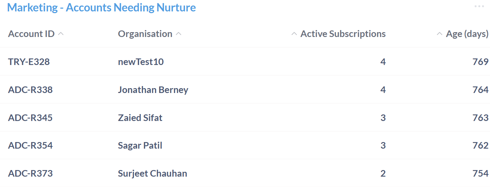

# Apiculus Marketing Dashboard

The Apiculus Marketing Dashboard provides a comprehensive overview of marketing activities and customer engagement. It brings together essential data on issued coupons, discount codes, and their application across transactions, helping teams monitor promotional effectiveness and usage trends. 

Additionally, the dashboard highlights the following account-level insights, such as customer activity and engagement status, enabling better targeting and nurturing strategies. Designed to support informed decision-making, the dashboard serves as a central tool for managing campaigns, tracking performance, and identifying opportunities for growth. The following insights help track promotions, understand customer response, and improve marketing efforts: 
## All Coupons

The All Coupons table provides a concise overview of issued coupons, capturing key details such as their unique codes, monetary value, currency type, and relevant timestamps. It also includes usage information to support tracking, accountability, and timely management of coupon lifecycles.

| Field           | Description                                                                      | Importance                                                                                                       |
| --------------- | -------------------------------------------------------------------------------- | ---------------------------------------------------------------------------------------------------------------- |
| **Coupon Code** | A unique identifier for each coupon issued.                                      | Essential for tracking and redeeming specific coupons                                                            |
| **Currency**    | The type of currency in which the coupon value is denominated.                   | Important for understanding the monetary value and applicability of the coupon.                                  |
| **Value**       | The monetary worth of the coupon.                                                | Indicates the financial benefit that can be gained from using the coupon.                                        |
| **Created On**  | The date and time when the coupon was created.                                   | Useful for tracking the issuance and validity period of the coupon.                                              |
| **Used On**     | The date and time when the coupon was redeemed.                                  | Important for tracking coupon usage and ensuring accurate accounting.                                            |
| **Expiring On** | The date and time when the listed item or service will expire.                   | Indicates the deadline for the validity of the item or service, which is crucial for timely renewals or actions. |
| **Used By**     | The identifier and name of the person or organization using the item or service. | Helps in tracking and managing who is utilizing the item or service, ensuring accountability and proper usage.   |

## All Discount Codes

The All Discount Codes table lists various promotional codes issued for products or services. Each entry includes key details such as the discount amount, type, usage limits, and validity period. This section helps in organizing and managing discount offerings for efficient application and tracking.

| Field              | Description                                                                 | Importance                                                        |
| ------------------ | --------------------------------------------------------------------------- | ----------------------------------------------------------------- |
| **Discount Code**  | A unique identifier for each discount code issued.                          | Essential for tracking and applying specific discount offers.     |
| **Description**    | A brief label or note associated with the discount code.                    | Helps clarify the purpose or context of the discount code.        |
| **Valid From**     | The date and time from which the discount code becomes active.              | Indicates when the discount can start being used.                 |
| **Valid Till**     | The date and time until which the discount code remains valid.              | Defines the expiration window for the discount code.              |
| **Max. Value**     | The maximum monetary value that can be redeemed using the discount code     | Indicates the financial benefit available through the discount.   |
| **Max. Count**     | The maximum number of times a discount code can be used.                    | Controls the usage limit to prevent over-redemption.              |
| **Discount Value** | The monetary amount deducted when the discount is applied.                  | Represents the financial benefit offered to the user.             |
| **Discount Type**  | Specifies the nature of the discount, such as a fixed amount or percentage. | Determines how the discount is calculated and applied.            |
| **Applicable To**  | Identifies the specific product or service the discount applies to          | Ensures the discount is used only for eligible items.             |
| **Applicable On**  | Indicates the category or scope where the discount can be applied.          | Defines the range of items or services eligible for the discount. |

## Applied Discount Codes

The Applied Discount Codes table captures essential information about promotional codes that have been used across transactions. This section serves as a useful reference for monitoring discount activity, validating usage, and supporting financial tracking across different entities and timeframes.

| Field             | Description                                                                           | Importance                                                                    |
| ----------------- | ------------------------------------------------------------------------------------- | ----------------------------------------------------------------------------- |
| **Discount Code** | The specific promotional code applied during a transaction.                           | Identifies which discount was used for tracking and validation purposes.      |
| **Applied On**    | The date and time when the discount code was applied.                                 | Useful for auditing and understanding usage patterns over time.               |
| **Applied By**    | The identifier and name of the entity or organization that applied the discount code. | Helps attribute discount usage to specific users or accounts.                 |
| **Currency**      | The currency in which the discount was applied.                                       | Ensures accurate financial tracking across different regions or systems.      |
| **Redeemed**      | Indicates whether the discount code was successfully redeemed.                        | Confirms the completion of the discount application and its financial impact. |

## Coupon Code Utilisation 

The Coupon Code Utilisation table provides a detailed summary of how distributed coupons are being used over time. It outlines the total value of all coupons issued and the value that has been successfully availed by users. This comparison helps in understanding the reach and effectiveness of promotional efforts, offering a general measure of customer response and campaign performance.

| Field                     | Description                                                                      | Importance                                                                          |
| ------------------------- | -------------------------------------------------------------------------------- | ----------------------------------------------------------------------------------- |
| **Coupons Value Availed** | The total monetary value of coupons that have been redeemed or used.             | Reflects actual utilization and helps assess the effectiveness of coupon campaigns. |
| **Coupons Value Total**   | The total monetary value of all issued coupons, regardless of redemption status. | Provides a benchmark for measuring coupon usage and potential promotional impact.   |

## Accounts Needing Nurture

The Accounts Needing Nurture table provides a focused view of customer accounts that may require additional attention or engagement. This table helps in identifying accounts that have been active for a while but may show signs of reduced interaction or growth, allowing teams to prioritize outreach efforts, enhance customer relationships, and support long-term retention strategies.

| Field                    | Description                                                                 | Importance                                                                                            |
| ------------------------ | --------------------------------------------------------------------------- | ----------------------------------------------------------------------------------------------------- |
| **Account ID**           | A unique identifier assigned to each customer account.                      | Used for tracking and managing individual accounts within the system.                                 |
| **Organisation**         | The name of the organization or individual associated with the account.     | Helps identify the account owner for communication and engagement purposes.                           |
| **Active Subscriptions** | The number of currently active service subscriptions linked to the account. | Indicates the level of ongoing engagement and service usage.                                          |
| **Age**                  | The number of days since the account was created.                           | Useful for assessing account maturity and identifying long-term customers who may need re-engagement. |

