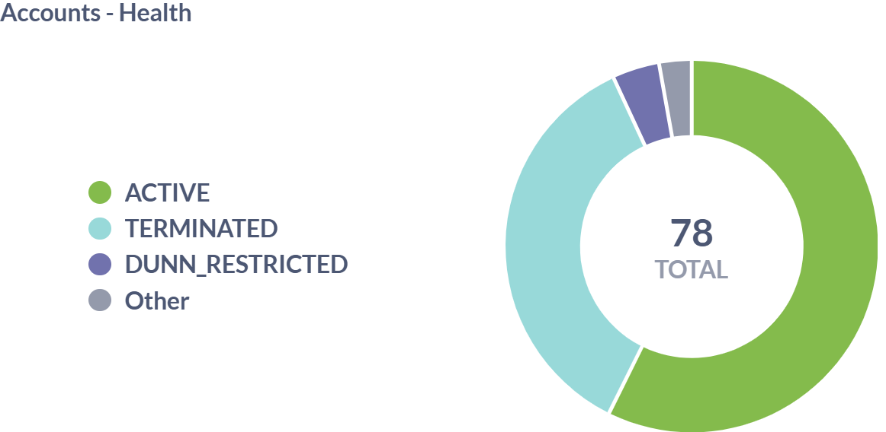
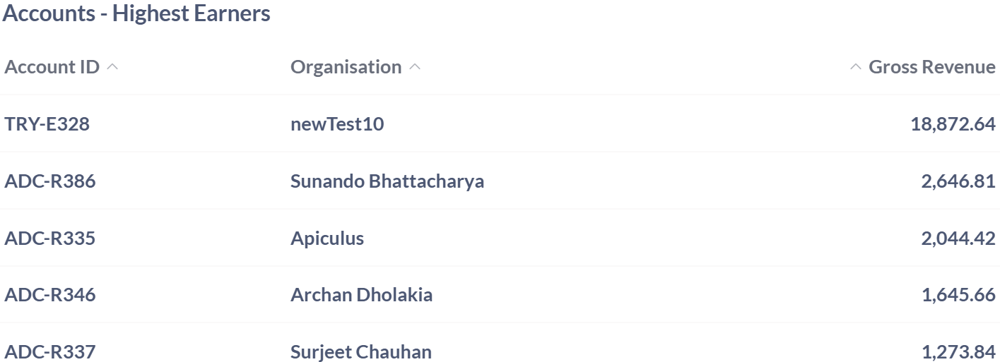
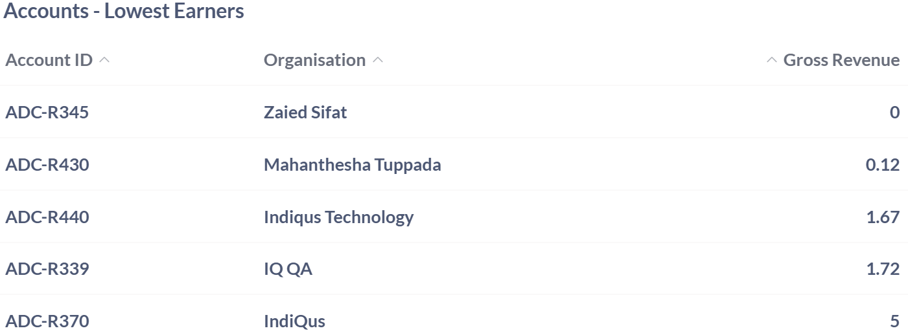

# Apiculus Accounts Dashboard

The Apiculus Account Dashboard provides an organized overview of customer accounts, combining key metrics to support monitoring, planning, and decision-making. It helps teams manage account activity, performance, and engagement with clarity and efficiency. The following insights help teams act quickly and manage accounts more effectively.
## Active Accounts

The Active Accounts table provides a detailed view of customer accounts that are actively using services. This table helps in understanding current engagement levels, tracking service utilization, and maintaining visibility into ongoing customer activity. By organizing this information, the table supports effective account management and ensures that active users are consistently monitored and supported.

| **Field**                | **Description**                                                             | **Importance**                                                          |
| ------------------------ | --------------------------------------------------------------------------- | ----------------------------------------------------------------------- |
| **Account ID**           | A unique identifier assigned to each active customer account.               | Used for tracking and managing individual accounts within the system.   |
| **Organisation**         | The name of the organization or individual associated with the account.     | Helps identify the account owner for service management and engagement. |
| **Active Subscriptions** | The number of currently active service subscriptions linked to the account. | Indicates the level of service usage and customer engagement.           |

## All Accounts 

The All Accounts table provides a comprehensive overview of every customer account within the system, regardless of its current status. This table supports effective account tracking, service management, and lifecycle monitoring. By maintaining visibility into both active and terminated accounts, this section helps ensure accurate record-keeping, operational clarity, and informed decision-making across customer engagements.

| **Field**         | **Description**                                                                                                           | **Importance**                                                                                                                             |
| ----------------- | ------------------------------------------------------------------------------------------------------------------------- | ------------------------------------------------------------------------------------------------------------------------------------------ |
| **Account ID**    | A unique identifier assigned to each customer account.                                                                    | Used for tracking and managing individual accounts within the system.                                                                      |
| **Organisation**  | he name of the organization or individual associated with the account.                                                    | Helps identify the account owner for service management and engagement.                                                                    |
| **Created On**    | The number of cuThe date and time when the account was createdrrently active service subscriptions linked to the account. | Provides information on the account's creation date for record-keeping and tracking purposes.                                              |
| **Account State** | The current status of the account.                                                                                        | Indicates whether the account is currently active or has been terminated, which is essential for account management and service provision. |

## Accounts Growth

The Accounts Growth table presents a detailed visual overview of how customer accounts have expanded over time. This representation helps in identifying patterns in user acquisition, evaluating the pace of growth, and understanding how account volume has evolved during the selected timeframe. By offering a clear snapshot of account activity, this table supports strategic planning and performance assessment in a broader business context.

| **Field**           | **Description**                                                                        | **Importance**                                                  |
| ------------------- | -------------------------------------------------------------------------------------- | --------------------------------------------------------------- |
| **Growth Trend**    | A visual representation of the increase in the number of accounts over time.           | Helps track user acquisition and overall business growth.       |
| **Date Range**      | The timeline covered by the graph, for example, from July 1, 2023, to January 1, 2024. | Defines the period for which account growth is being analyzed.  |
| **Account Count**   | The number of accounts plotted on the y-axis, for example, ranging from 0 to 80.       | Indicates the scale of growth and provides measurable insights. |
| **Cumulative Area** | The shaded region under the line graph representing total accounts over time.          | Offers a quick visual cue for cumulative growth                 |

## Accounts Health

The Accounts Health table provides a detailed information of the operational status of all customer accounts within the system. It categorizes accounts into distinct states such as ACTIVE, TERMINATED, DUNN_RESTRICTED, and Other, allowing for a clear assessment of overall account health. 

By presenting the total number of accounts and visually breaking down their status distribution through a color-coded chart, this section enables teams to quickly identify trends, monitor service continuity, and prioritize follow-up actions. It serves as a valuable tool for maintaining operational oversight and supporting strategic decisions related to customer lifecycle management.

| **Field**               | **Description**                                                               | **Importance**                                                                                  |
| ----------------------- | ----------------------------------------------------------------------------- | ----------------------------------------------------------------------------------------------- |
| **Account Status**      | Categorization of customer accounts based on their current operational state. | Helps assess the overall health of the account base and identify areas requiring follow-up.     |
| **Total Accounts**      | The total number of accounts represented in the chart.                        | Provides context for evaluating the distribution and proportion of each account status.         |
| **Status Distribution** | A visual breakdown of account statuses using a pie chart segmented by color.  | Offers a quick and intuitive view of account health across categories for operational planning. |

## Account- Highest Earner

The Accounts – Highest Earners table highlights customer accounts that have generated the most revenue over a defined period. This table provides valuable insight into top-performing customers, enabling teams to track financial contributions, prioritize high-value relationships, and inform strategic decisions. By identifying the accounts with the greatest impact on overall revenue, this section supports targeted engagement and helps optimize business growth efforts.

| **Field**         | **Description**                                                   | **Importance**                                                                                      |
| ----------------- | ----------------------------------------------------------------- | --------------------------------------------------------------------------------------------------- |
| **Account ID**    | A unique identifier assigned to each customer account.            | Used for tracking and referencing individual accounts associated with revenue generation.           |
| **Organisation**  | The name of the organization or individual linked to the account. | Helps identify the revenue source and supports customer-level financial analysis.                   |
| **Gross Revenue** | The total revenue generated by the account over a defined period. | Indicates the financial contribution of each account, useful for performance tracking and strategy. |

## Accounts- KYC Not Done

The Accounts – KYC Not Done table provides a detailed overview of customer accounts that have yet to complete their Know Your Customer (KYC) verification. This table is essential for identifying pending accounts, prioritizing follow-ups based on account age, and initiating direct communication with responsible contacts. By consolidating these details, the section supports compliance efforts, streamlines verification workflows, and ensures that regulatory requirements are met efficiently across the customer base.

| **Field**             | **Description**                                                         | **Importance**                                                                |
| --------------------- | ----------------------------------------------------------------------- | ----------------------------------------------------------------------------- |
| **External ID**       | A unique identifier assigned to each customer account.                  | Used for tracking and referencing accounts pending KYC verification.          |
| **Organisation Name** | The name of the organization or individual associated with the account. | Helps identify the account owner for KYC follow-up and compliance processing. |
| **Created On**        | The date the account was created.                                       | Useful for prioritizing KYC completion based on account age.                  |
| **Primary Name**      | The full name of the primary contact linked to the account.             | Supports direct communication for KYC reminders and verification.             |
| **Email**             | The email address of the primary contact.                               | Enables outreach for KYC completion and documentation requests.               |

## Accounts- Lowest Earner

The Accounts – Lowest Earners table provides a focused view of customer accounts that have generated minimal revenue over a defined period. This tables is essential for identifying underutilized or inactive accounts, enabling teams to assess potential gaps in engagement, service adoption, or billing activity. 

By highlighting low-performing revenue sources, this section supports strategic reviews, helps prioritize outreach efforts, and informs decisions aimed at improving overall account performance and financial outcomes.

| **Field**         | **Description**                                                   | **Importance**                                                                                        |
| ----------------- | ----------------------------------------------------------------- | ----------------------------------------------------------------------------------------------------- |
| **Account ID**    | A unique identifier assigned to each customer account.            | Used for tracking and referencing individual accounts with minimal revenue contribution.              |
| **Organisation**  | The name of the organization or individual linked to the account. | Helps identify low-performing revenue sources for potential review or engagement.                     |
| **Gross Revenue** | The total revenue generated by the account over a defined period. | Indicates the financial contribution of each account, useful for identifying underutilized customers. |

## Account- Monthly Growth

The Accounts – Monthly Growth table provides a detailed view of new account creation trends over time, helping teams monitor user acquisition and evaluate business momentum. By analyzing monthly account counts and identifying seasonal fluctuations or growth spikes, this section supports strategic planning, performance forecasting, and resource allocation. The visual representation enables quick recognition of patterns, making it a valuable tool for assessing engagement efforts and optimizing onboarding strategies.

| **Field**              | **Description**                                                                                          | **Importance**                                                                                          |
|------------------------|----------------------------------------------------------------------------------------------------------|----------------------------------------------------------------------------------------------------------|
| **Month**              | The calendar month during which new accounts were created, ranging from June 2023 to January 2024.       | Helps track account creation trends and seasonal patterns in user acquisition.                          |
| **Account Count**      | The number of new accounts created in each month (e.g., June: 12, July: 6).                              | Provides insight into monthly growth performance and supports forecasting and planning.                 |
| **Growth Visualization** | A vertical bar chart showing account growth per month, with the y-axis ranging from 0 to 15.           | Offers a quick visual reference to identify peaks, drops, and overall momentum in account creation.     |

## Accounts-Lifecycle Summary

The Accounts – Lifecycle Summary table provides a comprehensive view of customer account activity across various operational stages. This structured overview enables teams to monitor account engagement, identify dormant or inactive profiles, and assess onboarding timelines. By highlighting accounts that may require re-engagement or review, this section supports lifecycle management, operational efficiency, and strategic decision-making across the customer base.

| **Field**             | **Description**                                                    | **Importance**                                                                                 |
| --------------------- | ------------------------------------------------------------------ | ---------------------------------------------------------------------------------------------- |
| **Account ID**        | A unique identifier assigned to each customer account.             | Used for tracking and referencing accounts across various lifecycle states.                    |
| **Organisation**      | The name of the organization or individual linked to the account.  | Helps identify the account owner for status review and operational follow-up.                  |
| **Created On**        | The date and time when the account was initially created.          | Useful for understanding account age and onboarding timelines.                                 |
| **Updated On**        | The last recorded date and time of any update made to the account. | Indicates recent activity and helps assess account engagement or dormancy.                     |
| **Days Since Update** | The number of days elapsed since the account was last updated.     | Highlights inactive or potentially neglected accounts for re-engagement or termination review. |

## Accounts- Recent Logins

The Accounts – Recent Logins table provides a user-centric view of system access patterns across customer accounts. This table enables teams to monitor engagement levels, assess system utilization, and identify active versus dormant users. By linking login activity to organizational entities, the section supports operational oversight, enhances security auditing, and informs decisions related to user support, retention, and platform optimization.

| **Field**             | **Description**                                                            | **Importance**                                                                                              |
| --------------------- | -------------------------------------------------------------------------- | ----------------------------------------------------------------------------------------------------------- |
| **Parent Account ID** | A unique identifier for the parent account associated with the user login. | Used for tracking login activity at the account level and linking user behavior to organizational entities. |
| **Organisation**      | The name of the organization or individual linked to the parent account.   | Helps contextualize login activity within specific business units or customer profiles.                     |
| **User**              | The name of the individual who performed the login.                        | Enables user-level tracking for access monitoring and engagement analysis.                                  |
| **Total Logins**      | The cumulative number of times the user has logged into the system.        | Indicates user engagement and system utilization over time.                                                 |
| **Last Login**        | The date and time of the most recent login event.                          | Useful for identifying active users and detecting dormant accounts.                                         |

## Accounts- Stale Accounts

The Stale Accounts table highlights customer accounts that have shown no recent login activity, signaling potential disengagement. This table is critical for identifying dormant users, assessing account inactivity, and initiating targeted re-engagement strategies. By linking inactivity to specific organizational entities, this section supports retention efforts, helps prevent account churn, and informs decisions around customer outreach and lifecycle management.

| **Field**             | **Description**                                                          | **Importance**                                                                                        |
| --------------------- | ------------------------------------------------------------------------ | ----------------------------------------------------------------------------------------------------- |
| **Parent Account ID** | A unique identifier for the parent account associated with the user.     | Used for tracking inactive accounts and linking them to organizational entities for review.           |
| **Organisation**      | The name of the organization or individual linked to the parent account. | Helps identify which customers have not logged in recently, aiding in targeted re-engagement efforts. |
| **Last Login**        | The date of the most recent login activity recorded for the account.     | Indicates account dormancy and helps prioritize outreach to potentially disengaged users.             |

## Accounts in Trial

The Accounts in Trial table provides a structured overview of customer accounts currently enrolled in trial programmes. This information is essential for tracking trial engagement, managing onboarding workflows, and planning timely conversion strategies. By monitoring trial durations and linking activity to specific customer records, this section supports proactive outreach, helps evaluate trial performance, and ensures that potential customers receive the necessary support to transition into full-service accounts.

| **Field**            | **Description**                                                                 | **Importance**                                                                       |
| -------------------- | ------------------------------------------------------------------------------- | ------------------------------------------------------------------------------------ |
| **Account ID**       | A unique identifier assigned to each customer account participating in a trial. | Used for tracking trial activity and linking it to specific customer records.        |
| **Organisation**     | The name of the organization or individual associated with the trial account.   | Helps identify trial participants for onboarding, support, and conversion follow-up. |
| **Trial Programme**  | The name of the trial package assigned to the account.                          | Indicates the scope and features available during the trial period.                  |
| **Trial Start Date** | The date when the trial period began.                                           | Useful for monitoring trial duration and scheduling engagement checkpoints.          |
| **Trial End Date**   | The date when the trial period is scheduled to end.                             | Critical for planning conversion efforts and evaluating trial outcomes.              |

