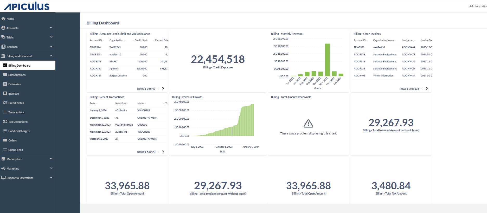
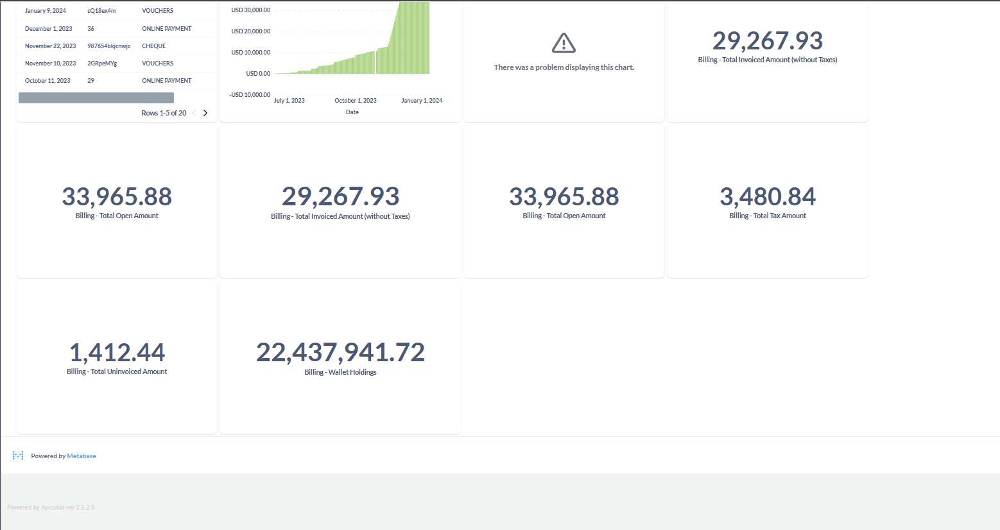

# Apiculus Billing Dashboard

The Apiculus Billing Dashboard provides a consolidated view of critical financial data related to customer billing and revenue. It is designed to support real-time financial tracking, risk monitoring, and business insights across the cloud service platform. The dashboard is structured in the following key sections: 

- Key Performance Indicators (KPIs)
- Charts and Graphs
- Data Tables.
## Key Performance Indicators

The Key Performance Indicators (KPIs) section of the Apiculus Billing Dashboard provides a quick overview of essential financial metrics that reflect the overall billing health of the platform. The widgets highlight critical values such as credit exposure, invoiced amounts, open payments, taxes, and wallet balances. By offering real-time insights, KPIs support financial risk management, Revenue tracking, proactive decision-making for both operations and compliance.

-  **Billing - Credit Exposure**: Represents the total amount of credit extended to customer organizations that has been used but not yet paid.

     - **Value:** For example, 22,454,518
     - **Importance:** A vital risk metric indicating potential financial exposure in case of customer defaults.

- **Billing - Total Invoiced Amount (Excluding Taxes)**: Total amount invoiced to customers, excluding taxes.
    
    - **Value:** For example, 29,267.93
    - **Importance:** Reflects actual net revenue recognized through invoices.

- **Billing - Total Open Amount**: Total value of all outstanding invoices, including taxes.

    - **Value:** For example, 33,965.88
    - **Importance:** Represents accounts receivable and is crucial for tracking overdue payments and managing cash flow.

- **Billing - Total Tax Amount**: Sum of all tax components included in invoices.
   
    - **Value:** For example, 3,480.84
    - **Importance:** Important for accurate tax reporting and compliance.

- **Billing - Total Uninvoiced Amount**: Charges accrued but not yet invoiced, such as usage or subscriptions.

    - **Value:** For example, 1,412.44
    - **Importance:** Indicates expected upcoming revenue in the next billing cycle.
      
- **Billing - Wallet Holdings**: Total funds held in customer wallets (prepaid balances).

    - **Value:** For example, 22,437,941.72
    - **Importance:** Shows available prepaid revenue that customers can use for future services.

- **Billing - Total Amount Receivable**: Reflects the grand total of all pending bills across all customers.
     - **Importance:** Gives a cumulative view of outstanding revenue yet to be collected.
## Charts and Graphs

The Charts and Graphs section provides a visual representation of revenue trends and financial growth over time. The widgets help users quickly interpret patterns in billing activity, monitor performance fluctuations, and identify significant milestones or anomalies. By translating raw data into intuitive visuals like bar and area charts, this section enhances decision-making through trend analysis and historical comparisons.

- **Billing - Monthly Revenue**: Displays the total monthly revenue. For example, from July 2023 to January 2024.

    - **Type:** Bar Chart
    - **Insights:** Reveals trends such as a revenue spike, which may correlate with business campaigns or seasonality.

- **Billing - Revenue Growth**:

    - **Type:** Cumulative Area Chart: Tracks cumulative revenue growth. For example, from July 1, 2023, to January 1, 2024.
    - **Insights:** A steady and steep upward trend indicates strong and consistent revenue generation in recent quarters.
## Data Tables

The Data Tables section provides structured and detailed financial data for in-depth visibility into customer accounts, invoices, and transactions. These widgets offer sortable and searchable records that help users monitor credit limits, track unpaid invoices, and review recent financial activities. The tabular format supports efficient data analysis and operational follow-up.

-  **Billing - Accounts Credit Limit and Wallet Balance**: Lists all customer accounts along with their credit limits and current wallet balances. The table shows the following details: 
    - Account ID
    - Organisation
    - Credit Limit
    - Current Balance

- **Billing - Open Invoices**: Displays all currently unpaid invoices. The table shows the following details: 
    - Account ID
    - Organisation Name
    - Invoice ID/Status
    
- **Billing - Recent Transactions**: A log of the latest financial transactions on the platform. The table shows the following details: 
    - Date
    - Narration (Transaction Description)
    - Mode (For example, VOUC - Voucher, CHEQ - Cheque, ONLP - Online Payment)

