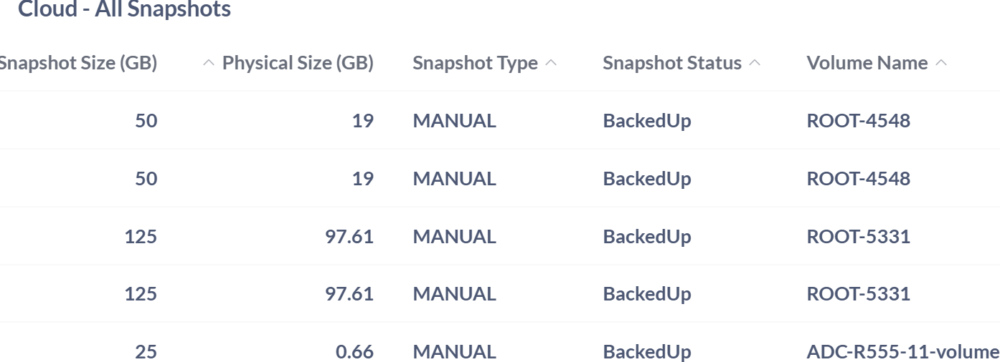
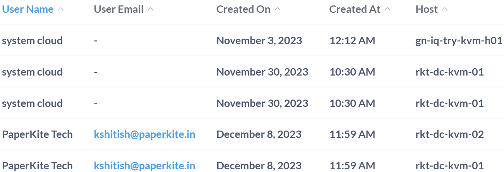

# Apiculus Cloud Resource Dashboard

The Apiculus Cloud Resource Dashboard provides a centralized view of key cloud components. It helps teams monitor resource allocation, track usage metrics, and manage infrastructure efficiently. With sections like OS Split, Service Offerings, and Storage Pools, the dashboard supports streamlined operations and better visibility across the cloud environment.
## Cloud- All Disk Volumes

The Cloud – All Disk Volumes table gives a clear view of all disk resources used in the cloud. Each disk is grouped under a resource pool, which helps organize and manage infrastructure. The table also shows when each disk and user account was created, helping track setup times and user activity. By linking disks to account IDs, organizations, and users, it supports accurate billing, audits, and ownership tracking. Overall, it helps teams manage storage better and keep cloud operations running smoothly.

| **Field**        | **Description**                                                         | **Importance**                                                                   |
| ---------------- | ----------------------------------------------------------------------- | -------------------------------------------------------------------------------- |
| **Volume Name**  | The name assigned to the disk volume.                                   | Used to identify and manage individual disk resources.                           |
| **Size (GB)**    | The storage capacity of the disk volume in gigabytes.                   | Helps monitor resource allocation and plan capacity usage.                       |
| **Status**       | Indicates whether the disk is currently attached or detached.           | Useful for understanding active resource usage.                                  |
| **State**        | The operational readiness of the disk volume.                           | Reflects whether the disk is available for use or in transition.                 |
| **Pool**         | The resource pool to which the disk belongs.                            | Helps categorize and manage resources based on infrastructure grouping.          |
| **Created On**   | The date the disk volume was created.                                   | Supports tracking provisioning timelines and historical usage analysis.          |
| **Created At**   | The timestamp when the user account was created.                        | Helps track when accounts were provisioned and supports user activity analysis.  |
| **Account ID**   | A unique identifier for the customer account.                           | Used to link users to specific accounts for management and billing purposes.     |
| **Organisation** | The name of the organization or individual associated with the account. | Provides context for user activity and resource ownership.                       |
| **User Name**    | The name of the user linked to the account.                             | Identifies the individual responsible for account operations and resource usage. |
| **User Email**   | The email address of the user.                                          | Supports communication, audit logging, and user-level tracking.                  |

## Cloud- All IP

The Cloud – All IP provides a centralized overview of IP address usage within the cloud infrastructure. It highlights key metrics such as the number of used IPs, offering insight into how network resources are being consumed. Monitoring all IP allocations, for example, enables administrators to efficiently manage address space, prevent conflicts, and support scalable cloud deployments.

## Cloud- All Snapshot

The Cloud – All Snapshot table serves as a comprehensive repository of all snapshot-related metadata within the cloud infrastructure. Snapshots are critical components in cloud environments, enabling data protection, disaster recovery, and system rollback capabilities. This dataset provides granular visibility into each snapshot's lifecycle, ownership, and resource footprint, ensuring administrators can effectively manage storage, monitor usage, and maintain operational continuity.

Each entry in this table is structured around key fields that capture both technical and administrative aspects of snapshot management:

| **Field**          | **Description**                                        | **Importance**                                                                |
| ------------------ | ------------------------------------------------------ | ----------------------------------------------------------------------------- |
| Snapshot Name      | The name assigned to the snapshot.                     | Used to identify and manage individual snapshot resources.                    |
| Created On         | The date when the snapshot was created.                | Helps monitor resource allocation and plan capacity usage.                    |
| Created At         | The time when the snapshot was created.                | Useful for understanding active resource usage.                               |
| Snapshot Size (GB) | The total allocated size of the snapshot in gigabytes. | Helps assess storage usage and capacity planning.                             |
| Physical Size (GB) | The actual disk space used by the snapshot.            | Useful for understanding real storage consumption.                            |
| Snapshot Type      | Indicates how the snapshot was created.                | Helps distinguish between automated and user-initiated backups.               |
| Snapshot Status    | The current state of the snapshot.                     | Reflects whether the snapshot is safely stored and available for restoration. |
| Volume Name        | The name of the volume associated with the snapshot.   | Used to trace the snapshot back to its source volume.                         |
| User Name          | The name of the user or system administrator.          | Identifies who is associated with the system or account.                      |
| User Email         | The email address linked to the user account.          | Used for communication and account verification.                              |
| Organisation       | The organization the user belongs to.                  | Helps categorize users by their organizational affiliation.                   |

## Cloud- All Templates

The Cloud – All Templates table provides a structured overview of all template-related metadata within the cloud infrastructure. Templates are essential for streamlining deployments, ensuring consistency across environments, and reducing configuration overhead. This dataset offers visibility into each template’s creation details, storage footprint, and administrative ownership, enabling efficient resource planning and governance.

Each entry in this table is structured around key fields that capture both technical and administrative aspects of template management:

| **Field**          | **Description**                                                | **Importance**                                                                              |
| ------------------ | -------------------------------------------------------------- | ------------------------------------------------------------------------------------------- |
| Template Name      | The name assigned to the cloud template.                       | Used to identify and manage reusable system or application configurations.                  |
| Created On         | The date when the template was created.                        | Helps track provisioning timelines and template versioning.                                 |
| Created At         | The time when the template was created.                        | Useful for auditing and understanding deployment activity.                                  |
| Template Size (GB) | The total disk space occupied by the template in gigabytes.    | Helps assess storage requirements and optimize resource allocation.                         |
| Physical Size (GB) | The actual disk space used by the user's associated resources. | Useful for understanding individual storage consumption and optimizing resource allocation. |
| User Name          | The name of the user or system administrator.                  | Identifies who is associated with the system or account.                                    |
| User Email         | The email address linked to the user account.                  | Used for communication and account verification.                                            |
| Organisation       | The organization the user belongs to.                          | Helps categorize users by their organizational affiliation.                                 |

## Cloud- All VPC

The Cloud – All VPC table provides a detailed overview of Virtual Private Clouds configured within the cloud infrastructure. VPCs are essential for creating isolated network environments that support secure and scalable resource deployment. This dataset captures both technical and administrative metadata, enabling efficient network management, auditing, and governance.

| **Field**     | **Description**                                             | **Importance**                                                                 |
| ------------- | ----------------------------------------------------------- | ------------------------------------------------------------------------------ |
| VPC Name      | The name assigned to the Virtual Private Cloud.             | Used to identify and manage isolated network environments within the cloud.    |
| CIDR          | The IP address range allocated to the VPC in CIDR notation. | Defines the network boundaries and IP allocation for resources within the VPC. |
| Subnets       | The number of subnets configured within the VPC.            | Indicates how the VPC is segmented for organizing and isolating resources.     |
| Purchased IPs | The number of public IP addresses purchased for the VPC.    | Helps manage external connectivity and resource exposure.                      |
| Account ID    | The identifier of the account associated with the VPC.      | Links the VPC to its owning entity for access control and billing.             |
| Organisation  | The organization the user belongs to.                       | Helps categorize users by their organizational affiliation.                    |
| User Name     | The name of the user or system administrator.               | Identifies who is associated with the system or account.                       |
| User Email    | The email address linked to the user account.               | Used for communication and account verification.                               |
| Created On    | The date when the user account was created.                 | Helps track provisioning timelines and user onboarding.                        |
| Created At    | The time when the user account was created.                 | Useful for auditing and understanding account activation patterns.             |

## Cloud- ALL VM

The Cloud – All VM table offers a comprehensive view of all virtual machines deployed within the cloud infrastructure. Virtual machines are the backbone of cloud computing, enabling scalable, flexible, and isolated environments for applications and services. This dataset captures essential metadata about each VM, supporting efficient management, auditing, and resource optimization.

| **Field**    | **Description**                                         | **Importance**                                                              |
| ------------ | ------------------------------------------------------- | --------------------------------------------------------------------------- |
| VM Name      | The name assigned to the virtual machine.               | Used to identify and manage individual VMs within the cloud infrastructure. |
| IP Address   | The internal or external IP address assigned to the VM. | Enables network communication and resource accessibility.                   |
| Account ID   | The identifier of the account associated with the VM.   | Links the VM to its owning entity for access control and billing.           |
| Organisation | The organization the VM belongs to.                     | Helps categorize VMs by their organizational affiliation.                   |
| User Name    | The name of the user or system administrator.           | Identifies who is associated with the system or account.                    |
| User Email   | The email address linked to the user account.           | Used for communication and account verification.                            |
| Created On   | The date when the user account was created.             | Helps track provisioning timelines and user onboarding.                     |
| Created At   | The time when the user account was created.             | Useful for auditing and understanding account activation patterns.          |
| Host         | The server or host associated with the user account.    | Helps identify the physical or virtual machine managing the user session.   |
| Template     | The name assigned to the virtual machine template.      | Used to identify and manage predefined VM configurations.                   |
| Guest OS     | The operating system associated with the VM template.   | Determines compatibility, performance, and software support.                |
| vCPU Cores   | The number of virtual CPU cores allocated to the VM.    | Impacts processing power and workload capacity.                             |
| RAM GB       | The amount of memory allocated to the VM in gigabytes.  | Affects application performance and resource availability.                  |

## Cloud- Primary Storage Used Total

The Cloud – Primary Storage Used Total field represents the total amount of primary storage currently utilized within the cloud infrastructure. It is essential for monitoring overall storage consumption across cloud resources. In this case, for example, the value is recorded as “null,” which may indicate that no data is currently stored, or that usage information is unavailable or not being reported.

## Cloud- Used IP

This figure is crucial for network administrators and IT teams to monitor IP consumption, manage resource allocation, and prevent address exhaustion or conflicts. Tracking used IPs helps ensure efficient network planning and supports scalability across cloud infrastructure.

## Cloud- VM Count

This figure is vital for understanding the scale of infrastructure usage, planning resource allocation, and maintaining operational efficiency. For example, tracking VM count helps administrators monitor growth trends, optimize workloads, and ensure that provisioning aligns with organizational needs.

## Cloud- VPC Count

This number reflects the scale of network segmentation and isolation across the environment. For example, tracking VPC count helps administrators assess resource distribution, manage multi-tenant architectures, and ensure efficient network planning and governance.

## Cloud- Disk Used Total 

The Cloud – Disk Used Total metric reflects the overall consumption of disk space within the cloud storage system. This figure is essential for tracking overall storage consumption and ensuring that resources are allocated efficiently. It plays a critical role in helping administrators monitor usage trends, optimize resource allocation, and maintain performance across the infrastructure.

## Cloud- OS Split

The Cloud – OS Split table provides a detailed breakdown of operating systems deployed across virtual machines in the cloud environment. This segmentation helps administrators assess compatibility, plan for updates, and manage support across a varied cloud infrastructure.

| **Field**                     | **Description**                                                 | **Importance**                                                              |
| ----------------------------- | --------------------------------------------------------------- | --------------------------------------------------------------------------- |
| Debian GNU/Linux 11 (64-bit)  | A modern and stable version of Debian used across cloud VMs.    | Offers reliability and long-term support for enterprise-grade applications. |
| Debian GNU/Linux 5.0 (64-bit) | An older Debian release still present in the environment.       | Supports legacy systems and specific dependencies.                          |
| Rocky Linux 9                 | A community-supported enterprise OS compatible with RHEL.       | Provides a secure and stable platform for production workloads.             |
| Ubuntu 20.04 LTS              | A widely used long-term support version of Ubuntu.              | Ensures extended support and compatibility with modern tools.               |
| Ubuntu 18.04 LTS              | An earlier LTS version still in use.                            | Maintains stability and supports legacy applications.                       |
| Other CentOS (64-bit)         | Various CentOS-based systems not individually categorized.      | Indicates continued use of CentOS variants for enterprise workloads.        |
| Other PV Virtio-SCSI (64-bit) | VMs using paravirtualized Virtio-SCSI drivers.                  | Enhances disk I/O performance and virtualization efficiency.                |
| Other Linux (64-bit)          | Miscellaneous 64-bit Linux distributions not explicitly listed. | Reflects OS diversity across the cloud infrastructure.                      |
| Other                         | Operating systems that don’t fit predefined labels.             | Captures edge cases and custom OS configurations.                           |

