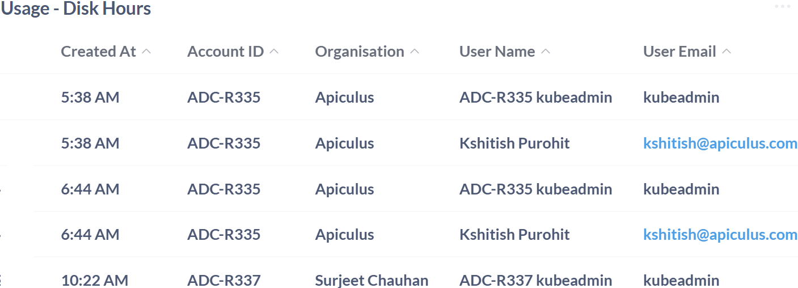

# Apiculus Cloud Usage Dashboard

The Apiculus Cloud Usage Dashboard provides a centralized view of resource consumption across disk, IP, VM, storage, and network components. It helps teams track usage, link resources to accounts and users, and support billing and audits. With the following insights into allocation times, usage duration, and infrastructure grouping, the dashboard enables better cost control, operational efficiency, and informed decision-making:
## Usage- Disk Hours

The Usage – Disk Hours table provides a comprehensive view of disk resource allocation and utilization across customer accounts. By linking each disk to specific users, organizations, and account IDs, this table supports accurate tracking, billing, and audit logging. The creation time helps track when disks were set up, and grouping them by resource pool makes it easier to manage infrastructure. Together, the insights help optimize storage usage, improve operational efficiency, and support informed decision-making across cloud environments.

| **Field**        | **Description**                                                                                     | **Importance**                                                           |
| ---------------- | --------------------------------------------------------------------------------------------------- | ------------------------------------------------------------------------ |
| **Volume Name**  | The name assigned to the disk volume.                                                               | Used to identify and manage individual disk resources.                   |
| **Size (GB)**    | The storage capacity of the disk volume in gigabytes.                                               | Helps monitor resource allocation and plan capacity usage.               |
| **Status**       | Indicates whether the disk is currently attached or detached.                                       | Useful for understanding active resource usage.                          |
| **State**        | The operational readiness of the disk volume.                                                       | Reflects whether the disk is available for use or in transition.         |
| **Pool**         | The resource pool to which the disk belongs.                                                        | Helps categorize and manage resources based on infrastructure grouping.  |
| **Created On**   | The date the disk volume was created                                                                | Supports tracking provisioning timelines and historical usage analysis.  |
| **Created At**   | The timestamp when the disk resource was created or allocated.                                      | Helps track provisioning time and supports resource usage analysis.      |
| **Account ID**   | A unique identifier for the customer account associated with the disk usage.                        | Used to link disk usage to specific accounts for billing and monitoring. |
| **Organisation** | The name of the organization or individual linked to the account (e.g., Apiculus, Surjeet Chauhan). | Provides context for resource usage across different customer entities.  |
| **User Name**    | The name of the user associated with the disk resource.                                             | Identifies the individual responsible for resource allocation and usage. |
| **User Email**   | The email address of the user.                                                                      | Supports user-level tracking and audit logging.                          |

## Usage - IP Hours

The Usage – IP Hours table provides a detailed breakdown of public IP address allocation and consumption across customer accounts. It captures the critical metadata, allowing teams to monitor network resource distribution with precision. Each IP address is marked with the date and time it was given, making it easy to see when it was set up and how long it’s been used. The inclusion of allocated hours helps quantify resource consumption, which is essential for billing, performance tracking, and optimization. By linking IP usage to specific users and accounts, this section supports audit readiness, improves operational transparency, and enables better cost control in cloud environments.

| **Field**           | **Description**                                                          | **Importance**                                                                        |
| ------------------- | ------------------------------------------------------------------------ | ------------------------------------------------------------------------------------- |
| **Account ID**      | The unique identifier assigned to the account.                           | Used to distinguish and manage different accounts.                                    |
| **User Email**      | The email address associated with the user of the account.               | Helps in identifying and contacting the user.                                         |
| **IP Address**      | The IP address allocated to the user.                                    | Used for network identification and access management.                                |
| **Allocation Date** | The date and time when the IP address was allocated to the user.         | Helps in tracking the allocation and usage period of the IP address.                  |
| **Allocated Hrs**   | The total number of hours the IP address has been allocated to the user. | Indicates the duration of IP usage, useful for billing, monitoring, and optimization. |

