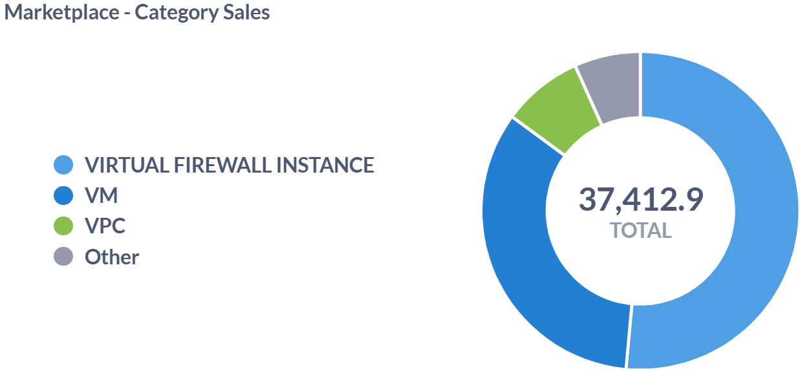
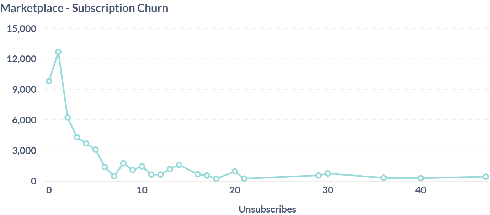

# Apiculus Marketplace Dashboard

The Apiculus Marketplace Dashboard offers a comprehensive view of sales and subscription trends across the cloud services platform. Designed to support product optimization, revenue tracking, and customer engagement strategies, this dashboard segments critical business data into visual and tabular formats. The dashboard is structured in the following key sections: 

**Marketplace - Category Sales**: This dashboard provides insight into which categories are driving the most revenue. For example, **VM** appears to be the most profitable, suggesting that customers rely heavily on virtual machine services. This data could be used to allocate marketing or infrastructure resources.

- Key Data Points: This image shows the total sales categorized by product/service types within a cloud or software marketplace.

    - **Virtual Firewall Instance**
    - **VM (Virtual Machines)** 
    - **VPC (Virtual Private Cloud)**
    - **Other**
      

**Marketplace - Popular Plans**: These are the most popular offerings based on customer adoption. For example, **4c8 with 2019 STD** likely means 4 CPUs, 8 GB RAM with Windows Server 2019 Standard edition and **1c2 with Ubuntu 18** refers to 1 CPU, 2 GB RAM on Ubuntu 18. It helps product teams and sales prioritize which offerings to scale or promote.

- Key Data Points: This shows the most subscribed-to plans in the marketplace, ranked by the number of current subscriptions — for example, the VR Standard plan leads with 76 active subscriptions.
 
		| Plan Name          | Subscriptions |
		| -----------------  | ------------ |
		| VR Standard        | 76            |
		| IP Address         | 59            |
		| 4c8 with 2019 STD  | 53            |
		| 1c2 with UBUNTU 18 | 52            |
		| 1c2 with UBUNTU 20 | 49            |

**Marketplace - Subscription Churn**: This helps identify problem periods when customer retention was low. It’s crucial for understanding what might be causing users to leave (for example, price hikes, performance issues, changes in features).

- Key Data Points: This chart represents subscription churn — for example, it shows the number of users unsubscribing from services over time, with noticeable spikes between values **30–40** on the X-axis.

**Marketplace - Subscription Growth**: This shows positive growth in user adoption. It helps assess daily performance of marketing or product efforts.

- Key Data Points: This table shows daily new subscription counts along with the total cumulative subscriptions — for example, on June 15, 2023, there were 15 new subscriptions, bringing the total to 43.

		| Date          | New Subscriptions | Total Subscriptions |
		| ------------- | ----------------- | ------------------- |
		| June 08, 2023 | 14                | 14                  |
		| June 12, 2023 | 04                | 18                  |
		| June 14, 2023 | 07                | 25                  |
		| June 15, 2023 | 18                | 43                  |
		| June 16, 2023 | 11                | 54                  |

**Marketplace - Top Grossing Plans**: This identifies top-revenue-generating services. It helps decide which services deserve more investment or bundling.

- Key Data Points: This table shows which individual plans generated the most revenue through billing — for example, the 1c2 with pfSense plan led with over $19,345.15 in earnings.
  
		| Plan Name           | Billing Generated |
		| ------------------- | ----------------- |
		| 1c2 with pfSense    | $19,345.15        |
		| 1c2 with Ubuntu 20  | $2,853.50         |
		| 4c8 with Ubuntu 20  | $1,962.60         |
		| 1c2 with CentOS 7.9 | $1,255.33         |
		| VR Standard         | $1,108.86         |

