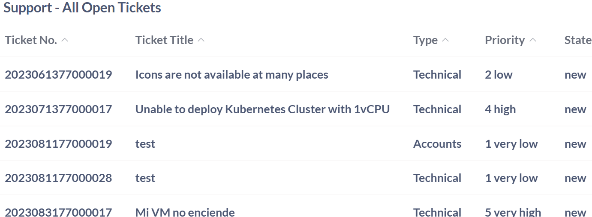
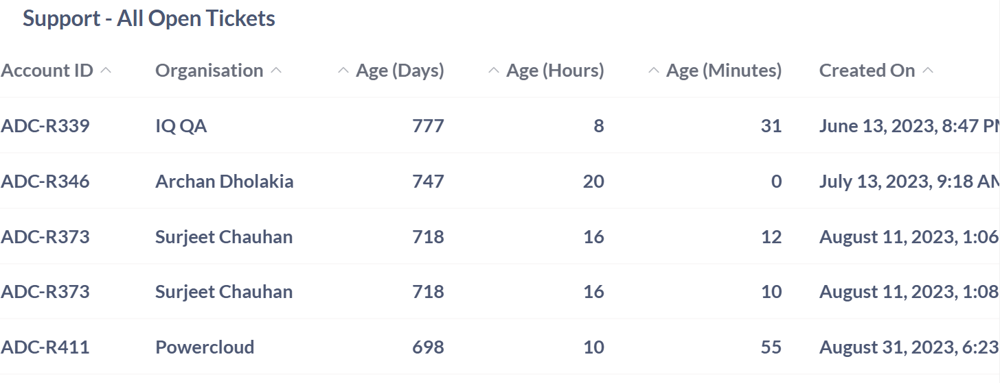
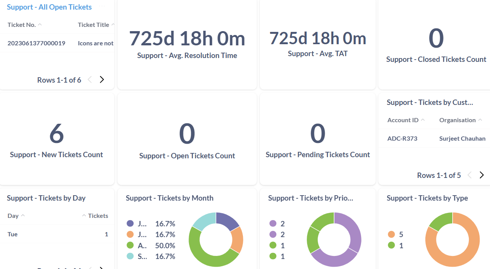
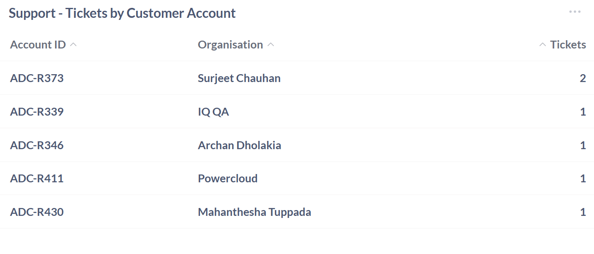
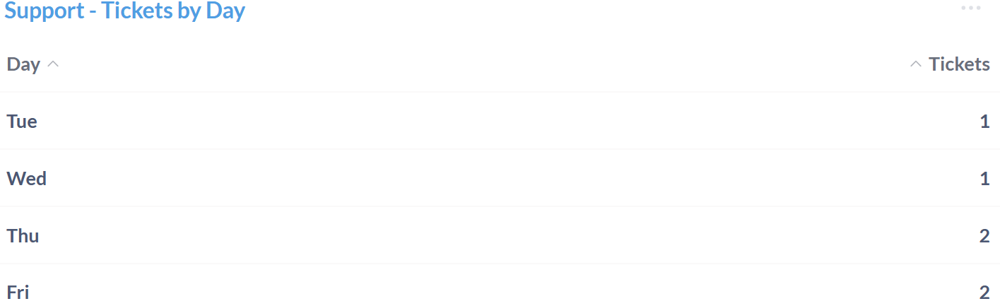
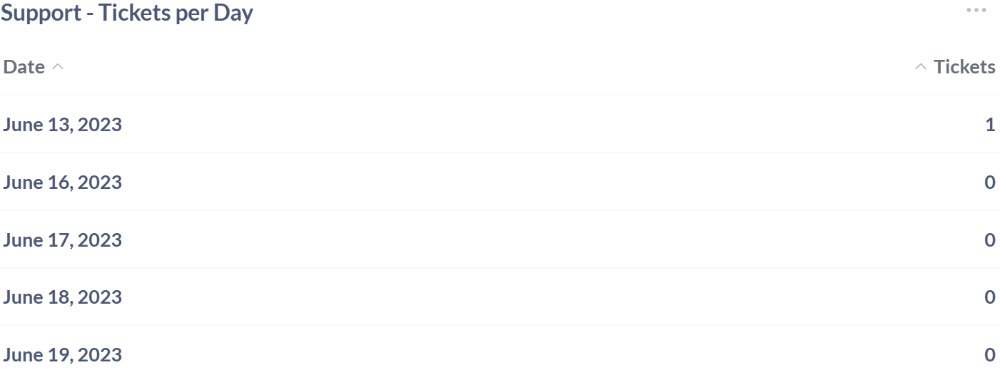
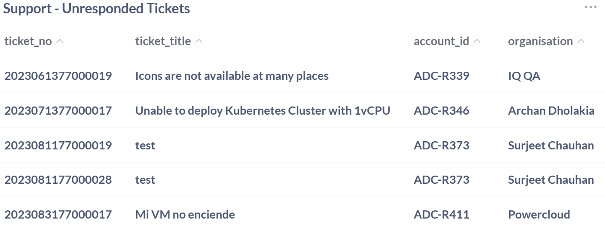

# Apiculus Support Dashboard

The Apiculus Support Dashboard gives a clear overview of key support-related metrics and activities. It helps teams track tickets, monitor response times, and understand user engagement patterns. By organizing support data in one place, it supports better planning and smoother service operations.
## Support- All Open Tickets

The Support – All Open Tickets section offers a simplified overview of pending support issues. It highlights key ticket details such as identification numbers, categories, priorities, and current statuses to help keep tasks organized. Additional fields like account information, organization name, and age indicators add context and support better tracking. By laying out ticket data in a consistent and accessible format, the section streamlines issue monitoring and improves resolution workflows across teams.

| **Field**         | **Description**                                                          | **Importance**                                                                 |
| ----------------- | ------------------------------------------------------------------------ | ------------------------------------------------------------------------------ |
| **Ticket Number** | Unique identifier assigned to each support ticket.                       | Essential for tracking, referencing, and managing individual issues.           |
| **Ticket Title**  | Brief summary describing the nature of the reported issue.               | Provides quick insight into the problem and helps prioritize resolution.       |
| **Type**          | Category of the issue—e.g., Technical or Accounts.                       | Determines which team or resources will handle the ticket.                     |
| **Priority**      | Urgency level of the issue, ranging from “very low” to “very high.”      | Guides resource allocation and response time expectations.                     |
| **State**         | Current status of the ticket (e.g., new).                                | Indicates workflow progression and whether action has been taken.              |
| **Account ID**    | Unique identifier for the account that raised the support ticket.        | Crucial for associating tickets with specific users or organizations.          |
| **Organisation**  | Name of the organization linked to the support request.                  | Helps contextualize the ticket’s business environment and client relationship. |
| **Age (Days)**    | Number of full days since the ticket was created.                        | Indicates how long the issue has remained unresolved.                          |
| **Age (Hours)**   | Additional hours beyond full days of ticket age.                         | Allows for more granular measurement of elapsed time.                          |
| **Age (Minutes)** | Additional minutes beyond hours and days of ticket age.                  | Provides precise timestamp for issue aging.                                    |
| **Created On**    | Full timestamp of when the support ticket was initiated.                 | Supports historical tracking and prioritization of older unresolved tickets.   |
| **Last Updated**  | Shows the most recent date and time when the data or entry was modified. | Helps confirm the freshness and relevance of the information displayed.        |

## Support- Average Resolution Time

This metric is essential for support teams and service managers to assess how efficiently customer issues are being addressed. By monitoring the average time taken to resolve tickets, organizations can identify delays, improve workflows, and enhance overall service quality. Regular tracking helps ensure quicker turnaround, boosts customer satisfaction, and promotes accountability across support operations.

## Support- Average TAT

This figure represents the average turnaround time (TAT) for handling support tickets. It serves as a key benchmark for evaluating the responsiveness and operational efficiency of support teams. Tracking average TAT helps identify process bottlenecks, optimize resolution workflows, and maintain quality service delivery across customer interactions.

## Support- Closed Ticket Count

This figure reflects the total number of support tickets successfully closed. It highlights the resolution progress made by support teams and helps gauge operational effectiveness. Tracking this metric is essential for understanding workload clearance, identifying areas of delay, and assessing overall service performance in addressing client concerns.

## Support- New Tickets Count

This figure represents the number of new support tickets received. It serves as a key metric for evaluating the volume of incoming customer inquiries and issues. Monitoring new ticket count helps support teams anticipate workload, prioritize initial responses, and maintain timely service across client interactions.

## Support- Open Tickets Count

This figure represents the current number of open support tickets. It acts as a clear indicator of issue backlog and support responsiveness. A count of zero reflects strong operational performance, suggesting that existing customer concerns have been effectively addressed. Regular monitoring of this metric helps ensure prompt service, optimize team efficiency, and maintain high satisfaction levels.

## Support- Pending Tickets Counts

This figure shows the number of support tickets still awaiting resolution. It serves as a useful benchmark for understanding the volume of unresolved issues and support team efficiency. A pending count of zero reflects a clear ticket queue, indicating that current workloads have been addressed or escalated effectively. Monitoring this metric helps prevent backlog accumulation and supports proactive service management.

## Support- Tickets by Customer Account

The Support – Tickets by Customer Account section provides a structured overview of support activity across various accounts. By organizing ticket data according to customer identifiers and affiliated organizations, this view helps teams understand which clients are generating the most support requests. Such information is valuable for identifying patterns in issue frequency, prioritizing outreach or resolution efforts, and maintaining strong customer relationships. Tracking these details enhances operational visibility and ensures that support resources are distributed effectively.

| **Field**        | **Description**                                                | **Importance**                                                                 |
| ---------------- | -------------------------------------------------------------- | ------------------------------------------------------------------------------ |
| **Account ID**   | Unique identifier for the account that raised support tickets. | Crucial for associating tickets with specific users or organizations.          |
| **Organisation** | Name of the organization linked to the support request.        | Helps contextualize the ticket’s business environment and client relationship. |
| **Tickets**      | Total number of support tickets raised by the account.         | Indicates the volume of issues reported and helps track client activity.       |

## Support- Tickets by Day

The Support – Tickets by Day section presents a temporal overview of incoming support requests segmented by weekday. By analyzing the number of tickets received on each day, this metric reveals key trends in issue frequency and helps anticipate workload peaks. It enables support teams to better plan staffing schedules, prioritize response efforts, and improve operational readiness based on daily demand patterns.

| **Field**   | **Description**                                             | **Importance**                                                                       |
| ----------- | ----------------------------------------------------------- | ------------------------------------------------------------------------------------ |
| **Day**     | The day of the week when the support tickets were received. | Essential for tracking the distribution of support tickets over time.                |
| **Tickets** | The number of support tickets received on each day.         | Provides insight into the volume of support requests and helps in resource planning. |
|             |                                                             |                                                                                      |

## Support- Tickets by Month

This donut chart highlights how support activity fluctuates over different months, offering a clear view into client engagement and system issues across time. For example, from June to September 2023, the volume of tickets varied, with August seeing a significant spike. This pattern can help support teams anticipate high-demand periods and allocate resources accordingly.

These insights guide operational planning, helping ensure consistent and responsive support coverage during peak times.

## Support - Tickets by Priority

Support tickets are grouped by priority to optimize response workflows and resource planning. This classification ensures teams address issues based on urgency, helping maintain service efficiency and balanced workload management.

## Support - Tickets by Type

Support tickets are classified by type to track recurring issue categories and improve response strategies. This categorization helps teams focus resources where they’re most needed and streamline resolution across different types of support requests.

## Support - Tickets per Day

This section shows how many support tickets are received each day. It helps give a quick view of how much help users need and how busy the support system is. By tracking ticket numbers for each date, teams can spot patterns, understand user needs, and plan resources better. Watching these numbers helps make sure support stays fast and well-organized.

| **Field**   | **Description**                                                  | **Importance**                                                                   |
| ----------- | ---------------------------------------------------------------- | -------------------------------------------------------------------------------- |
| **Date**    | Specific calendar day when support ticket activity was recorded. | Helps track daily workload trends and identify patterns in support demand.       |
| **Tickets** | Number of tickets logged on each respective date.                | Useful for operational planning and assessing fluctuations in user interactions. |

## Support - Unresponded Tickets

This section gives a simple view of tickets that have not been replied to yet. It includes basic details to help keep track of what still needs attention and where support follow-up is pending.

| **Field**        | **Description**                                                    | **Importance**                                                        |
| ---------------- | ------------------------------------------------------------------ | --------------------------------------------------------------------- |
| **Ticket No**    | Unique identifier assigned to each support ticket.                 | Essential for tracking and referencing individual issues.             |
| **Ticket Title** | Short description of the issue reported in the support ticket.     | Helps quickly understand the nature of the user concern.              |
| **Account ID**   | Identifier linked to the user's account that raised the ticket.    | Useful for identifying recurring issues or account-specific problems. |
| **Organisation** | Name of the organization associated with the support request.      | Helps group tickets by company or department for analysis.            |
| **raw_age**      | Numerical representation of ticket age in minutes or system units. | Useful for backend tracking and metric analysis.                      |
| **age**          | Showing ticket age in days, hours, and minutes.                    | Helps quickly assess ticket delay duration and prioritize response.   |

