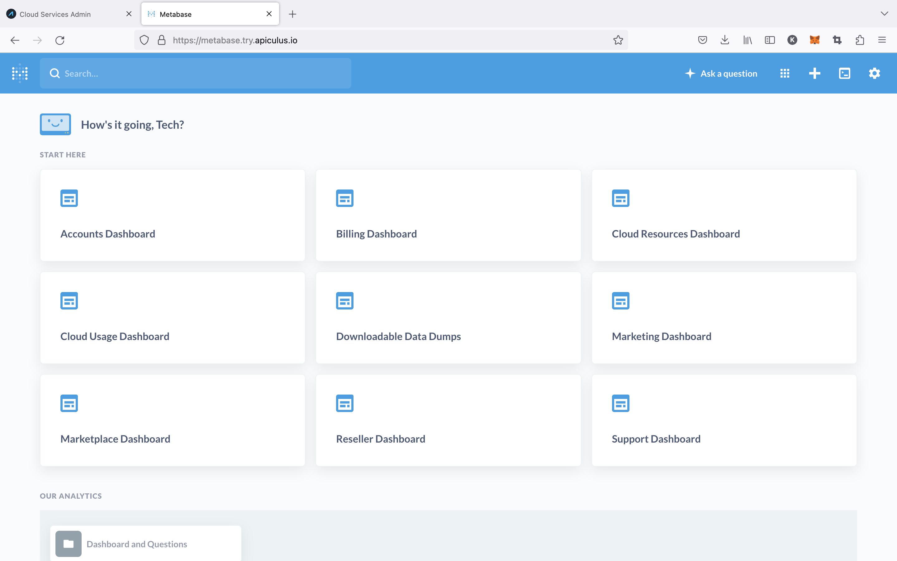

# Metabase Business Intelligence Dashboards

The Apiculus solution stack includes the open-source BI tool [Metabase](https://metabase.com), which can be configured to deliver powerful business and commercial reporting insights. Service providers' techno-commercial teams (Product, Operations, Business, Upper Management, C-Suite) can configure and access highly customisable visual dashboards to gain visibility into how the cloud business is being operated using Apiculus. 

By default, the following dashboards are set up and integrated with the Apiculus Admin Console:

1. Accounts dashboard
2. [Apiculus Billing Dashboard](/docs/AboutServiceProviderAdministration/MetabaseBusinessIntelligenceDashboards/ApiculusBillingDashboard)
3. Marketing dashboard
4. [Apiculus Marketplace Dashboard](/docs/AboutServiceProviderAdministration/MetabaseBusinessIntelligenceDashboards/ApiculusMarketplaceDashboard)
5. Cloud usage dashboard
6. Cloud resources dashboard
7. Support dashboard

Additionally, the following dashboards are available directly on Metabase and not integrated with the Apiculus Admin Console:

- Reseller dashboard
- Downloadable data dumps

:::note
Metabase is highly configurable and can be used to configure alerts on reports, daily notifications on data, and visually engaging views and reports. For any assistance, a support ticket can be raised with Apiculus (By Yotta) Support.
:::

