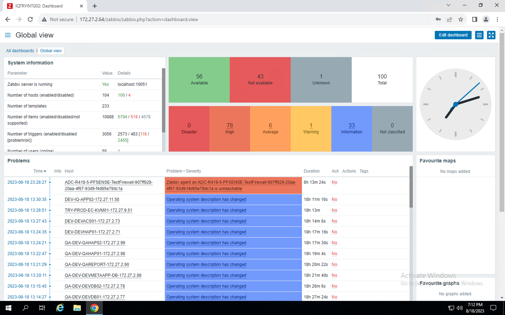

# Zabbix Dashboard and NMS

Service provider NOC teams get restricted access to the Zabbix monitoring system as part of the service provider administration suite. Restricted access is provided because any modifications done on the Zabbix system can severely impact the quality of service and experience delivered via Apiculus.

Apiculus uses Zabbix for the following:

- Agent-based monitoring of all guest/customer Instances
- Alert configurations using Apiculus Cloud Console
- System-level alerting for capacity utilisation
- Parametric monitoring of the entire cloud infrastructure

