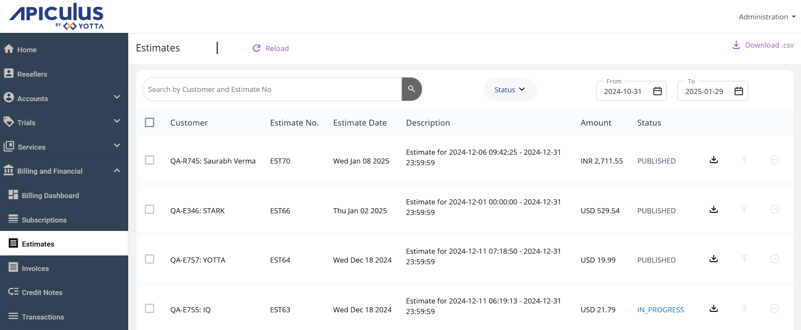
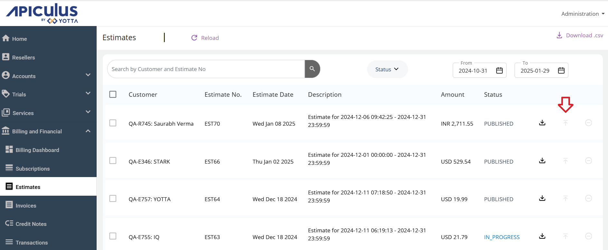

# About Estimates

Estimates provide a better control to admin users and integrate seamlessly with IRP/ERP systems for effective invoice management. It reduces manual data entry errors by automating the invoicing process and ensure compliance with regulatory requirements for e-invoicing, such as generating Invoice Reference Numbers (IRN) and integrating with tax authorities.

You receive an email, once the estimates are available. To view the estimates, navigate to the **Billing and Financial** section and select **Estimates**. 

All the estimates for your user accounts are listed with the following details:

- **Customer** - Displays the customer's name.
- **Estimate No** - Shows the unique number assigned to each customer.
- **Estimate Date** - Specifies the date of the estimate.
- **Description** - Provides the description of the particular estimate.
- **Amount** - Indicates the amount to be paid by the customer.
- **Status** - Displays the status of the estimate, such as Published, In Progress, Discarded, or Reopen.
:::note
You can search for an estimate by specifying the **Customer** or **Estimate No**. Additionally, you can filter estimates by selecting a date range using the **From** and **To** fields.
:::

You can perform various operations:

- **Download the Estimate** - To download a particular invoice, click the **Download** icon.
  
- **Publish the Estimate** - To publish an estimate, click the **Publish** icon. If an IRP/ERP system is integrated, the invoice is passed to the IRP/ERP system. Published estimates are listed in the **Invoices** section.
  
- **Discard the Estimate**: To discard the estimate, click the **Discard** icon. The discarded estimates are no longer available for download.
	
	
	:::note
	You can select and publish multiple estimates or all estimates at once. Estimates can be downloaded in a .csv format.
	:::