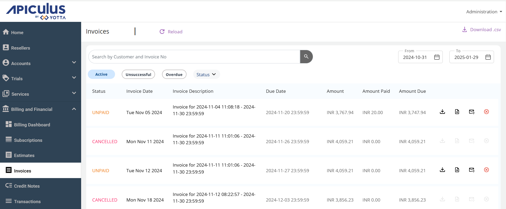
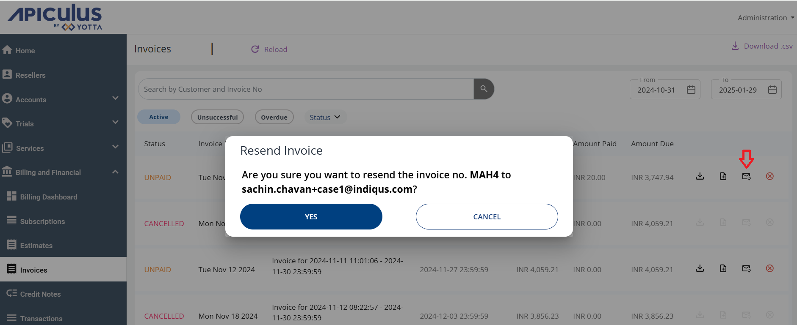
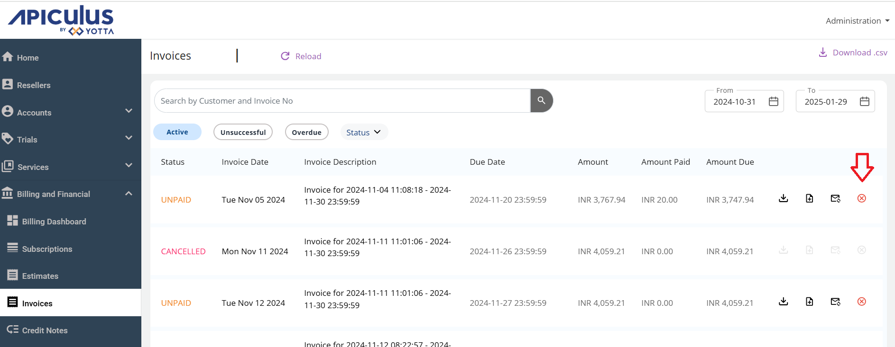

# About Invoice

To view the invoice, navigate to the **Billing and Financial** section and select **Invoices**.

Invoices on Apiculus are automatically sent to customers upon generation. However, there may be cases where the email could not be delivered to the customer, was deleted by mistake, or any other way that the email could not be retrieved. For such cases, you can resend invoices to the account. 

## Resending Invoice
To resend an invoice to a customer, click on (Resend icon) in the global-level or account-level list of invoices.

:::note
This does not regenerate an invoice. The same invoice is sent again to the same recipient.
:::

## Canceling Invoice
To cancel an Invoice, click on (cancel icon) in the global-level or account-level list of invoices.

