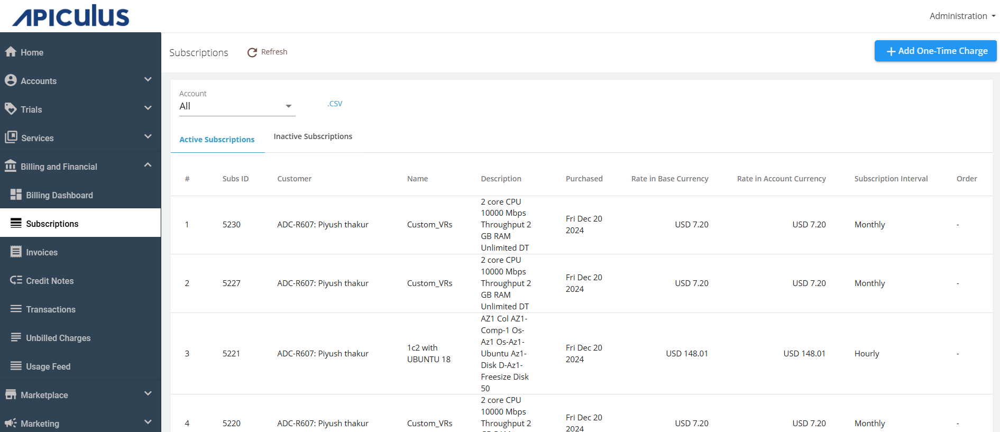
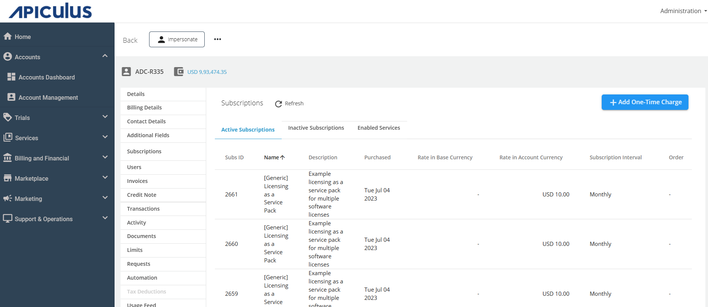
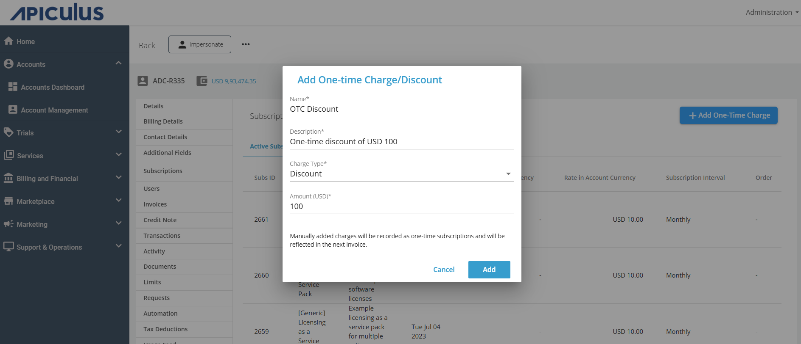

# Adding One-time Charges and Discounts

You can add charges and discounts manually as one-time subscriptions. It is beneficial for the use cases; if the invoice is generated and some discount or charge needs to be recorded for a customer, then you can do the same. This feature significantly enhances billing-related workflows.

You are add one-time charges and discounts in the following ways:
- [From Global Subscriptions](#from-global-subscriptions)
- [From Account Subscriptions](#from-account-subscriptions)
## From Global Subscriptions

Follow these steps to add charges and discounts from the **Global Subscription** section:

1. Navigate to **Billing and Financial** > **Subscription**.
2. Click on the **+ Add One Time Charge** button.
3. Enter the following details:
    - **Name** 
    - **Description**
    - **Charge Type** (Charge or discount)
    - **Customer**
    - **Amount**
4. Click on the **Add** button.
## From Account Subscriptions

Follow these steps to add charges and discounts from the **Account Subscription** section:

1. Navigate to **Accounts** > **Account Management** > **Select Account** > **Edit Account** > **Subscriptions**.
2. Click on the **Add One-Time Charge** button.
3. Enter the following details:
    - **Name** 
    - **Description**
    - **Select Charge Type** (Charge or discount)
    - **Enter the amount**
4. Click on the **Add** button.

:::note
- Manually added charges will be recorded as one-time subscriptions and reflected in the next invoice.
- Multiple charges and discounts can be added.
:::

