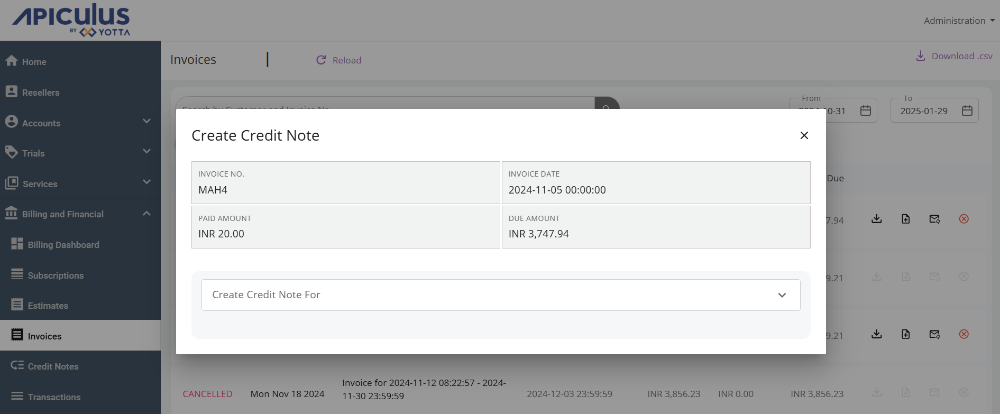

# Creating a Credit Note Against an Invoice

You can create credit notes against paid or unpaid invoices. A credit note requires an invoice to be generated and present in the system. Credit notes can be used in cases such as disputed invoices, disputed charges, refunds etc., where editing an invoice is not financially possible.

You can create credit notes against any invoice that is present in the account-level or global list of invoices.

Navigate to an invoice and click on  (create credit note icon).

Credit notes can be created for (in increasing order of levels of control offered):

- **Full Invoice Amount** - Generated with a single line item for the complete invoice amount.
- **Partial Invoice amount** - Generated with a custom amount that can also include a custom/specified tax component.
- **Custom Amount** - Generated with custom/specified line items with optional tax fields for each line item.

:::note
The above options are only available when creating credit notes from the Apiculus Cloud Console against a single invoice.
:::

