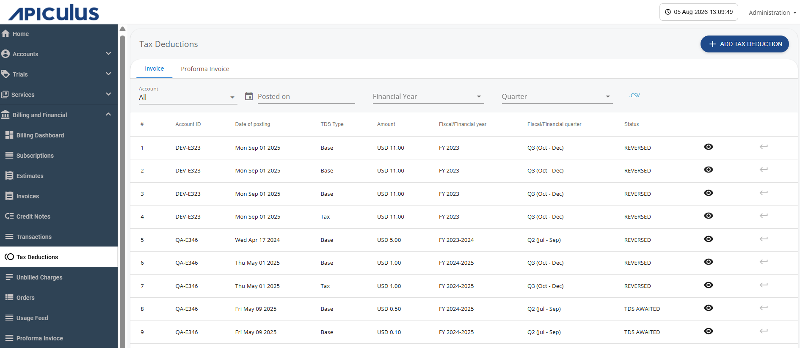
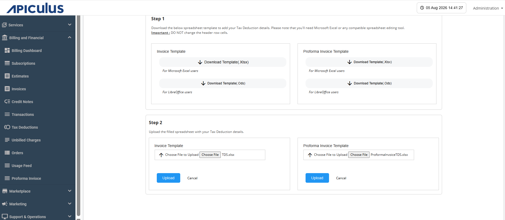
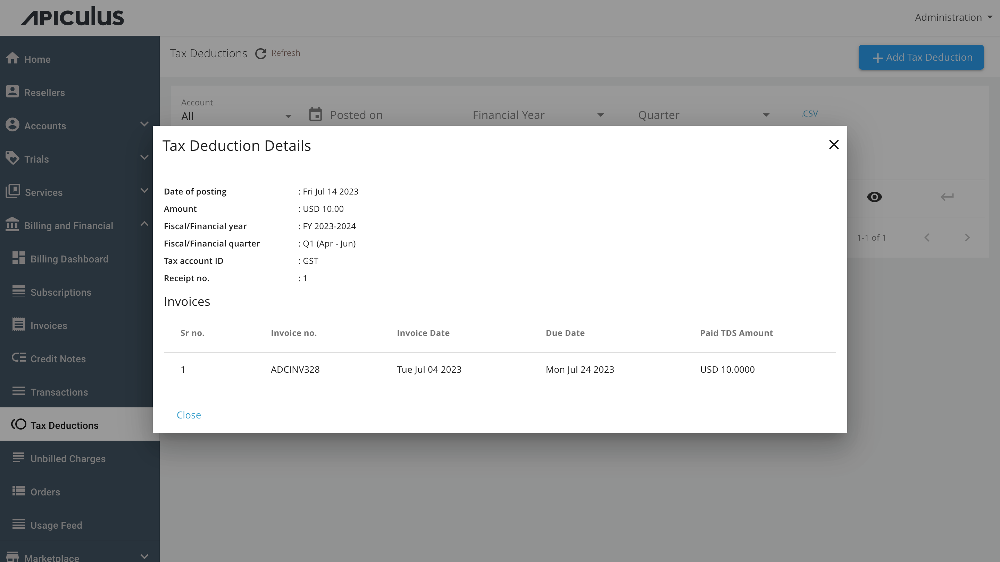

# Managing Tax Deductions

This section covers the Tax Deduction (TDS) section that allows you to configure tax deductions applicable to a Proforma Invoice or Invoice. TDS is a statutory deduction withheld from the payment amount in accordance with applicable tax regulations.

## Adding a Tax Deduction for Invoice or Proforma Invoice

To add a tax deduction, follow these steps:

1. Navigate to **Billing and Financial > Tax Deduction**. The following screen appears:
2. Click the **Add Tax Deduction** button. The following screen appears:
3. You can download the Invoice or Proforma Invoice template (.Xlsx or .Ods format). Fill in the tax deduction details as per the template.
4. Click the **Upload** icon to upload the edited file.
5. Click the **Upload** button.

## Viewing Tax Deduction

You can view tax deductions recorded quarterly against historical invoices as per [fiscal period configurations](/docs/GettingStarted/BillingandFinancials/ConfiguringTaxDeductions).

Click the **eye** icon; the following screen appears with tax details:
