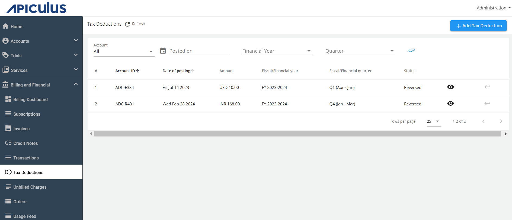
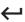
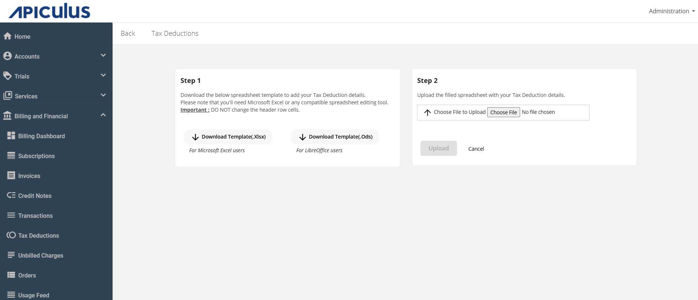
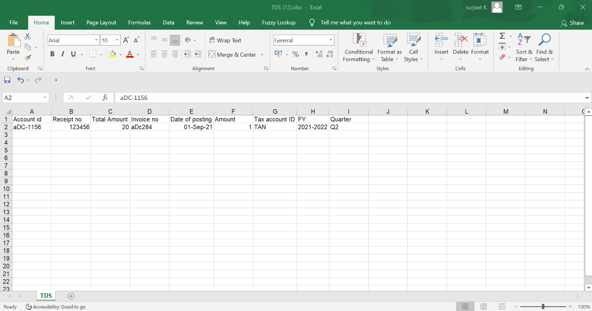
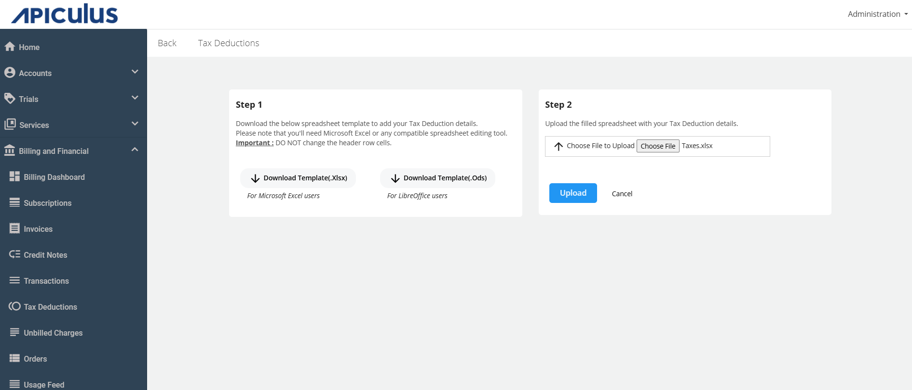
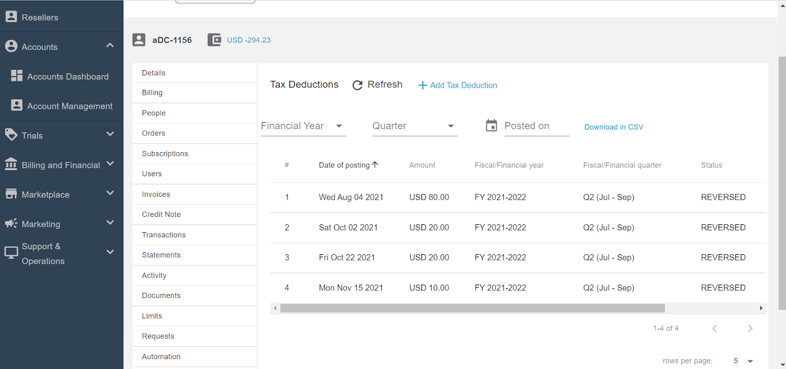
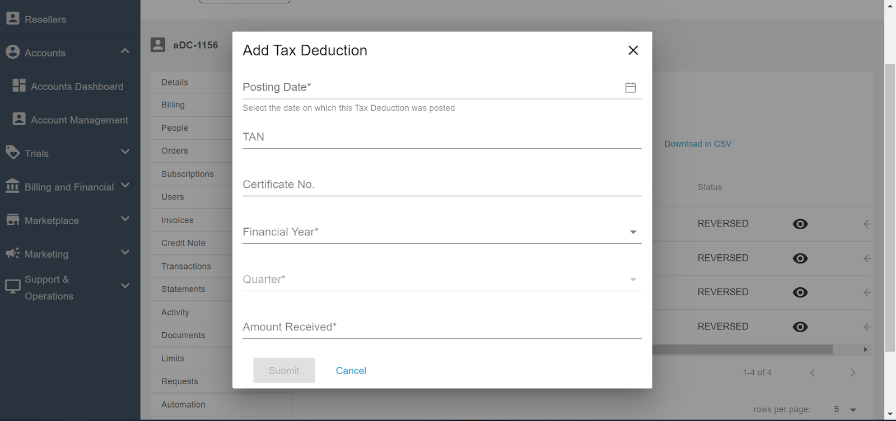

# Recording Tax Deductions

You can configure tax deductions via a new section under Settings called Tax Deductions. This involves taxes deducted by the customers while making a payment and is different from taxation on services which involves taxes charged on the services delivered. Admins can record quarterly tax deductions for all customer invoices. The Tax Deductions section lists all such tax deductions and also allows for adding new items. The Tax Deductions feature is optional and needs to be enabled from the global settings, where admins also get the ability to define their country’s fiscal period and fiscal quarters.

## Configuring Tax Deductions

To [configure tax deductions](/docs/GettingStarted/BillingandFinancials/ConfiguringTaxDeductions), follow these steps:

1. Navigate to **Administration** >  **Settings > Financials & Business > Tax Deduction**.
2. Enable the **Tax Deduction** switch and provide the following details:
	- Enter the **Tax Name** as applicable.
	- Enter the **Tax Account ID Name**.
	- Select the quarter from the **Fiscal/Financial Year** drop-down list.
3. Click on **Save** and then click **Publish Settings**.
## Accessing and Adding Tax Deductions 

Tax Deductions can be accessed and added in the following ways: 
- [Global Tax Deductions Section](#global-tax-deductions-section) 
- [Account Level Tax Deductions Section](#account-level-tax-deductions-section)

### Global Tax Deductions Section

1. Navigate to **Billing and Financial** > **Tax Deduction** in the main navigation panel. All the recorded accounts posting are displayed, which include the following details:
    - Account ID
    - Date of Posting
    - Amount
    - Fiscal/Financial Year
    - Fiscal/Financial Quarter
    - Status

	
1. You can view the details by clicking on  (Eye icon).
2. You can also reverse the transaction by clicking on   (Reverse icon).
3. You can also filter using the options available above the table.
4. For adding the tax deduction from the global section, click on the **+ Add Tax Deduction**. The following screen appears:
	1. Download the template (.Xlsx or .Ods).
	2. Upload the template after filling in the required details.
	
	

### Account Level Tax Deductions Section

1. Navigate to the **Accounts Management** > **Select Account** > **Edit Account** > **Tax Deductions**.
	All the recorded accounts posting get listed, which include the following details:
    - Account ID
    - Date of Posting
    - Amount
    - Fiscal/Financial Year
    - Fiscal/Financial Quarter
    - Status

	

3. You can view the details by clicking on  (Eye icon).
4. You can also reverse the transaction by clicking on   (Reverse icon).
5. You can also filter using the options available above the table.
6. For adding the tax deduction, click on the **+ Add Tax Deduction**. The Add Tax Deduction window opens.
7. Enter the required details, and click the **Submit** button.

