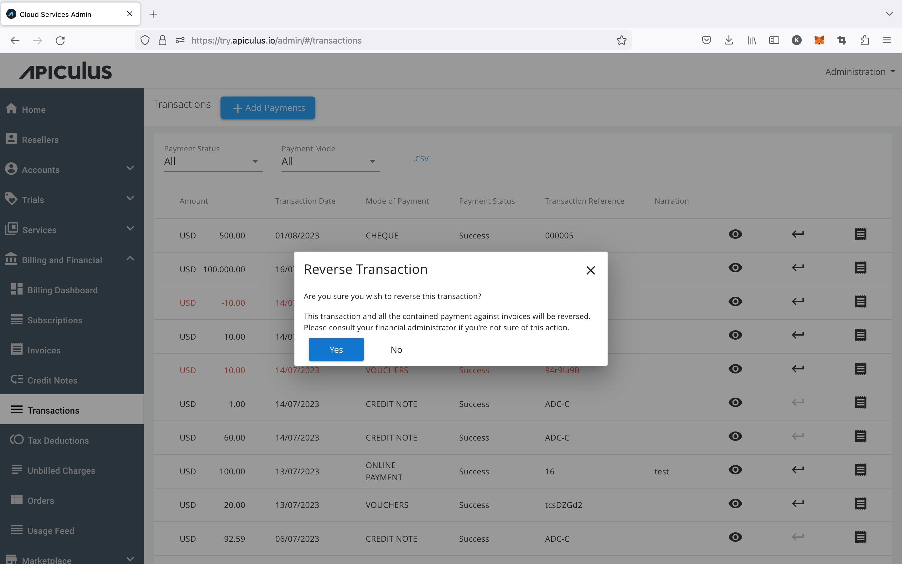

# Reversing Transactions

Transactions and payments, once received and recorded, can not be edited. In case of refunds or cancellations, a reverse entry must be made in the accounting books. All online and offline transactions (with the exception of credit notes) can be reversed by clicking on   (reverse icon) in an account-level or global transactions listing, or by clicking the **Reverse** icon while [viewing transaction details](ViewingTransactionDetails).

:::note 
Reverse transactions show in red colour in the transactions listing and show a negative (-) amount. All recorded [transactions are visible to subscribers/customers](/docs/Subscribers/AccountCentre/WalletandTransactions) in their Account Centre.
:::

