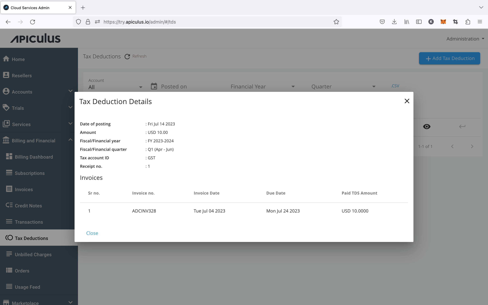

# Viewing Tax Deductions

You can view [tax deductions recorded quarterly](RecordingTaxDeductions) against historical invoices as per [fiscal period configurations](/docs/GettingStarted/BillingandFinancials/ConfiguringTaxDeductions). 

Click on  (Eye icon) on any account-level or global listing of tax deductions.

