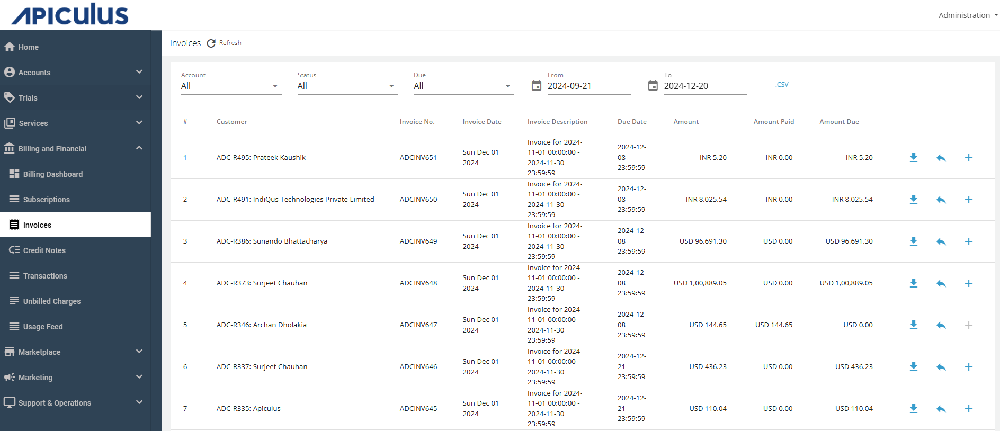
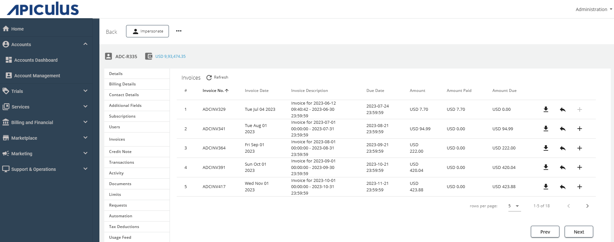

# Viewing and Downloading Invoices

You can view all invoices that are generated on the Apiculus system. Apiculus stores invoices as downloadable and printable .pdf files that are stored on the Apiculus management server(s) on the  service provider premises.

Invoices contain the following (blocks of) information:
- Invoice details (invoice ID, bill/due dates, payable amount)
- Customer and biller details
- Summary of charges (fixed, usage, total taxes, trial benefits)
- Charges and discount line items
- Trial benefit line items (if any)
- Other static information (for example, payment details, footnotes etc.)

You can download the invoices in the following ways:
- [Global Level](#global-level)
- [Account Level](#account-level)
## Global Level
1. Navigate to **Billing and Financials** > **Invoices**.
2. Click on    (download icon) to download the required invoice. 

## Account Level
1. Navigate to **Accounts** > **Account Management** > **Select Account** > **Edit Account** > **Subscriptions**.
2. Click on   (download icon) to download the required invoice. 

:::note
Apiculus allows complete customisation of the invoice template according to brand, local and national compliance requirements. For any invoice customisation request, a ticket may be raised to the Support support team.
:::
