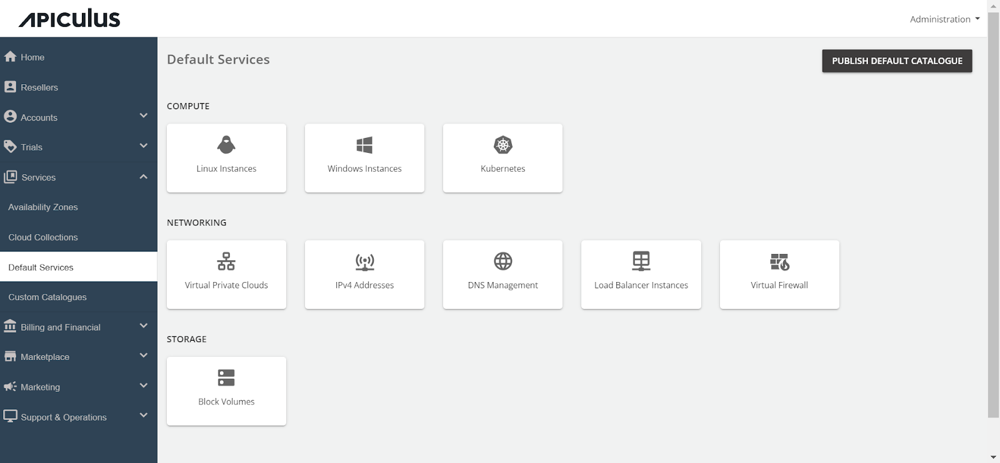

# Configuring IPv4 Addresses

Follow these steps to configure IPv4 Addresses :

1. Navigate to the **Default Services** in the primary menu.
2. Choose **IPv4 Addresses** within the **Compute** section.
3. Activate the switch at the top, indicating the availability of this service as part of the default services. All associated sections will become enabled.
4. Proceed to the **Availability section**. Select the desired availability zones from which you want to deliver the service to the end user, then click **Save & Update.**

5. Under the **Billing** section, select the **Billing Options**.
	- **Prorate on Entry**: Purchases will be pro-rated at the time of purchase of services.
	- **Prorate on Exit**: Removals will be pro-rated at the time of removal of services.
6. Select the **Billing Cycle** to be displayed to the subscribers: **Hourly**, **Monthly**, or **Both**.

6. IPv4 Addresses can be provisioned to an approval-based system within the Provisioning section. This is done by activating the Approval Required switch, offering additional functionalities such as sending custom instructions to end-users upon approval and attaching up to five files, each up to 3 MB.

Further, the _PRICING_ options include:

7. Click on the **IPv4 Addresses** to enable the switch for the Additional IPv4 Address for VPC networking and define the pricing that you want to offer to the end-user.

Finally, return to Default Services and click **PUBLISH DEFAULT CATALOGUE.**

