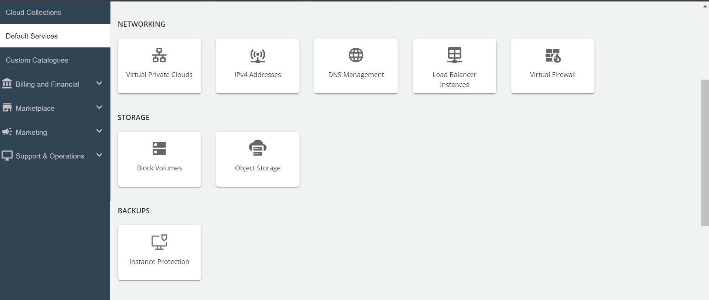
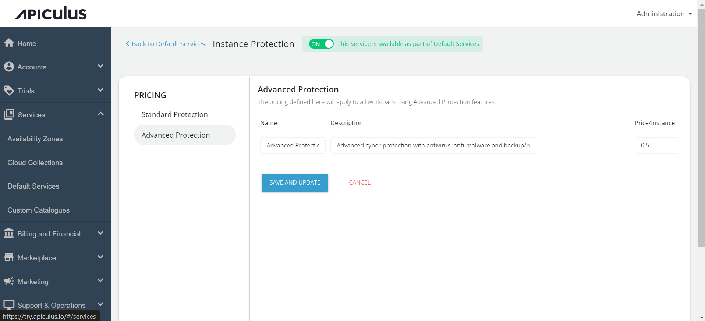

# Configuring Instance Protection

Instance protection safeguards virtual machine instances and workloads by creating backups using Acronis backup solutions.

To configure Instance Protection via the Default Services section, follow these steps:

1. Navigate to the Default Services in the primary menu.
2. Under Backups, select **Instance Protection**.
	
3. Activate the switch at the top, indicating the availability of this service as part of the default services. All associated sections will become enabled.
4. Click on the **Standard Protection** section and specify the price in GB/Mo as per your requirement in the standard protection section. This price will be displayed to the end-user and will be charged to them as per the usage.
	
5. Click on the **Advance Protection** section and specify the price per Instance as per your requirement in the advance protection section.
	
6. Click on **Save and Update** to save the changes you made.
	Finally, return to Default Services and select **PUBLISH DEFAULT CATALOGUE**.

