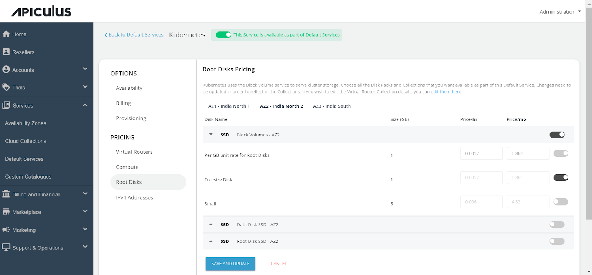

# Configuring Kubernetes Service

Follow the below steps to configure the Kubernetes Service:

1. Navigate to the Default Services in the primary menu.
2. Choose **Kubernetes** within the Compute section.

3. Activate the switch at the top (This service is available as part of default services). All associated sections will become enabled.
4. Proceed to the Availability section. Select the desired availability zones for offering the service, then click **Save & Update**.

5. Within the _Billing_ section, two options are available: 
	- Prorate on Entry
	- Prorate on Exit

6. Kubernetes service provisioning can be offered as an approval-based system from the Provisioning section. This is done by activating the Approval Required switch, offering additional functionalities such as sending custom instructions to end-users upon approval and attaching up to five files, each up to 3 MB.

Further, the PRICING options include:

- Click on **Virtual Routers** under the **Pricing** section, then select the **Availability Zone**. Enable the collections or specific packs within a collection, and specify the pricing for your selection.

- Access the **Compute** section, select **Availability Zone**.
- Enable the collections or specific packs within a collection, and specify the pricing for your selection.

- In the Root Disks section, select the **Availability Zone**. 
- Enable the collections or specific packs within a collection, and specify the pricing for your selection.

- In the IPv4 Addresses section, click on the **Availability Zone** and specify the pricing for the Default IPv4 address.

Finally, return to **Default Services** and select **PUBLISH DEFAULT CATALOGUE**.

