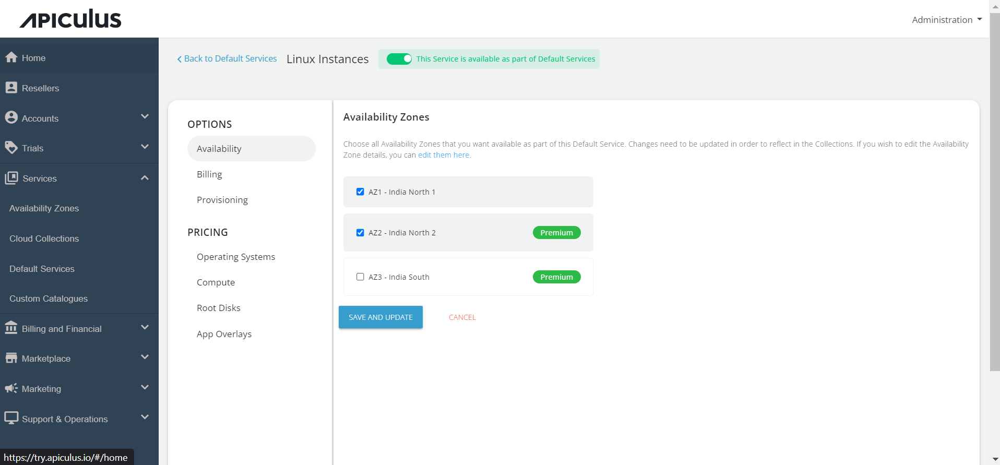
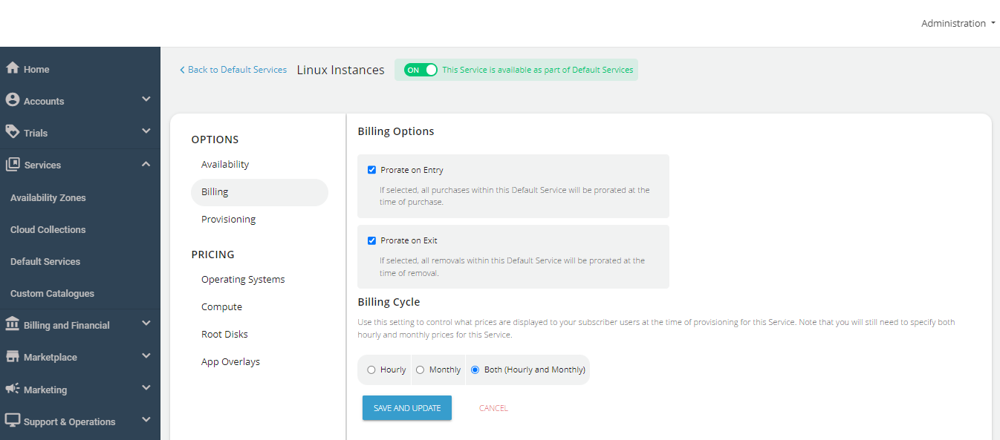
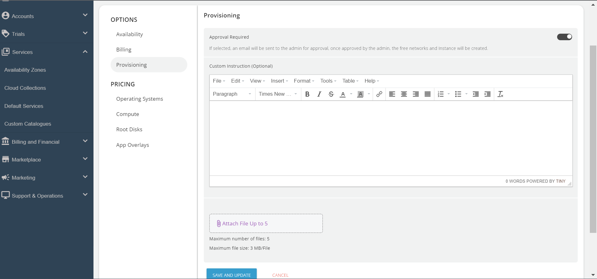
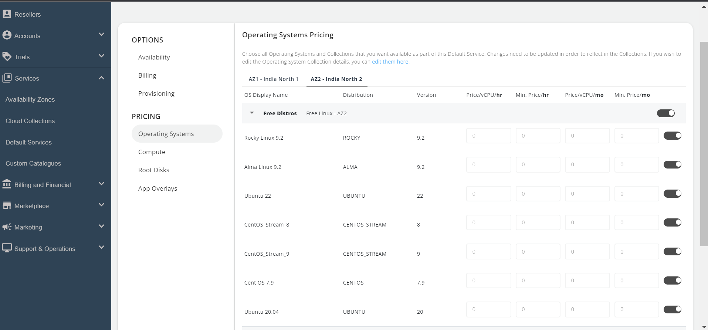
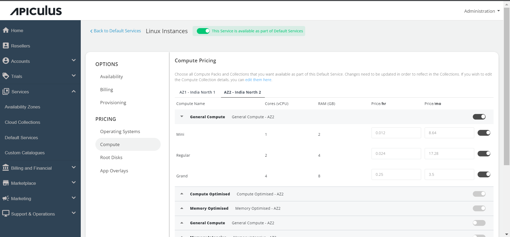
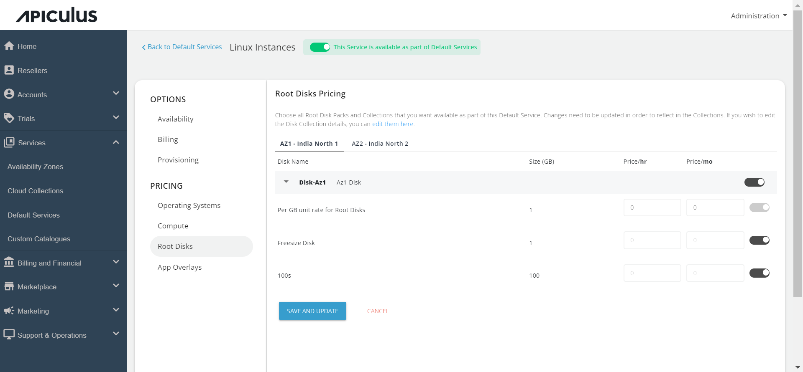
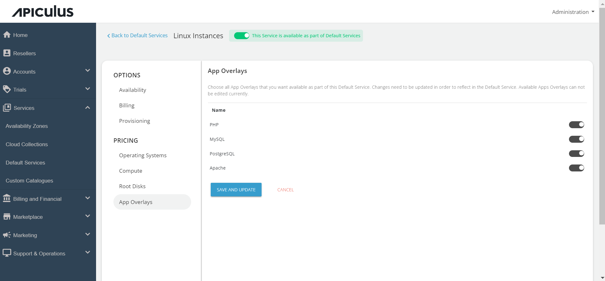
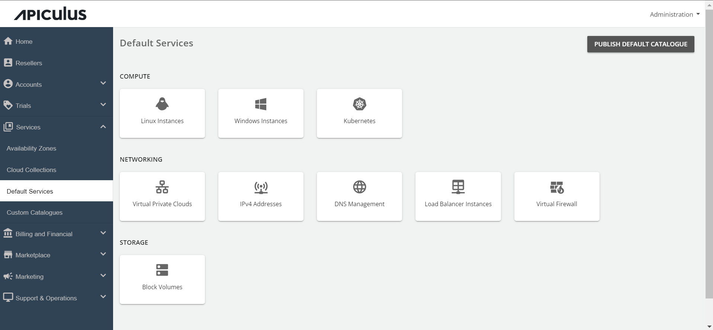

# Configuring Linux Instances

Follow these steps to configure Linux Instances:

1. Go to the **Default Services** in the primary navigation menu.

1. Select **Linux Instances** under the Compute section.
2. Turn on the switch at the top to make this service available as part of the default services. This action will enable all associated sections.
3. Move to the **Availability section**. Choose the availability zone from which you want to offer the service, then click **Save & Update**.

 

5. Under the **Billing** section, select the **Billing Options**.
	- **Prorate on Entry**: Purchases will be pro-rated at the time of purchase of services.
	- **Prorate on Exit**: Removals will be pro-rated at the time of removal of services.
6. Select the **Billing Cycle** to be displayed to the subscribers: **Hourly**, **Monthly**, or **Both**.
 

7. Linux Instances can be provisioned to an approval-based system within the **Provisioning** section. This is done by activating the "**Approval Required**" switch, offering additional functionalities such as sending custom instructions to end-users upon approval and attaching up to five files, each up to 3 MB.

7. Click on the **Operating System** under Pricing, click on the **Availability Zones**, and enable the particular packs inside the collections.

8. Click on the **Compute section**, click on the **Availability Zone**, and enable the compute pack of the specific collection you want to offer to the end user.

9. In the **Root Disks** section, select the availability zone and enable packs for the designated collection.

10. Under the **App Overlays** section, select all the apps that you want to provide as part of the default service to the end-users during the deployment of the Linux instance.

11. Return to the Default Services and click **PUBLISH DEFAULT CATALOGUE**.

 
