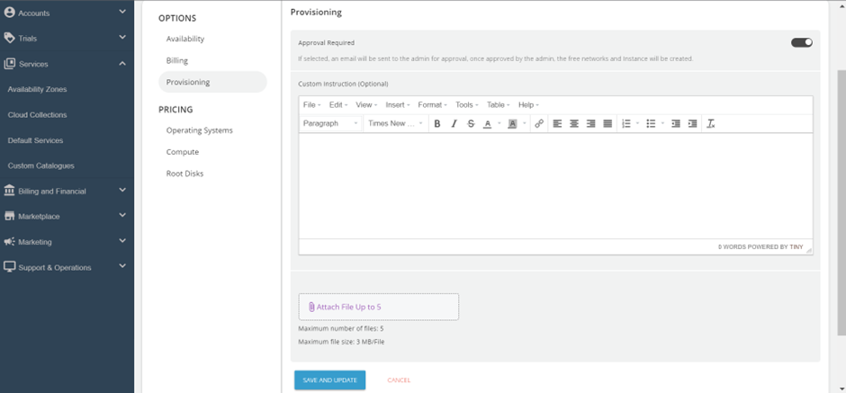
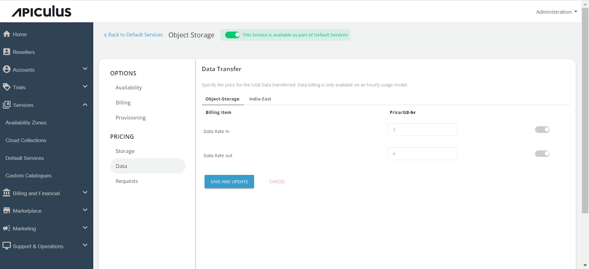

# Configuring Object Storage

Admins can configure the Object storage from the services section. To configure the Object Storage service, follow these steps:
1. Go to the **Default Services** in the primary navigation menu.
2. Select **Object Storage** under the **Storage** section.
3. Enable the switch present at the top, that is, **This service is available as part of default services**. All the sections will be enabled.
4. Under the Availability section, select the **Availability Zones** where you want to offer the service. Then, click on **Save and Update**.
	
5. Under the **Billing** section, select the **Billing Options**.
	- **Prorate on Entry**: Purchases will be pro-rated at the time of purchase of services.
	- **Prorate on Exit**: Removals will be pro-rated at the time of removal of services.
6. Select the **Billing Cycle** to be displayed to the subscribers: **Hourly**, **Monthly**, or **Both**.
	
6. Click on the **Provisioning** section to offer the Object Storage service as approval-based. Enable the approval required switch. Enabling the switch, you will get two more options, that is, Custom instructions that you want to send to the end user upon approval; you can also attach a maximum of five files up to three MB. 
	
7. Click on the **Storage** under **Pricing**.
8. Click on the AZ, and specify the pricing in GB/hr. 
	
9. Click on the **Data** section, click on the **Availability Zone**, and specify the pricing in GB/hr for both Data Rate in and Data Rate out.
	
10. Click on the **Requests** section, select the availability zone, and specify the pricing for the following:
    a. HTTP requests GET/HEAD
    b. HTTP requests PUT/POST
    c. HTTP requests DELETE
	 Return to the Default Services and click on **PUBLISH DEFAULT CATALOGUE**.
	
