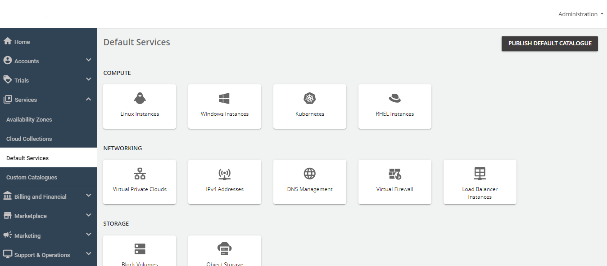
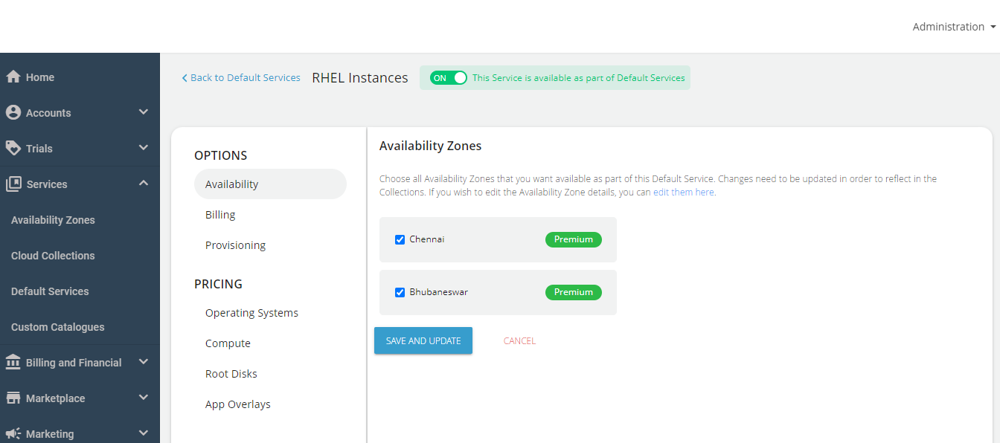
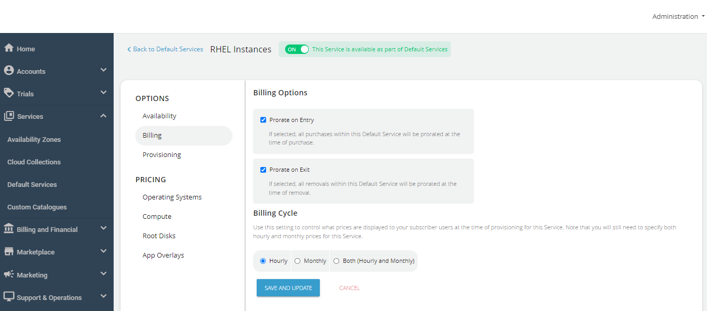
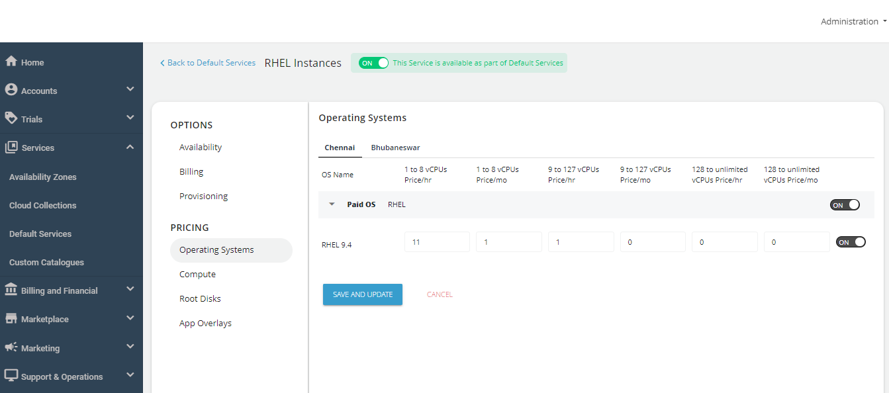
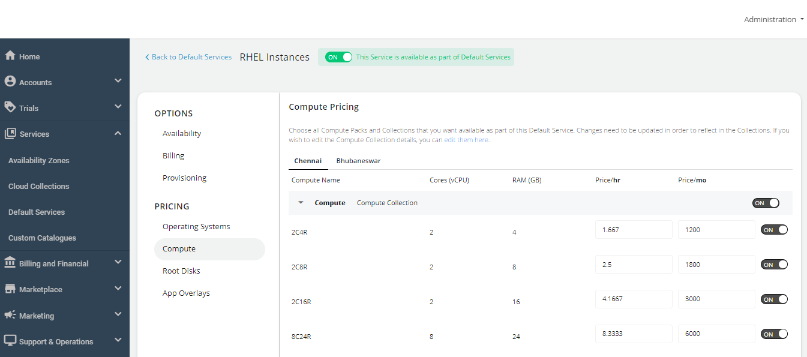
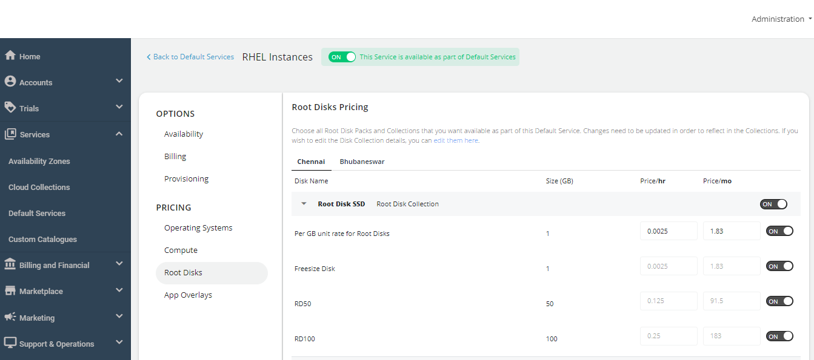
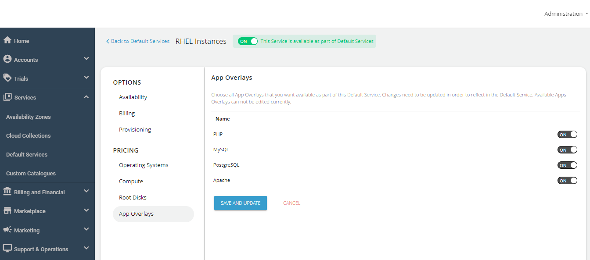

# Configuring RHEL Instances

Red Hat Enterprise Linux (RHEL) pricing model is based on virtual CPU (vCPU) core slabs. You can configure pricing per Red Hat’s standard core model, which includes:
- 1-8 vCPUs
- 9-128 vCPUs
- 129+ vCPUs

Follow these steps to configure RHEL Instances:

1. Click **Default Services**.
2. Under the **Compute** section, click **RHEL Instances**.
 

4. Turn on the toggle button at the top to make this service available as part of the default services. This action will enable all associated sections.
5. Under the **Availability** section, select the availability zone(s) from which you want to offer the service. Then, click **Save and Update**.
 
5. Under the **Billing** section, select the **Billing Options**.
	- **Prorate on Entry**: Purchases will be pro-rated at the time of purchase of services.
	- **Prorate on Exit**: Removals will be pro-rated at the time of removal of services.
6. Select the **Billing Cycle** to be displayed to the subscribers: **Hourly**, **Monthly**, or **Both**.
 

7. You can provision the RHEL Instances to an approval-based system within the **Provisioning** section. To do so, turn on the **Approval Required** toggle button to offer additional functionalities such as sending custom instructions to end-users upon approval and attaching up to five files, each up to three MB.

7. Under the **Operating Systems** section, click on Availability Zones, and enable the required packs inside the collections.

8. Under the **Compute** section, click on  Availability Zones, and enable the compute pack of the specific collection you want to offer to the end user.

9. Under the **Root Disks** section, click on Availability Zones and enable packs for the designated collection.

10. Under the **App Overlays** section, select all the apps that you want to provide as part of the default service to the end-users during the deployment of the RHEL instance.

11. Return to the Default Services, and click **PUBLISH DEFAULT CATALOGUE**.
 
