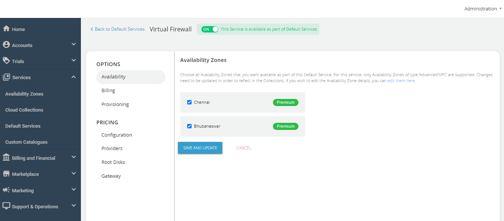
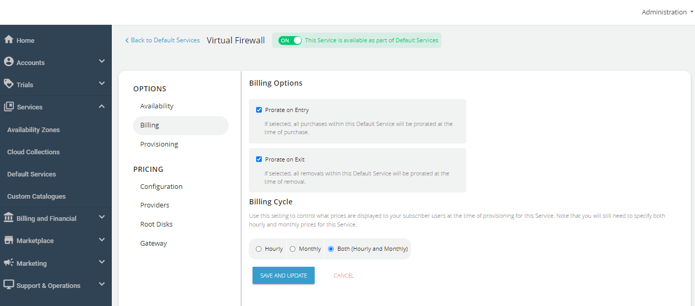
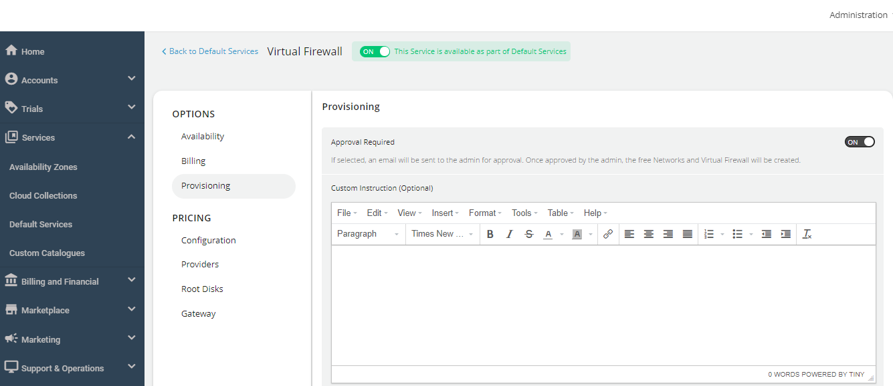
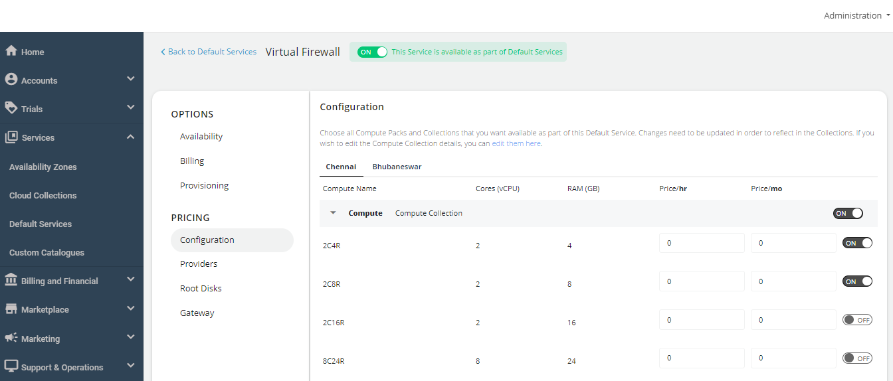
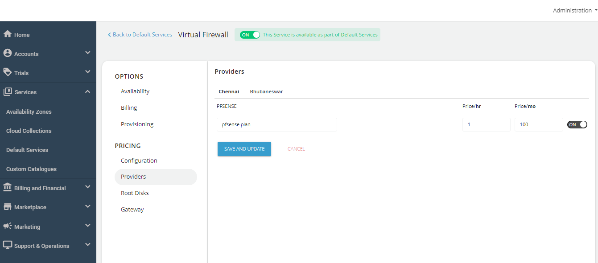
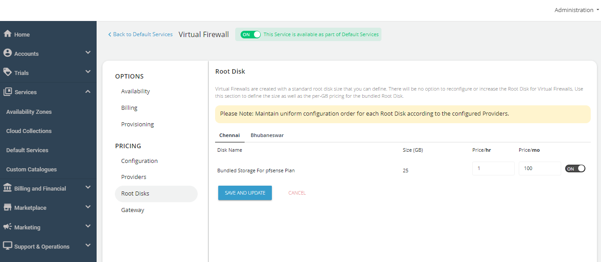
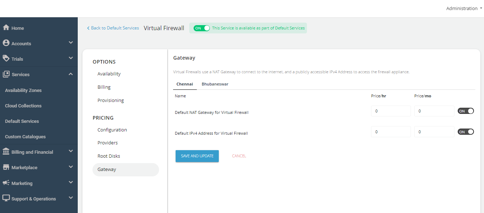

# Configuring Virtual Firewall Instances

Follow these steps to configure Virtual Firewall Instances:

1. Navigate to **Services** > **Default Services**.
2. Under **Networking**, select **Virtual Firewall**.
3. Turn on the toggle switch at the top to make this service available as part of the default services. This action will enable all associated sections.
4. Under **Availability Zones**, select the availability zone from which you want to offer the service, then click **Save and Update**.

5. Under the **Billing** section, select the **Billing Options**.
	- **Prorate on Entry**: Purchases will be pro-rated at the time of purchase of services.
	- **Prorate on Exit**: Removals will be pro-rated at the time of removal of services.
6. Select the **Billing Cycle** to be displayed to the subscribers: **Hourly**, **Monthly**, or **Both**.

6. To provision, Virtual Firewall Instances to an approval-based system, navigate to **Provisioning** and turn on the **Approval Required** toggle button. Additionally, you can send custom instructions to end-users upon approval and attach up to five files, each up to three MB.

The PRICING options include the following:

- Navigate to the **Configuration** section, select the **Availability Zone**, and enable the desired compute packs for the end-users.

- Navigate to the **Providers** section, select the **Availability Zone**, and activate both providers—**pfSense and Fortinet** based on your requirement. Specify the descriptions and then establish the pricing accordingly.

- Navigate to the **Root Disks** section, select the **Availability Zone** and enable packs for the designated collection.

- Navigate to the **Gateway** section, select the **Availability Zone**, and and define the pricing for the NAT gateway and IPv4 address.

Finally, return to Default Services and click on **PUBLISH DEFAULT CATALOGUE**.
