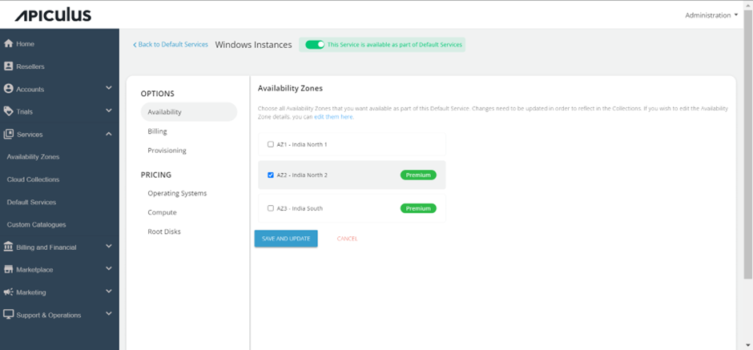
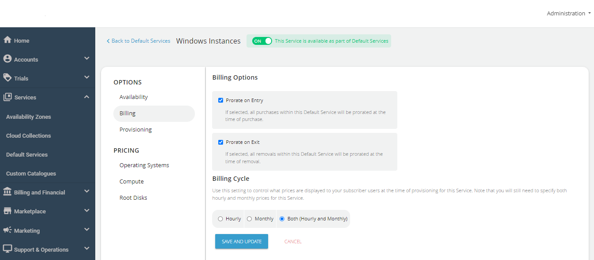
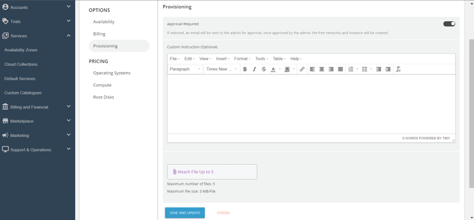
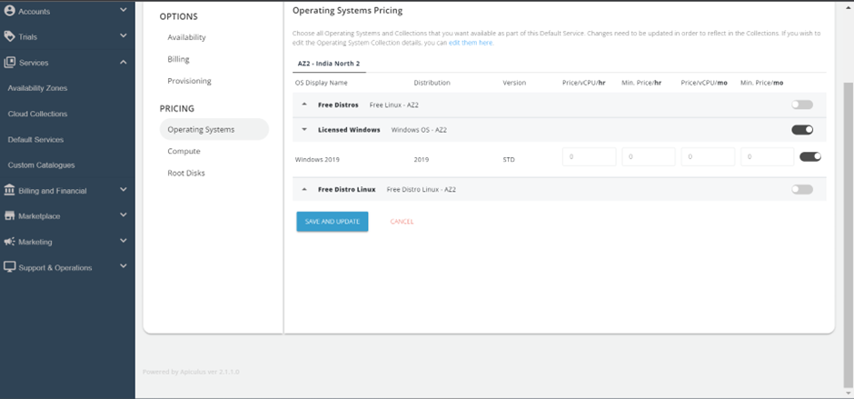
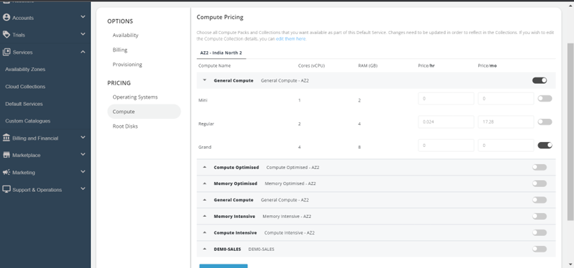
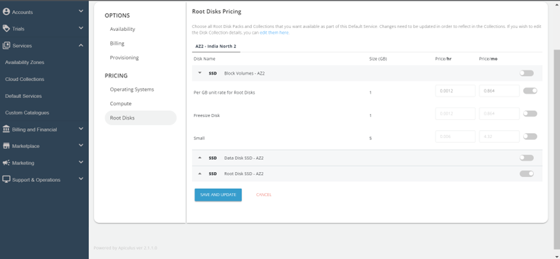
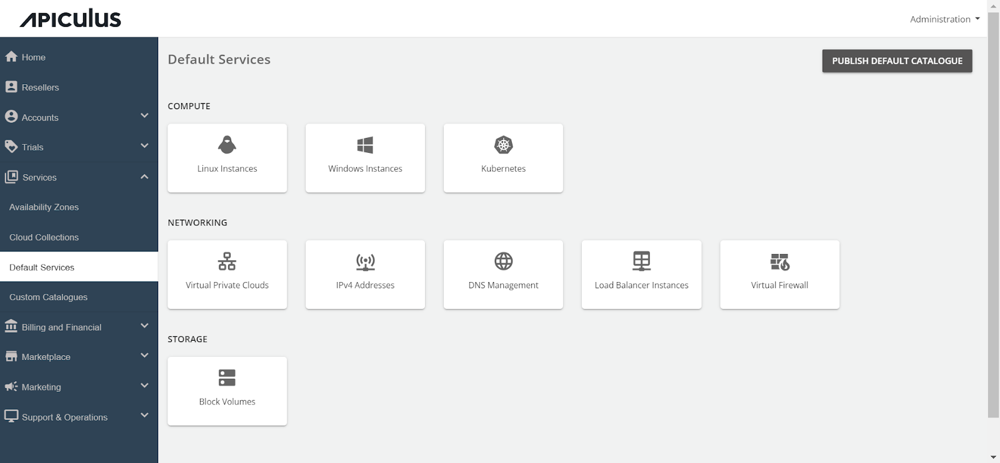

# Configuring Windows Instances

Follow these steps to configure Windows Instances :

1. Go to the **Default Services** in the primary navigation menu.
2. Select **Windows Instances** under the Compute section.
3. Turn on the switch at the top to make this service available as part of the Default Services. This action will enable all associated sections.
4. Move to the **Availability section**. Choose the availability zone from which you want to offer this service, then click **Save & Update.**

5. Click on the **Billing section**; the following two options will be listed: Prorate on Entry and Prorate on Exit.

6. Windows Instances can be provisioned to an approval-based system within the **Provisioning** section. This can be done by activating the **Approval required** switch, offering additional functionalities such as sending custom instructions to end-users upon approval and attaching up to five files, each up to 3MB. 

7. Click on the **Operating System** under Pricing; click on the **Availability Zone**, and enable the particular packs inside the collections.

8. Click on the **Compute** section; click on the **Availability Zone** and enable the compute pack of the specific collection and define the pricing that you want to offer to the end user.

9. In the **Root Disks section**, select the availability zone and enable the packs for the designated collection.

10. Return to the Default Services and click **PUBLISH DEFAULT CATALOGUE**.

