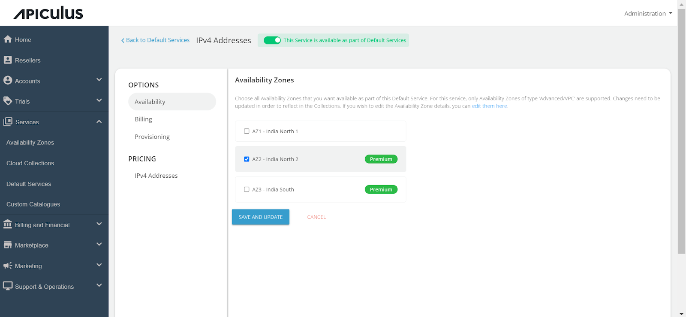

# Configuring IPv4 Addresses

Follow these steps to configure IPv4 Addresses:

1. Navigate to the **Default Services**.   
2. Under **Networking**, select **IPv4 Addresses**.
3. Activate the switch at the top, indicating the availability of this service as part of the default services. All associated sections will become enabled.
4. Proceed to the **Availability section**. Select the desired availability zones from which you want to deliver the service to the end user, then click **Save and Update.**   
5. Under the **Billing** section, select the **Billing Options**.   
	- **Prorate on Entry** - Purchases will be pro-rated at the time of purchase of services.
	- **Prorate on Exit** - Removals will be pro-rated at the time of removal of services.
6. Select the **Billing Cycle** to be displayed to the subscribers: **Hourly**, **Monthly**, or **Both**.
7. You can provision IPv4 Addresses to an approval-based system within the **Provisioning** section. You can do this by activating the **Approval Required** switch for offering additional functionalities such as sending custom instructions to end-users upon approval and attaching up to five files, each up to three MB.
   
8. Click on the **IPv4 Addresses** and enable the **Additional IPv4 Addresses Pricing** switch and define the pricing that you want to offer to the end-user.
	
9. Finally, return to Default Services and click **PUBLISH DEFAULT CATALOGUE.**
	

