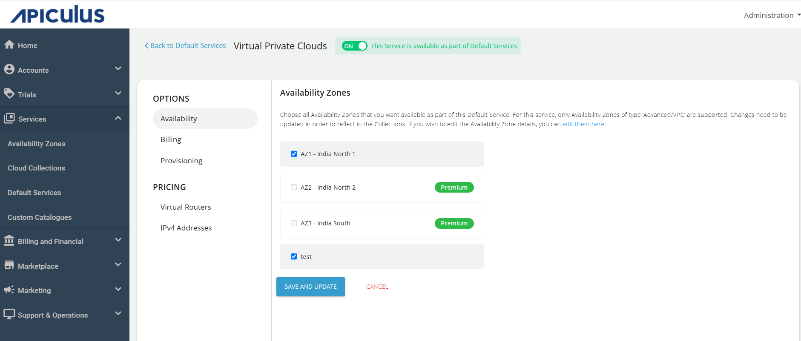
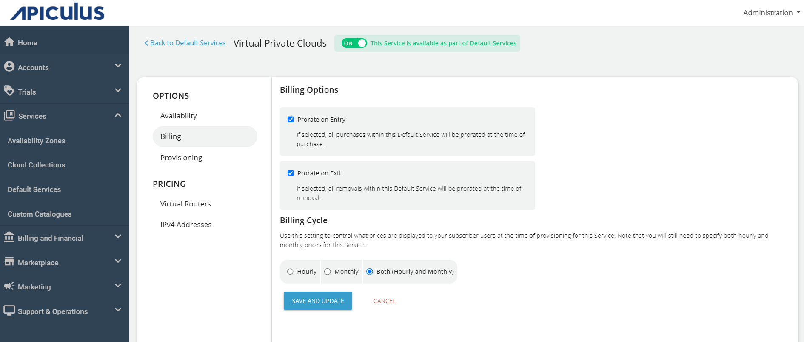
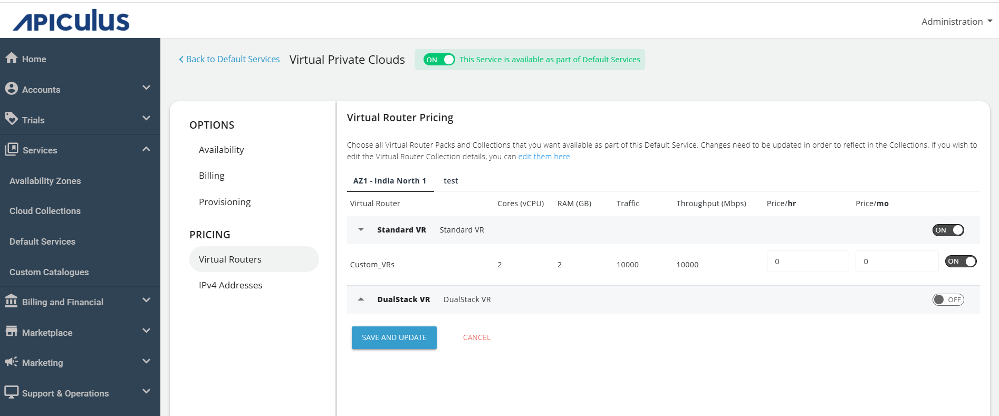
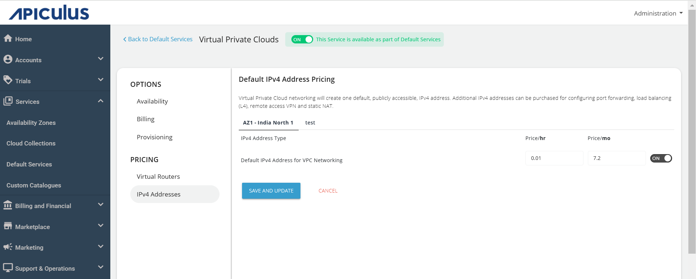
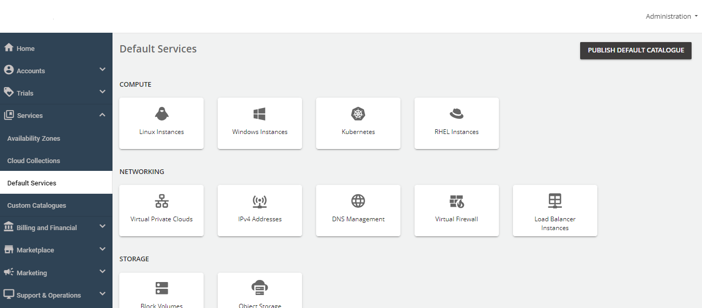

# Configuring Virtual Private Clouds

A Virtual Private Cloud (VPC) is an isolated network inside a public cloud that allows organizations to manage their own network. The Default Services provide various options and pricing that help administrators to customize the configurations.

To configure Virtual Private Clouds, follow these steps:

1. Navigate to **Services** > **Default Services**.
2. Under **Networking**, click **Virtual Private Cloud**s.
	
3. Turn on the toggle switch at the top to make this service available as part of the default services. This action will enable all associated sections.
4. Under the **Availability** section, select the availability zone from which you want to offer the service, then click **Save and Update**.
5. Under the **Billing** section, select the **Billing Options**.
	- **Prorate on Entry** - Purchases will be pro-rated at the time of purchase of services.
	- **Prorate on Exit** - Removals will be pro-rated at the time of removal of services.
6. Select the **Billing Cycle** to be displayed to the subscribers: **Hourly**, **Monthly**, or **Both** and click **SAVE AND UPDATE**.
	
7. To provision Virtual Private cloud to an approval-based system, navigate to **Provisioning** and turn on the **Approval Required** toggle button. Additionally, you can send custom instructions to end-users upon approval and attach up to five files, each up to three MB.
	![[VPC3.png]]
 8. Navigate to the **Virtual Routers**, and select all Virtual Router Packs and collections that you want to available as part of default service. To update the details of virtual Router Collection, edit the changes as per your requirement and click **SAVE AND UPDATE**.
	
9.  The VPC networking creates one default, publicly accessible IPV4 address.
   :::note
   You can purchase additional IPV4 addresses for configuring port forwarding, load balancing(L4), remote access VPN and Static NAT.
   :::
	

10. Finally, return to **Default Services** and select **PUBLISH DEFAULT CATALOGUE**.
	