# Managing Quick Plans
The following are the tasks required to configure and manage quick plans:
1. [Set up a Quick Plan Category](#setting-up-a-quick-plan-category)
2. [Create Quick Plans](#setting-up-a-quick-plan-category)
3. [Add Quick Plans to a Catalogue](#adding-quick-plans-to-a-catalogue)
---
## Setting Up a Quick Plan Category

Creating a Quick Plan starts with setting up a Quick Plan Category, which helps in organising the quick plans. 

Follow these steps to create a category:

1. Log in to the **Admin Portal**. Ensure that you have the appropriate permissions to manage Quick Plans.
2. Navigate to **Administration** > **Settings** to configure various administrative tasks, including Quick Plans.
3. Under the **Financials & Business** section, click **Quick Plans** to manage and create Quick Plan categories.
4. Click the **+ADD NEW** button located at the top right of the Quick Plans page. 
   
	The Add Quick Plan Category window appears where you can enter the details for the new category.
	
1. Enter a meaningful name for the **Plan Category** that clearly describes the type of plans it will contain. Then, click **Add**.
	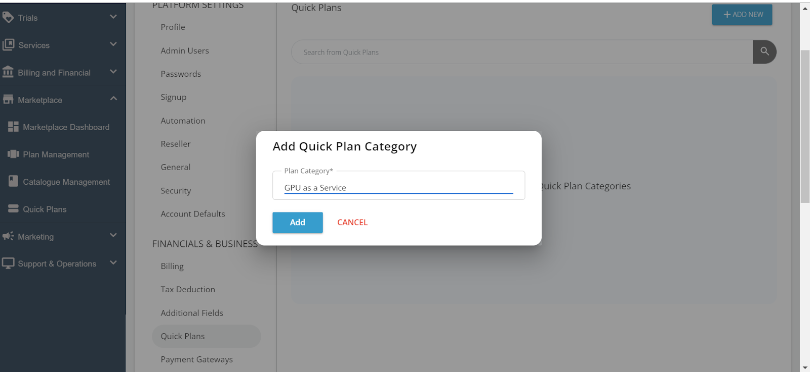

5. Repeat as needed. You can create multiple categories to organise different types of Quick Plans. Each category will help users find the Quick Plans relevant to their needs more easily.      
  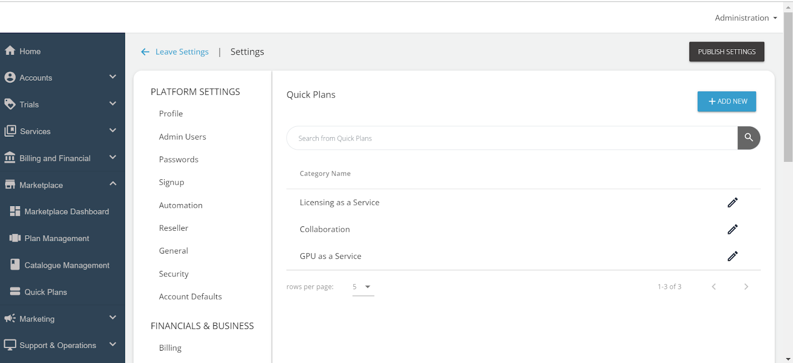

## Creating Quick Plans

After setting up your categories, the next step is to create the Quick Plans. Quick Plans are pre-configured service packages that users can purchase. 

Follow these steps to create a Quick Plan:

1. Navigate to **Marketplace** and select **Quick Plans**.
  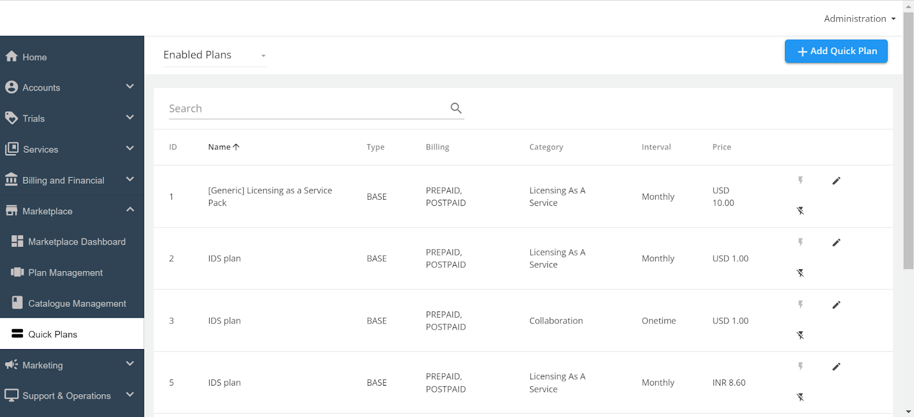

2. Click the **+Add Quick Plan** button at the top right of the Quick Plans page. This action will open a new page with a few sections that you need to complete.

The creation process is divided into five key sections.
- [Details Section](#details-section)
- [Components Section](#components-section)
- [Customer Input Section](#customer-input-section)
- [Access Fields Section](#access-fields-section)
- [Customer Communication Section](#customer-communication-section)

### Details Section

The Details section gathers the basic details about the Quick Plan.
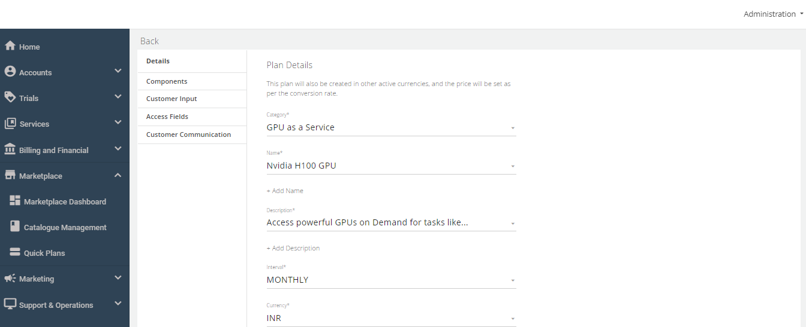
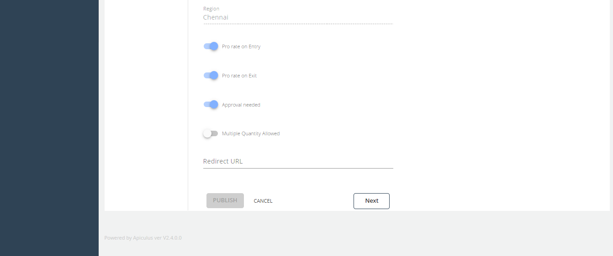

1. **Category** - Select one of the previously created categories from the drop-down menu. The Quick Plan will be listed under this category for users.
2. **Name** - Click **+Add Name** to enter a descriptive name for the Quick Plan.
3. **Description** - Click **+Add Description** to provide details about what the Quick Plan offers.
4. **Interval** - Select whether the Quick Plan is billed **Monthly** or **One-time**. This determines how the user will be charged.
5. **Currency** - If multiple currencies are supported in your cloud environment, choose the appropriate one from the drop-down menu.
6. **Region** - Select the Region.  
7. **Pro-rate on Entry** - Enable this option if you want to bill the user from the date of purchase rather than from the beginning of the billing month.
8. **Pro-rate on Exit** - Enable this option if you want to bill the user only for the days they used the Quick Plan, rather than until the end of the billing month.
9. **Approval Needed** - Enable this if the Quick Plan requires admin approval before it becomes active. When enabled, an email notification will be sent to admins, and the Quick Plan will only activate after the admin approval.
10. **Multiple Quantity Allowed** - Enable this option if you want to let users purchase multiple quantities of the Quick Plan. The number of subscriptions generated will correspond to the quantity selected by the user.
11. **Redirect URL** - Specify that URL if you want users to be redirected to a specific URL.
12. Click the **Next** button to proceed to the Components section.

### Components Section

The Components section allows you to define the components of the Quick Plan, which can include different service or feature bundled in the plan.
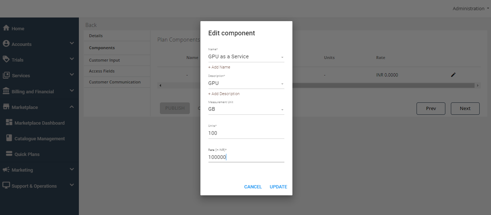

1. **Name** - Click the pencil icon to edit the component name, then click **+Add Name** to enter the name of the component.
2. **Description** - Click **+Add Description** to provide details about what this component includes.
3. **Measurement Unit** - Select a measurement unit from the dropdown list (e.g., GB, MB, Number, Count). If the required unit isn’t available, select **None/Other**.
4. **Units** - Specify the number of units included in this component (e.g., 10 GB of storage).
5. **Rate** - Enter the price per unit of this component. This is the amount the user will be charged for each unit they consume.
6. Click **Update** to save the information, then click **Next** to move to the Customer Input section.

### Customer Input Section

In the Customer Input section, you can create custom fields to capture specific information from the customer when they purchase or provision the Quick Plan.
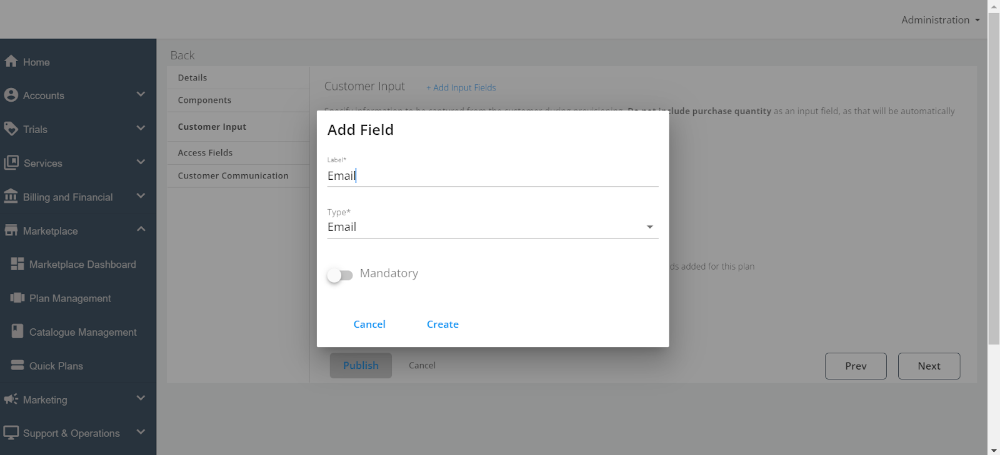

1. **Add Input Fields** - Click **+Add Input Fields** to open a window where you can create a new field.
	- **Field Name** - Enter the name of the field (e.g., Email, Org Name).
	- **Field Type** - Select the type of field (options include Email, Password, URL, and Text).
	- **Mandatory Field** - Indicate whether this field is mandatory for the user to fill out.
2. You can add multiple fields if needed to gather all the required information from the user.
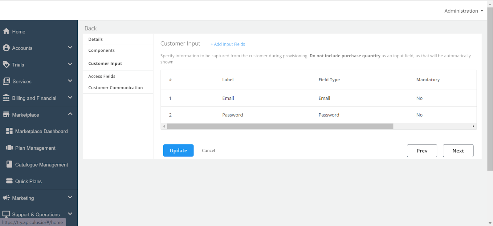
:::note
The Customer Input section is not mandatory. You can create these fields depending on the requirement.
:::
### Access Fields Section

The Access Fields section is used to create fields that will pass information to the end user, such as keys or codes required for accessing the service.
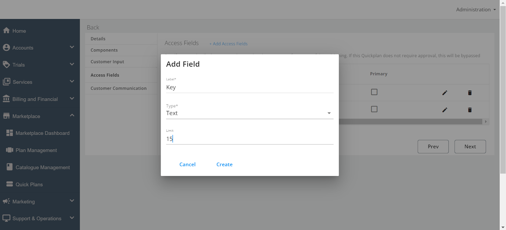
1. **Add Access Fields** - Click **+Add Access Fields** to open a popover where you can create these fields.
	- **Field Name** - Enter the name of the field (e.g., "License Key").
	- **Field Type** - Choose the appropriate type for the field (Email, Password, URL, or Text).
	- **Field Limit** - Set a limit if needed (e.g., character limit for a code).
	- **Primary Field** - You can designate a field as primary if it’s the most important piece of information.
2. Multiple access fields can be added and managed as necessary. You can also delete or update fields after they’ve been created.      
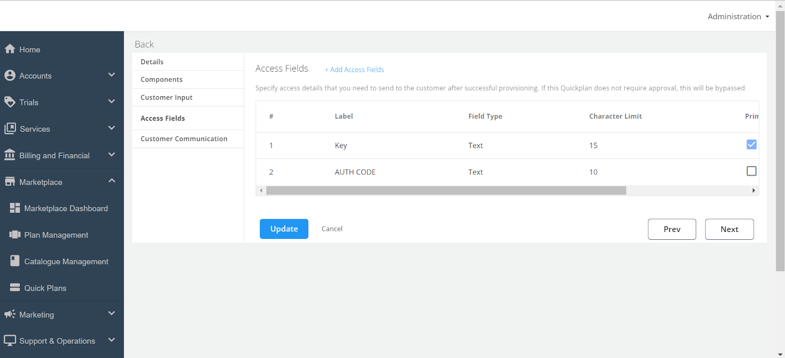

### Customer Communication Section

This Customer Communication section allows you to customise the email communication sent to customers when the Quick Plan is provisioned.
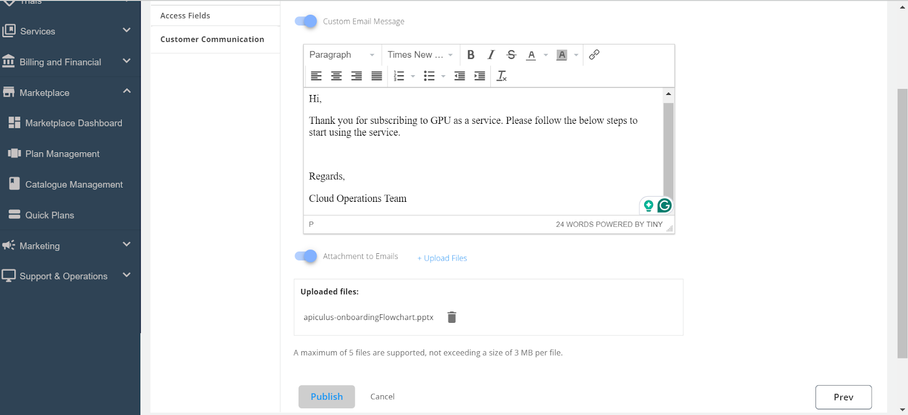

1. **Custom Email Message** - Enable this switch if you want to send a custom message along with the system-generated provisioning email.
2. **Email Text** -  Enter the text you want to send, or you can copy and paste the message from another source.
3. **Attachment to Emails** - Enable this switch if you want to include attachments in the email. Click **+Upload Files** to select and upload files from your system.
4. After entering the necessary information, click the **Publish** button to finalise and make the Quick Plan available.

## Adding Quick Plans to a Catalogue

Once you’ve created your Quick Plans, you need to add them to all the catalogues that are present so that the quick plan is available for the end users to purchase. Here’s how:

1. Edit the **Existing Catalogue**.
    - In the Admin portal, locate the catalogue you want to update. Click on the pencil icon next to the catalogue name to open it for editing.
      

2. Add **Quick Plans to the Catalogue**.
    - Navigate to the "Plan" section within the catalogue editor. Click the **+Add More Quick Plans** button to open a list of available Quick Plans.
    - Select the Quick Plans you want to add to this catalogue. You can select multiple plans if necessary.
      

	- Click the **Add** button to include these plans in the catalogue.
1. Sync the **Catalogue**.

After adding the Quick Plans, it’s crucial to synchronise the catalogues to ensure the plans are visible to end users. Click the **Sync Catalogues** button at the top of the page.

Once the synchronization is complete, the newly added Quick Plans will be available for purchase by end users.