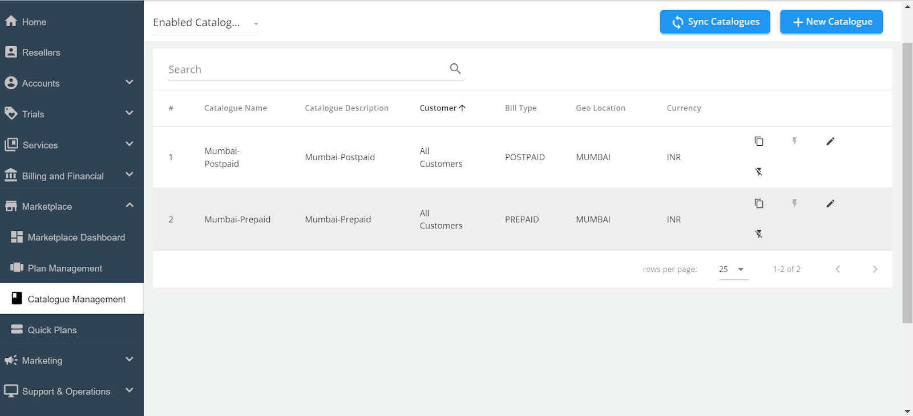
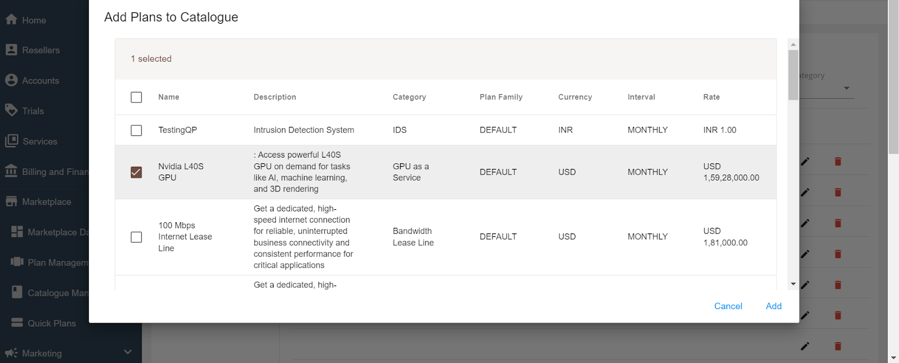

# Adding Quick Plans to a Catalogue

Once you’ve created your Quick Plans, you need to add them to all the catalogues that are present so that the quick plan is available for the end users to purchase. Here’s how:

1. Edit the **Existing Catalogue**.
    - In the Admin portal, locate the catalogue you want to update. Click on the pencil icon next to the catalogue name to open it for editing.
      

2. Add **Quick Plans to the Catalogue**.
    - Navigate to the "Plan" section within the catalogue editor. Click the **+Add More Quick Plans** button to open a list of available Quick Plans.
    - Select the Quick Plans you want to add to this catalogue. You can select multiple plans if necessary.
      

	- Click the **Add** button to include these plans in the catalogue.
1. Sync the **Catalogue**.

After adding the Quick Plans, it’s crucial to synchronise the catalogues to ensure the plans are visible to end users. Click the **Sync Catalogues** button at the top of the page.

Once the synchronization is complete, the newly added Quick Plans will be available for purchase by end users.