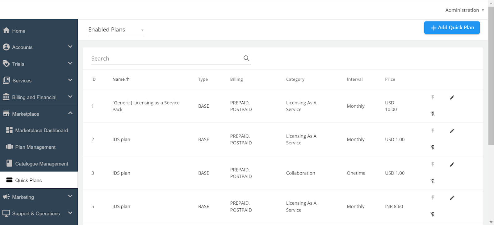
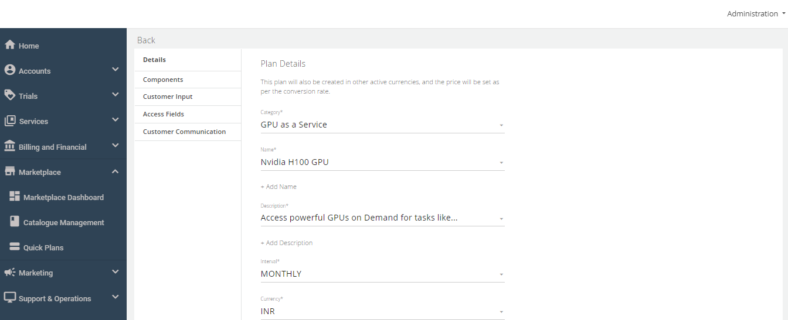
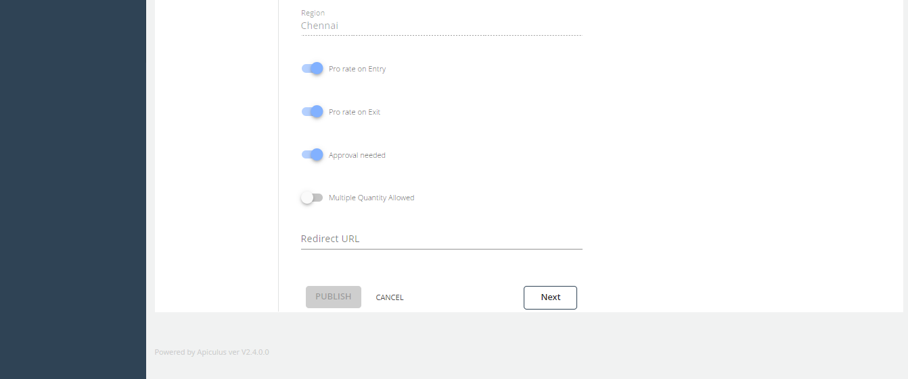
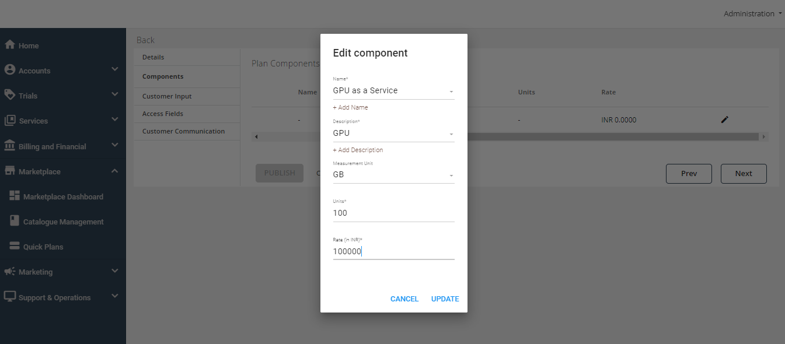
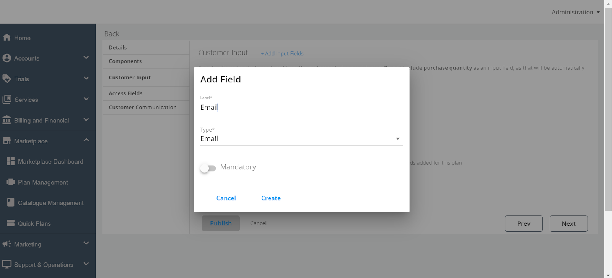
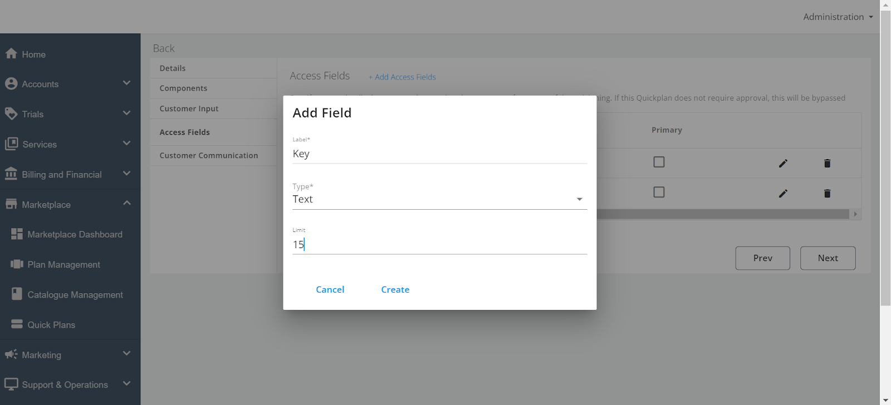
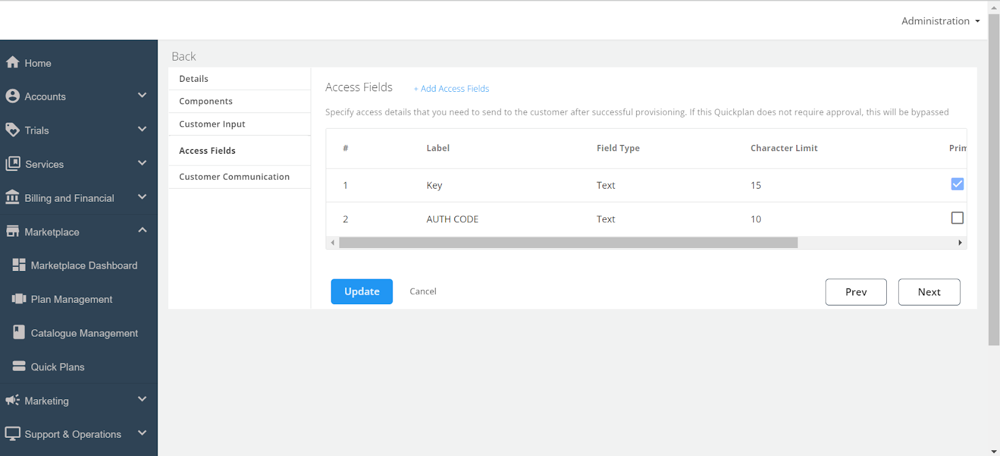

# Creating Quick Plans

After setting up your categories, the next step is to create Quick Plans. Quick Plans are pre-configured service packages that users can purchase. 

Follow these steps to create a Quick Plan:

1. Navigate to **Marketplace**, and click **Quick Plans**.
  

2. Click the **+Add Quick Plan** button at the top right of the Quick Plans screen. A new page opens where you need to provide additional details.

The creation process is divided into five key sections.
- [Details](#details)
- [Components](#components)
- [Customer Input](#customer-input)
- [Access Fields](#access-fields)
- [Customer Communication](#customer-communication)

## Details

The Details section gathers the basic details about the Quick Plan.

1. **Category** - Select one of the previously created categories from the drop-down menu. The Quick Plan will be listed under this category for users.
2. **Name** - Click **+Add Name** to enter a descriptive name for the Quick Plan.
3. **Description** - Click **+Add Description** to provide details about what the Quick Plan offers.
4. **Interval** - Select whether the Quick Plan is billed **Monthly** or **One-time**. This determines how the user will be charged.
5. **Currency** - If multiple currencies are supported in your cloud environment, choose the appropriate one from the drop-down menu.
6. **Region** - Select the Region.  
7. **Pro-rate on Entry** - Enable this option if you want to bill the user from the date of purchase rather than from the beginning of the billing month.
8. **Pro-rate on Exit** - Enable this option if you want to bill the user only for the days they used the Quick Plan, rather than until the end of the billing month.
9. **Approval Needed** - Enable this if the Quick Plan requires admin approval before activation. When enabled, an email notification will be sent to admins, and the Quick Plan will only activate after the admin approval.
10. **Multiple Quantity Allowed** - Enable this option if you want to let users purchase multiple quantities of the Quick Plan. The number of subscriptions generated will correspond to the quantity selected by the user.
11. **Redirect URL** - Specify that URL if you want users to be redirected to a specific URL.
12. Click the **Next** button to proceed to the Components section.

## Components

The Components section allows you to define the components of the Quick Plan, which can include different service or feature bundled in the plan.

1. **Name** - Click the pencil icon to edit the component name, then click **+Add Name** to enter the name of the component.
2. **Description** - Click **+Add Description** to provide details about what this component includes.
3. **Measurement Unit** - Select a measurement unit from the dropdown list for example, GB, MB, Number, Count). If the required unit isn’t available, select **None/Other**.
4. **Units** - Specify the number of units included in this component (for example, 10 GB of storage).
5. **Rate** - Enter the price per unit of this component. This is the amount the user will be charged for each unit they consume.
6. Click **Update** to save the information.
7. Click **Next** to move to the Customer Input section.

## Customer Input

In the Customer Input section, you can create custom fields to capture specific information from the customer when they purchase or provision the Quick Plan.

1. **Add Input Fields** - Click **+Add Input Fields** to open a window where you can create a new field.
	- **Field Name** - Enter the name of the field (for example, Email, Org Name).
	- **Field Type** - Select the type of field (options include Email, Password, URL, and Text).
	- **Mandatory Field** - Indicate whether this field is mandatory for the user to fill out.
2. You can add multiple fields if needed to gather all the required information from the user.

:::note
The Customer Input section is not mandatory. You can create these fields depending on the requirement.
:::
## Access Fields

The Access Fields section is used to create fields that will pass information such as keys or codes required for accessing the service to the end user.

1. **Add Access Fields** - Click **+Add Access Fields** to open a popover where you can create these fields.
	- **Field Name** - Enter the name of the field (for example, License Key).
	- **Field Type** - Choose the appropriate type for the field (Email, Password, URL, or Text).
	- **Field Limit** - Set a limit if needed (for example, character limit for a code).
	- **Primary Field** - You can designate a field as primary if it is the most important piece of information.
2. Multiple access fields can be added and managed as necessary. You can also delete or update fields after they have been created.      

## Customer Communication

This Customer Communication section allows you to customise the email communication sent to customers when the Quick Plan is provisioned.

1. **Custom Email Message** - Enable this switch if you want to send a custom message along with the system-generated provisioning email.
2. **Email Text** - Enter the text you want to send, or you can copy and paste the message from another source.
3. **Attachment to Emails** - Enable this switch if you want to include attachments in the email. Click **+Upload Files** to select and upload files from your system.
4. After entering the necessary information, click the **Publish** button to finalise and make the Quick Plan available.

