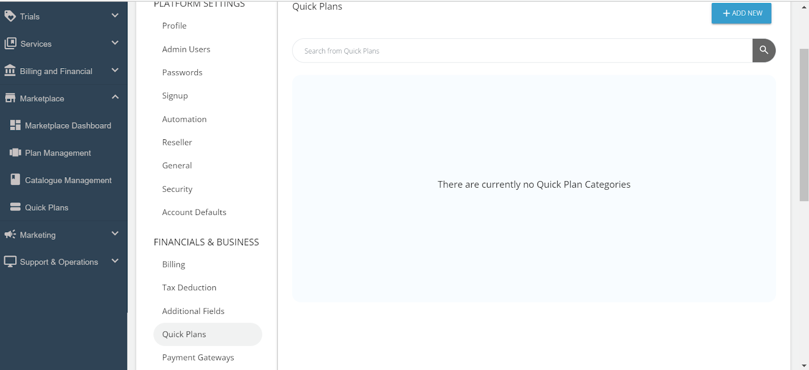
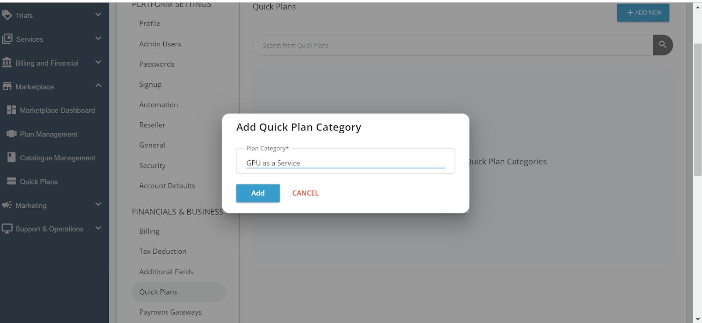
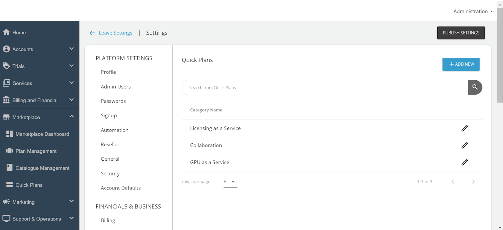

# Setting Up a Quick Plan Category

Creating a Quick Plan starts with setting up a Quick Plan Category, which helps in organising the quick plans. 

Follow these steps to create a category:

1. Log in to the **Admin Portal**. Ensure that you have the appropriate permissions to manage Quick Plans.
2. Navigate to **Administration** > **Settings** to configure various administrative tasks, including Quick Plans.
3. Under the **Financials & Business** section, click **Quick Plans** to manage and create Quick Plan categories.
4. Click the **+ADD NEW** button located at the top right of the Quick Plans page.
   
	The Add Quick Plan Category window appears where you can enter the details for the new category.	
1. Enter a meaningful name for the **Plan Category** that clearly describes the type of plans it will contain. Then, click **Add**.
	
5. Repeat as needed. You can create multiple categories to organise different types of Quick Plans. Each category will help users find the Quick Plans relevant to their needs more easily.      
  
