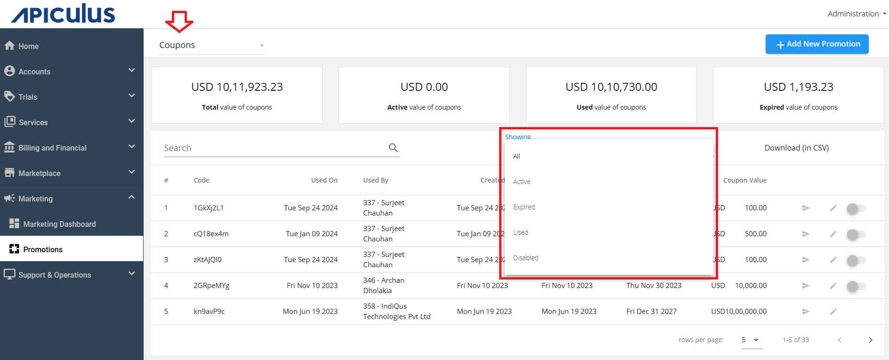
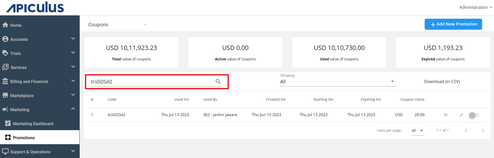
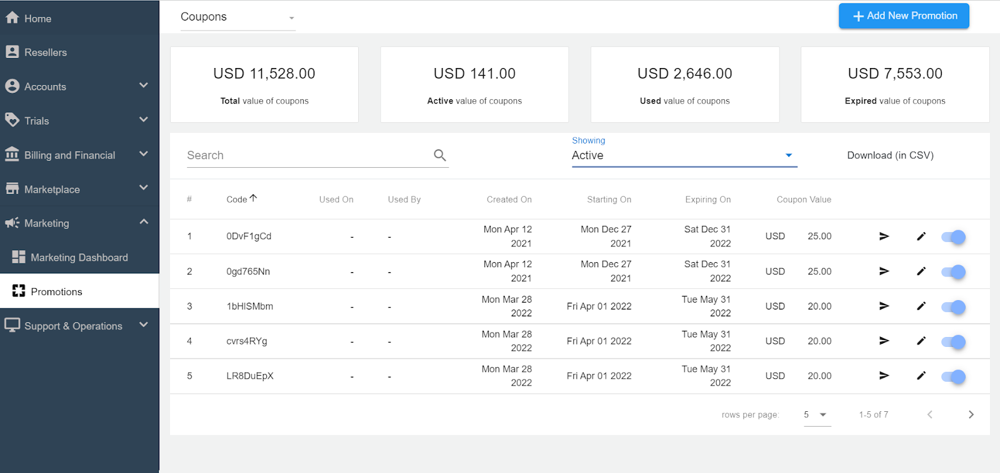
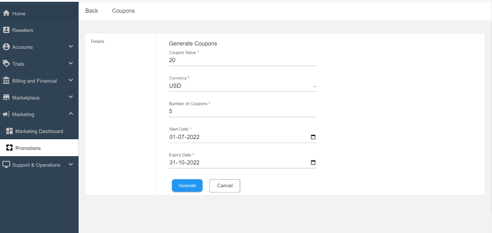
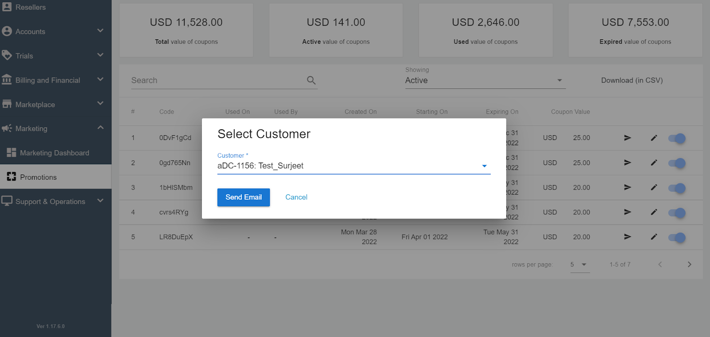
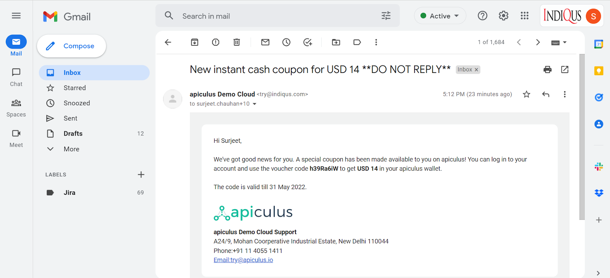

# Working with Coupons

## Viewing Coupons

To access Coupons, navigate to **Marketing > Promotions** section in the main admin navigation panel and switching the view to show Coupons using the switcher dropdown at the top of the listing.

Apiculus comes with a built-in mini dashboard for viewing information related to Coupons. It  highlights the **Total** value of coupons, **Active** value of coupons, **Used** Value of coupons, and **Expired** value of coupons. The details are listed below:

- It shows the information of all the coupon codes that have been created till now. Using the showing filter, the active, expired, used and disabled coupon codes information can be filtered and viewed.

- Use the search option for searching the discount code.

	- **Coupon Code** - This is the coupon code that is generated by the system and is displayed to the customer.
	- **Used On** - The date on which it was used by the customer.
	- **Used By** - The customer’s name who has used the coupon.
    - **Created On** - The date on which the coupon code was generated/created.
    - **Starting On** - The date from which the coupon code can be redeemed.
    - **Expiring On** - The date on which the coupon code will expire.
    - **Coupon Value** - The value of the coupon code.

:::note
You can download the information in .CSV format.
:::

You can edit the coupon codes by clicking the   (pencil icon).

## Creating/Generating the Coupon Codes
To create/generate coupon code, follow these steps:

1. Click on the **Add New Promotion** button. The following screen appears:
2. Specify **Coupons** as the **Type** and click **Ok**.
3. Enter the **Coupon Value**, **Currency**, **Number of Coupons**, **Start** and **Expiry Date**, and click the **Generate** button.
## Sending the Coupon Code to the Customer

You can email the coupon codes to specific customer by clicking the   (Notify icon). 
A confirmation message appears. Click **Send Email** to send the email to the customer.

## Redeeming Coupons
Subscriber/customers can redeem Coupons from the [Wallet](/docs/Subscribers/AccountCentre/WalletandTransactions) section of their [Account Centre](/docs/Subscribers/AccountCentre/AboutApiculusAccountCentre). Redeeming a Coupon will instantly add the Coupon value to their service balance/wallet.

