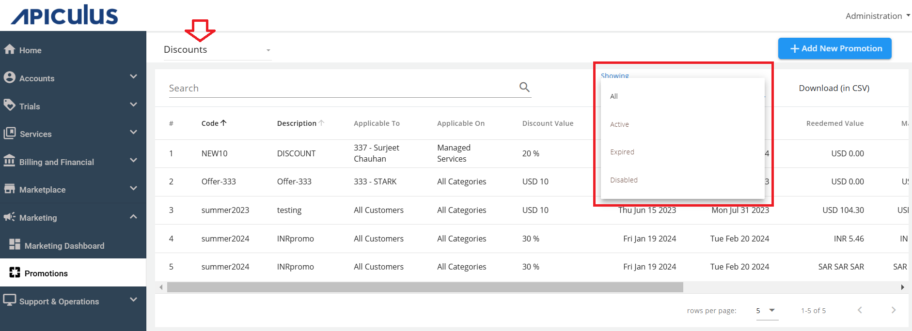
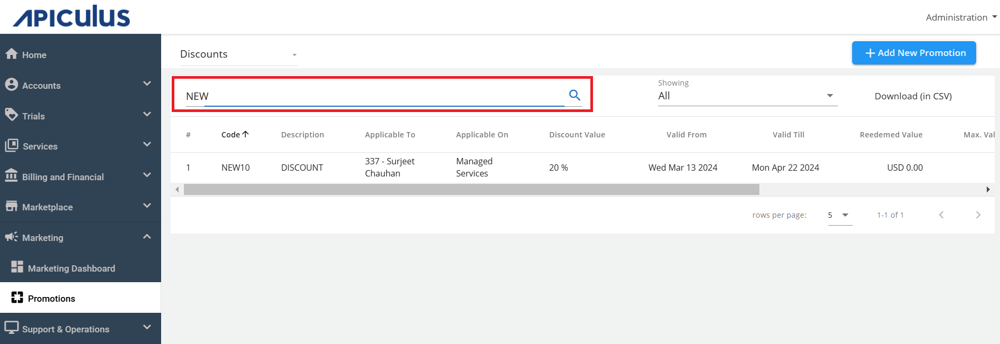
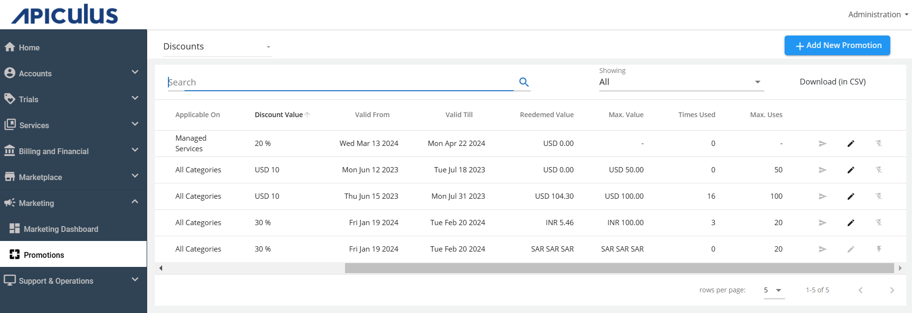
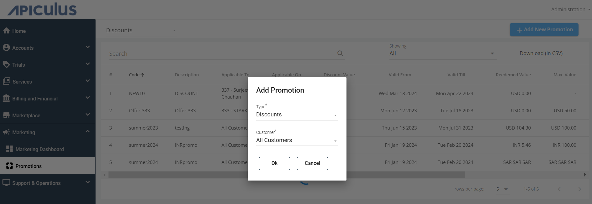
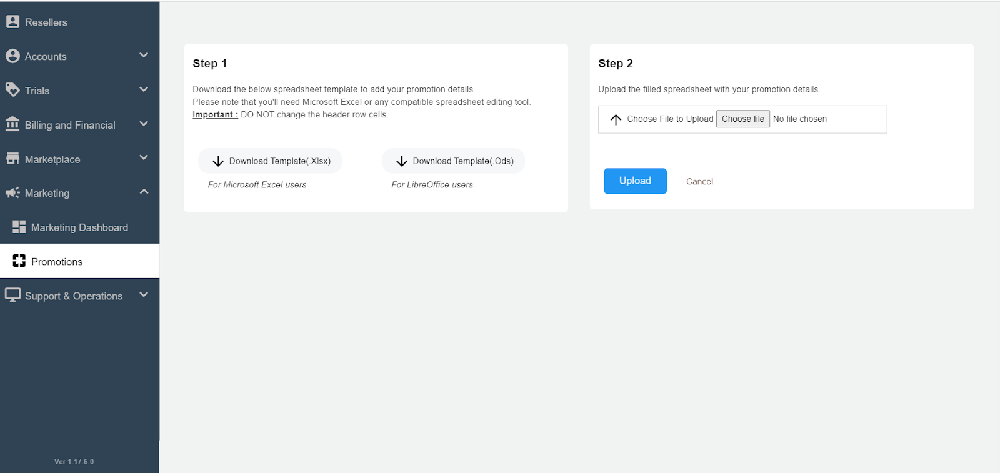
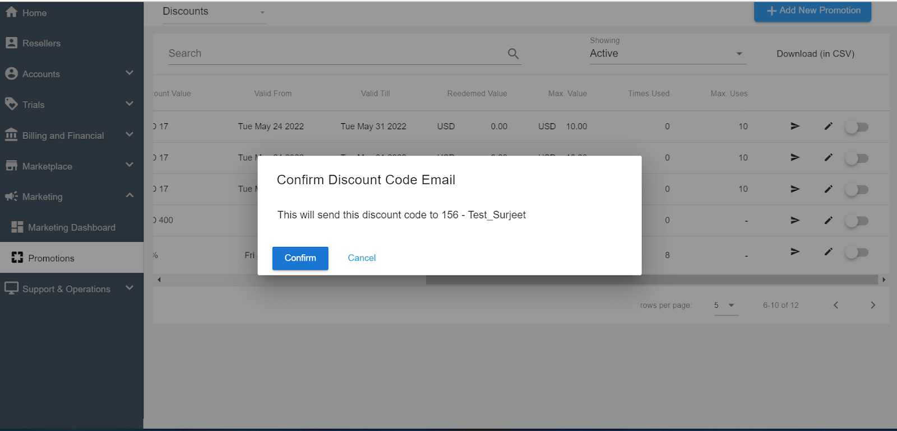

# Working with Discount Codes

## Viewing Discount Codes

To access Discount Codes, navigate to **Marketing > Promotions**. By default, it shows the Discount Codes from the drop-down list on top-left corner of the screen.

The page shows the information of all the discount codes that have been created so far. In addition, the active, expired, and disabled discount code information can be filtered and viewed using the **Showing** filter.

Use the Search field to find a specific discount code.

The various information about the discount codes that are listed is as follows:
	- **Code** - This is the code displayed to the customer (for example, NEW10).
	- **Description** - Specifies the description of the promotion (for example, 10% off on all purchases).
	- **Applicable To** - To which customer this code is applicable. It can be for a particular customer or for all customers.
	- **Applicable On** - Codes can be applied to all categories or a single product category.
	- **Discount Value** - Specified Discount Type
	- **Valid From** - The starting date can be blank also, which means it can be redeemed from the time it has been created 
	- **Valid Till** - The discount expiry date can also be blank, which means that it doesn’t have any expiry date associated with it
	- **Redeemed Value** -This specifies the Value that the customer has already used
	- **Max. Value** - This is the maximum value of the discount that a customer can avail of.
	- **Times Used** - How many times this particular discount code has been used.
	- **Max. Uses** - This is the maximum limit up to which the customer can use the discount code.

:::note
You can download the information in a .CSV format.
:::
You can edit the discount codes by clicking the   (pencil icon).

## Adding Discount Codes
To add a new discount code, follow these steps:
1. Click on the **Add New Promotion** button in the top right corner.
2. Specify the **Discount** as a **Type** and select **Customer** from the drop-down list. You can select all customers, or a specific customer. Then, click **Ok**.

3. Download the .Xlsx and .Ods template.

4. Fill the details in the template.

5. Upload the file. The details will be visible once uploaded successfully.

## Sending the Discount Code to the Customer

You can email the discount codes to the specific customer by   (Notify icon). 
A confirmation message appears. Click **Confirm** to send the email to the customer.

## Applying Discount Codes

Subscribers/customers can view and apply all available Discount Codes at the time of purchase confirmation on all supported Services in Apiculus Cloud Console.

:::note
Discount-deflated amounts are permanent, i.e., any Service subscribed at a discounted rate using a Discount Code will carry the discounted price for its lifetime.
:::

