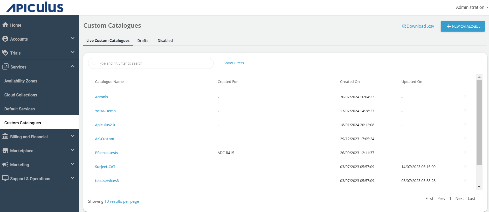
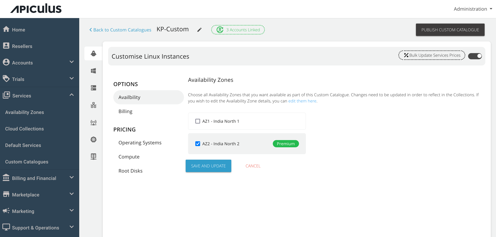
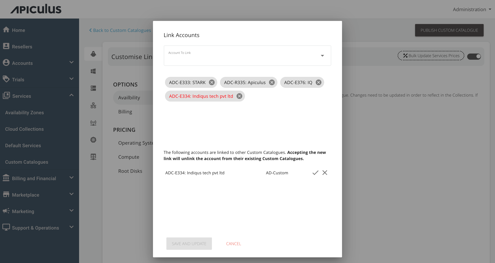

# Assigning Custom Catalogues to Customers

[Custom Catalogues](CreatingaCustomCatalogue.md) can be assigned to one or more customers using the Apiculus Admin Console. This is a guided workflow on the Apiculus Admin Console UI and can be done in simple steps.

1. Navigate to **Services > Custom Catalogues**.
2. Click on the catalogue that needs to be associated with one or more customers.
3. The screen will show how many customers are linked to this catalogue and clicking the counter (**green**button) at the top will open details of which customers are linked.

4. To add more customers, open the **Account to Link** dropdown and select all the customer accounts that need to be linked to this catalogue.
5. If any of the customers is already linked to another Custom Catalogue, the system will flag it in red and give a prompt to accept this new linkage or retain the existing one.

6. Click on the **SAVE AND UPDATE** button.
7. Once all the desired changes are made, click the **PUBLISH CUSTOM CATALOGUE** button.

:::note
If the newly-linked customer is already on any resource creation/purchase page on the Apiculus Cloud Console at the time of publishing the changes, their purchase will fail.
:::

