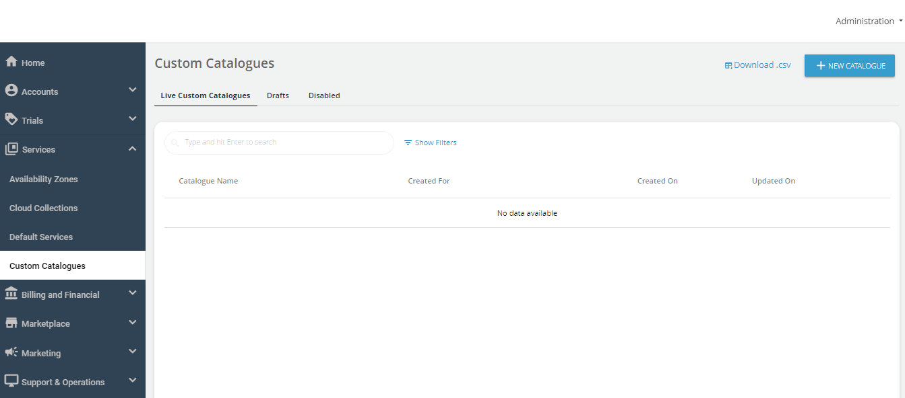
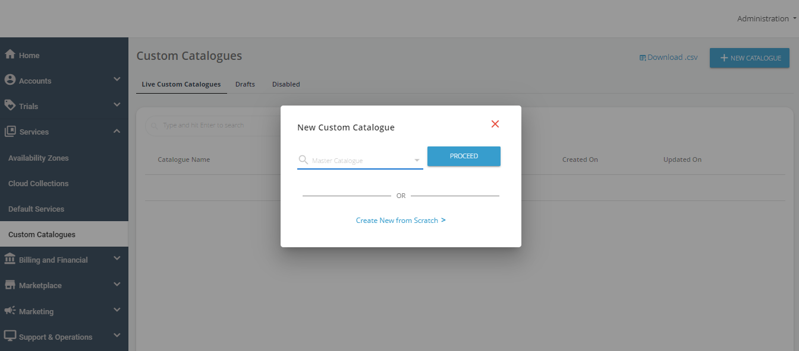

# Creating a Custom Catalogue

Custom Catalogues behave in the same way as [Default Services](../WorkingwithDefaultServices), except that these are designated for specified customers. Custom Catalogues carry the following considerations and characteristics:

- They can have availability and pricing rules that are completely different from Default Services
- They need to be specified for individual (single or multiple) customers
- They offer a great way of strategically offering differentiated pricing models to customers

To create a custom catalogue, follow these steps:
1. Navigate to **Services > Custom Catalogues**.

3. Click on the **New Catalogue** button.

5. You can create a new catalogue from one of the following options:
	- Select an existing catalogue (from the drop-down list) as a template with prepopulated details. Then, click **Proceed** to customize the existing catalogue.
	- Create a new catalogue from scratch by click on **Create New from Scratch**.
1. Continue configuring services the same way as described in [Configuring Sections](/docs/category/configuring-sections).

