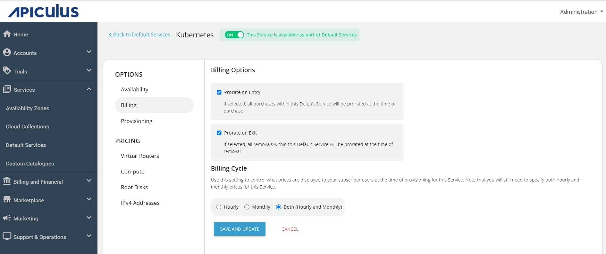
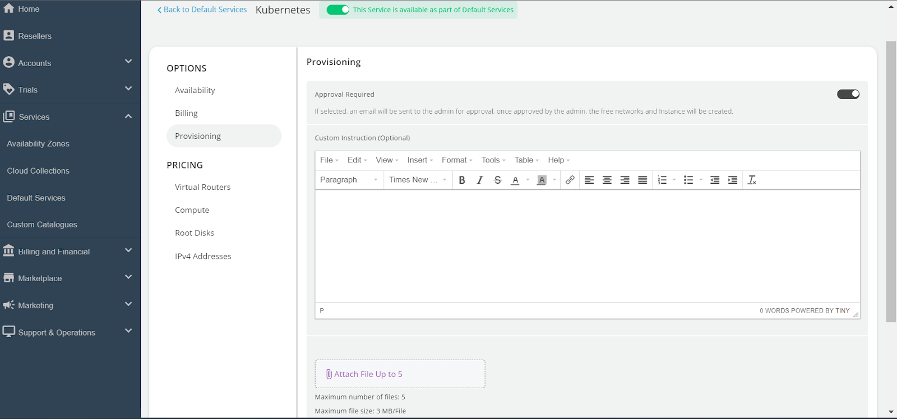
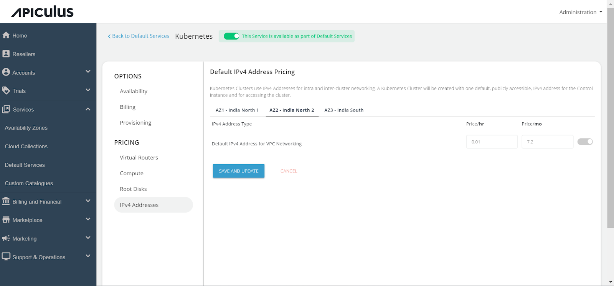

# Configuring Kubernetes Service

Follow the below steps to configure the Kubernetes Service:

1. Navigate to **Default Services**.
2. In the Compute section, click **Kubernetes**.
3. Activate the switch at the top (This service is available as part of default services). All associated sections will become enabled.
4. Navigate to the **Availability** section. Select the desired availability zones for offering the service, then click **Save and Update**.
	
5. Under the **Billing** section, select the **Billing Options**.
	- **Prorate on Entry** - Purchases will be pro-rated at the time of purchase of services.
	- **Prorate on Exit** - Removals will be pro-rated at the time of removal of services.
6. Select the **Billing Cycle** to be displayed to the subscribers: **Hourly**, **Monthly**, or **Both**.
	
7. Kubernetes service provisioning can be configured as an approval-based system from the Provisioning section. This is done by activating the **Approval Required** switch, provides additional functionalities such as sending custom instructions to end-users upon approval and attaching up to five files, each up to three MB.
	
8. Under **Pricing**, click on **Virtual Routers**, then select the **Availability Zone**. Enable the desired collections or packs within a collection, and specify the pricing for your selection.
	
9. In the **Compute** section, select **Availability Zone**. Enable the collections or specific packs within a collection, and specify the pricing for your selection.
	
10. Under the **Root Disks** section, select the **Availability Zone**. Enable the collections or specific packs within a collection, and specify the pricing for your selection.
	
11. In the IPv4 Addresses section, click on the **Availability Zone** and specify the pricing for the default IPv4 address.
	
12. Finally, return to **Default Services** and select **PUBLISH DEFAULT CATALOGUE**.
	

