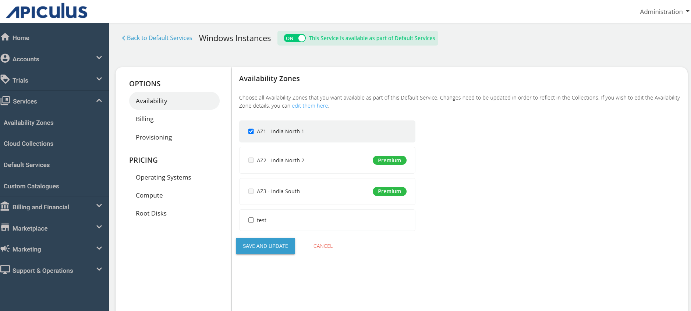
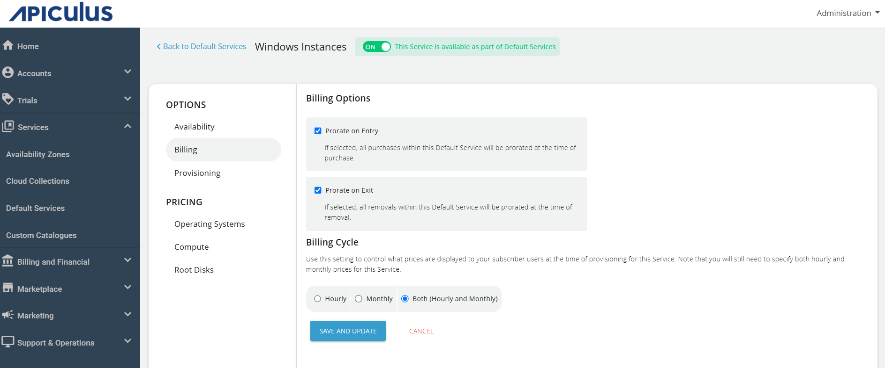
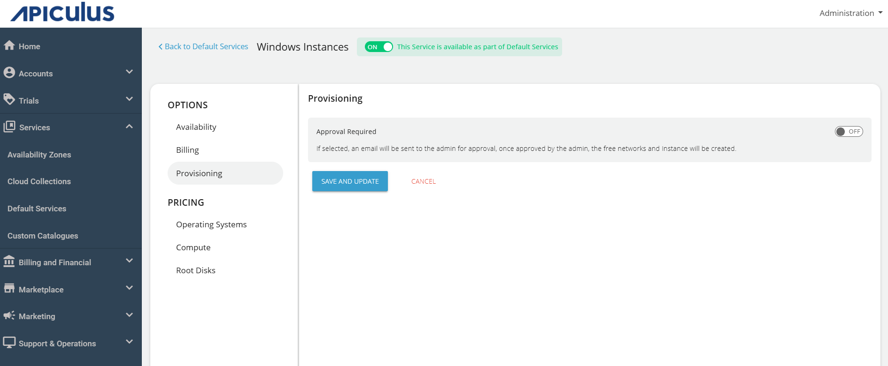
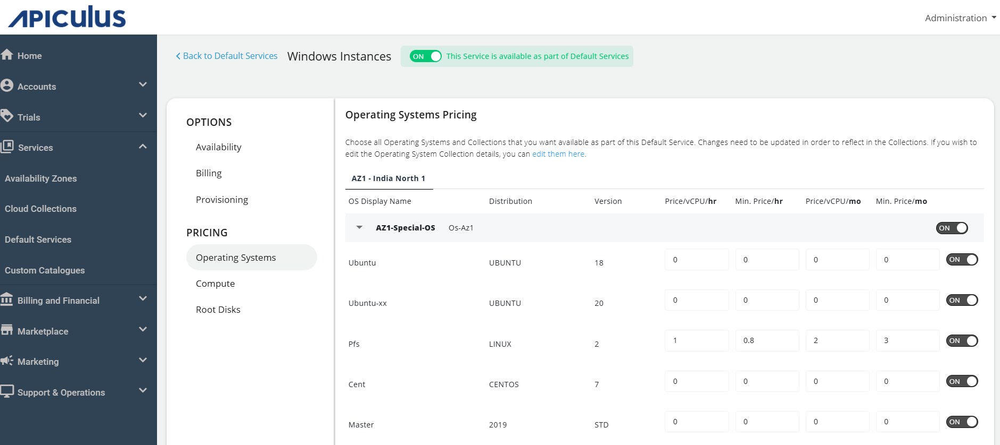
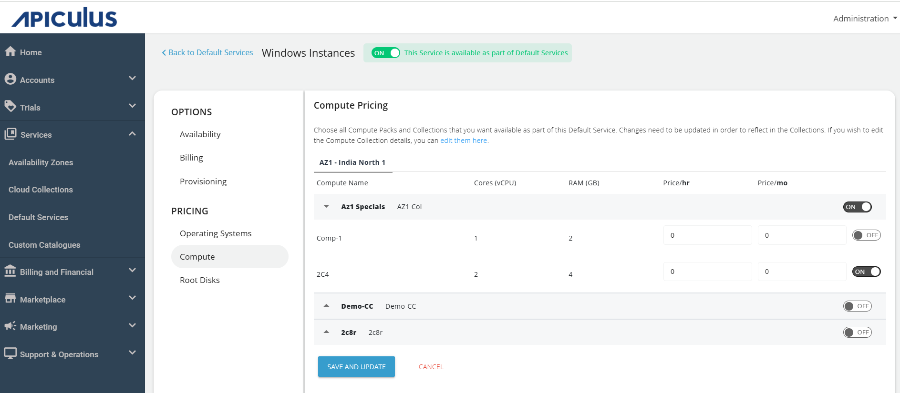
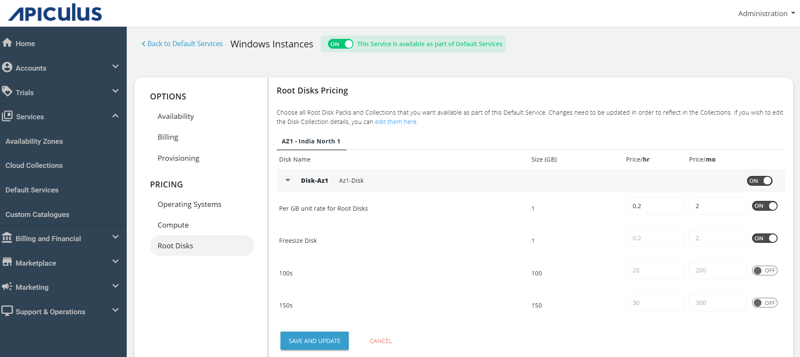

# Configuring Windows Instances

Follow these steps to configure Windows Instances:

1. Navigate to **Default Services** in the primary navigation menu.
	
2. Under the Compute section, click **Windows Instances**.
3. Turn on the switch at the top to make this service available as part of the Default Services. This action will enable all associated sections.
4. Navigate to the **Availability section** and select the **Availability Zone** from which you want to offer this service, then click **Save and Update**.
	
5. Under the **Billing** section, select the **Billing Options**.
	- **Prorate on Entry**: Purchases will be pro-rated at the time of purchase of services.
	- **Prorate on Exit**: Removals will be pro-rated at the time of removal of services.
6. Select the **Billing Cycle** to displayed to the subscribers: **Hourly**, **Monthly**, or **Both**.
	
7. Under the **Provisioning** section, you can provision Windows Instances to an approval-based system. To enable this, enable the **Approval Required** option for offering additional functionalities such as sending custom instructions to end-users upon approval and attaching up to five files, each up to three MB. 
	
8. Under **Pricing**, click on **Operating System**.
9. Click on the **Availability Zone**, and enable the desired packs inside the collections.
	
10. Under on the **Compute** section, click on the **Availability Zone** and enable the compute pack of the specific collection and define the pricing you want to offer to the end user.   
11. Under the **Root Disks** section, select the availability zone and enable the packs for the designated collection.   
12. Return to **Default Services** and click **PUBLISH DEFAULT CATALOGUE**.
    

