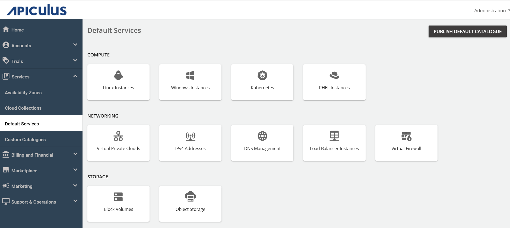
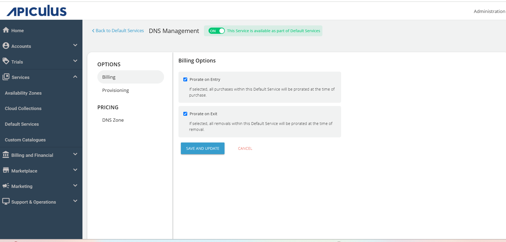
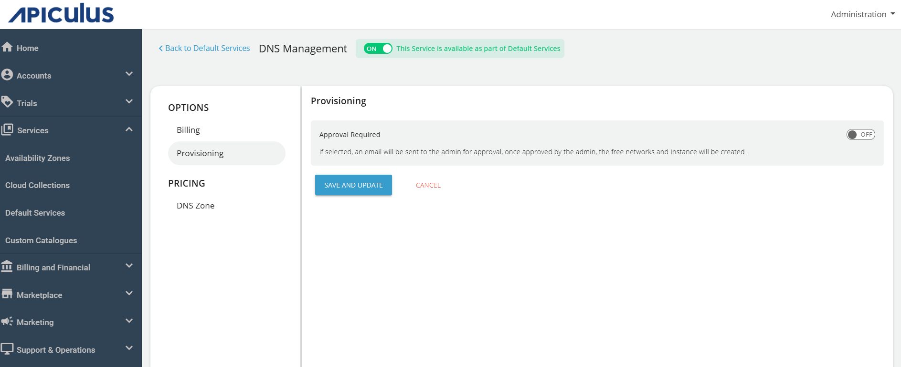
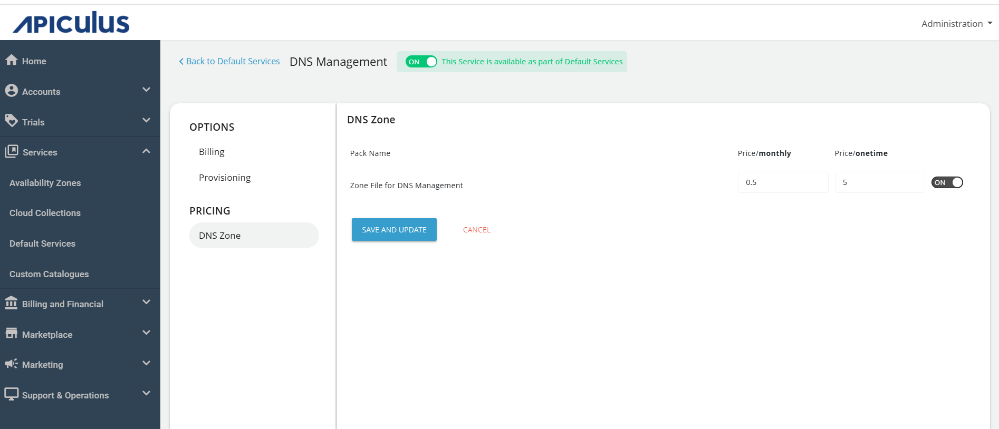

# Configuring DNS Management

To configure DNS, follow these steps:

1. Navigate to **Default Services**.   
   
2. Under **Networking**, select **DNS Management**.
3. Activate the switch at the top, indicating the availability of this service as part of the default services. All associated sections will become enabled.
4. Under the **Billing** section, select the **Billing Options**.
   - **Prorate on Entry** - Purchases will be pro-rated at the time of purchase of services.
   - **Prorate on Exit** - Removals will be pro-rated at the time of removal of services.
	
5. You can provision IPv4 Addresses to an approval-based system within the **Provisioning** section. You can do this by activating the **Approval Required** switch for offering additional functionalities such as sending custom instructions to end-users upon approval and attaching up to five files, each up to three MB.
   
6. Under **PRICING** section, navigate to the **DNS Zone**, Edit the price/**monthly** and price/**onetime** and click **SAVE AND UPDATE.**
   
7. Finally, return to Default Services and click **PUBLISH DEFAULT CATALOGUE.**
	

