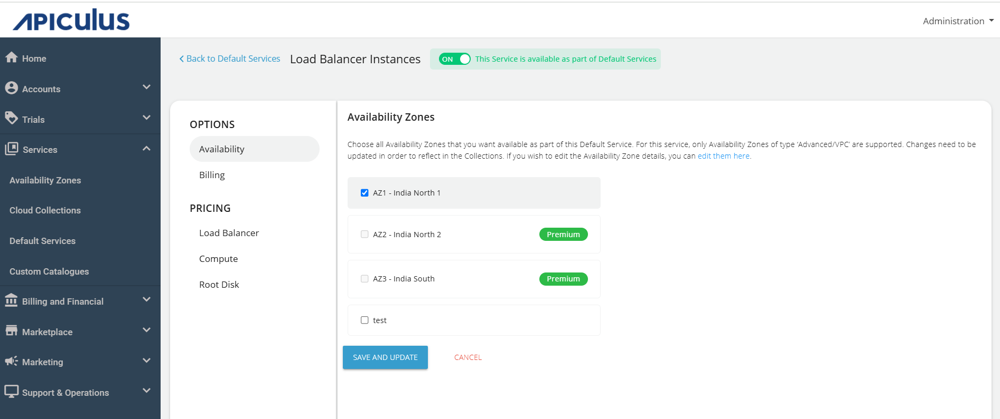
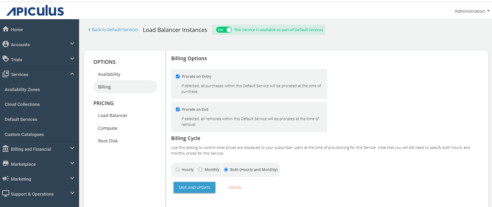
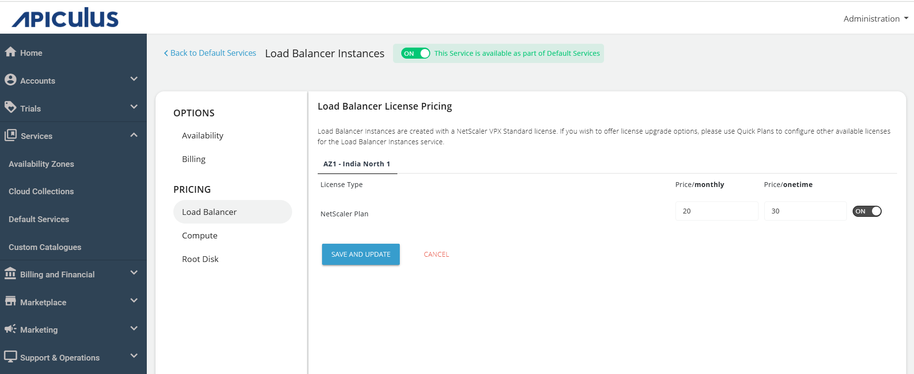
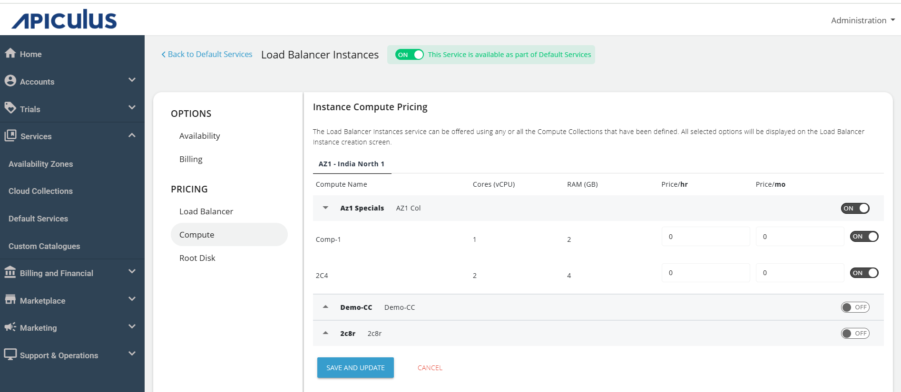
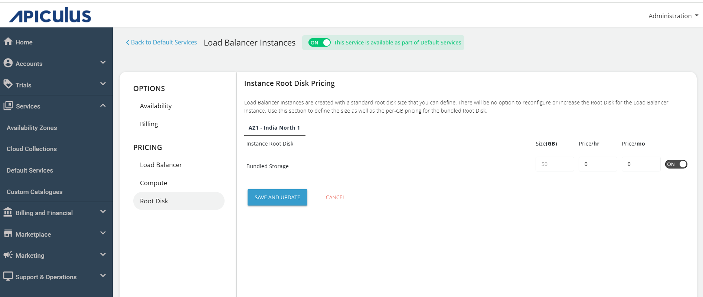

# Configuring Load Balancer Instances

To configure Load Balancer Instances, follow these steps:

1. Navigate to **Default Services**.   
   
2. Under **Networking**, select **Load Balancer Instances**.
3. Activate the switch at the top, indicating the availability of this service as part of the default services. All associated sections will become enabled.
4. Proceed to the **Availability section**. Select the desired availability zones from which you want to deliver the service to the end user, then click **Save and Update.**   
	
5. Under the **Billing** section, select the **Billing Options**.
   - **Prorate on Entry** - Purchases will be pro-rated at the time of purchase of services.
   - **Prorate on Exit** - Removals will be pro-rated at the time of removal of services.
   
 1. Navigate to **Load Balancer**, edit the price/**monthly** and price/**onetime** and click **SAVE AND UPDATE.**
    :::note
    Load Balancer Instances are created with a NetScaler VPX Standard license. If you wish to offer license upgrade options. Use Quick plan to configure other available licenses for the Load Balancer Instances service.
    :::
	
2. Navigate to the **Compute**, edit the **Instance Compute Pricing** and click **SAVE AND UPDATE**.
	 
3. Navigate to the **Root Disk**, edit the **Instance Root Disk Pricing** and click **SAVE AND UPDATE**.
	
4. Return to Default Services and click **PUBLISH DEFAULT CATALOGUE.**
	

