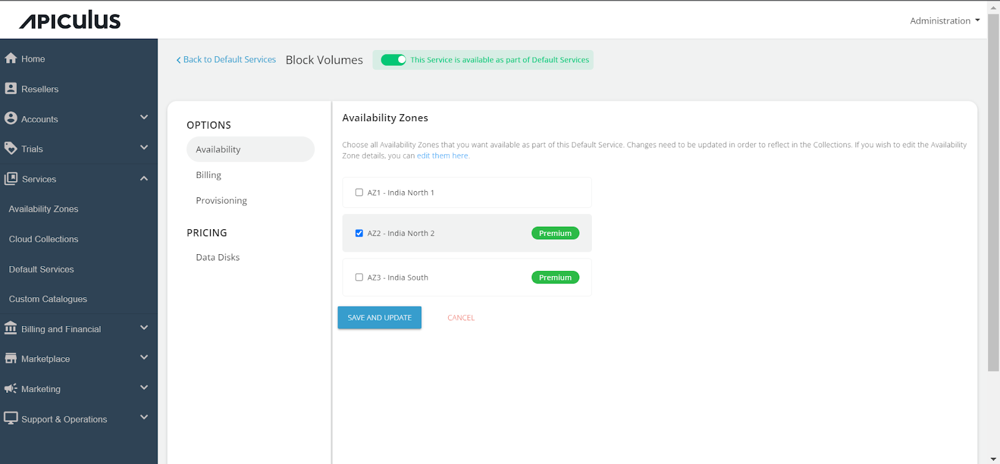
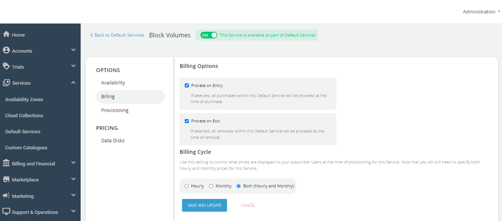
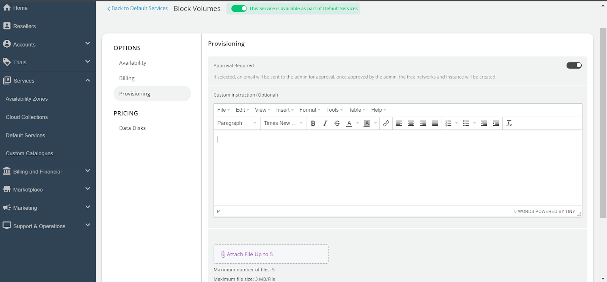
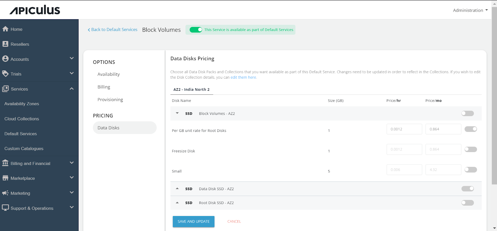

# Configuring Block Volumes

Apiculus Block Volumes are the underlying software-defined volume management layer that powers various storage-related or storage-driven cloud Services.

Follow these steps to configure Block Volumes:

1. Access **Default Services** in the main navigation menu.
2. Choose **Block Volumes** within the Storage section.
3. Turn on the switch at the top to make this service available as part of the default services. This action will enable all associated sections.
4. Move to the **Availability**. Choose the availability zone from which you want to offer the service, then click **Save & Update**. 

5. Under the **Billing** section, select the **Billing Options**.
	- **Prorate on Entry**: Purchases will be pro-rated at the time of purchase of services.
	- **Prorate on Exit**: Removals will be pro-rated at the time of removal of services.
6. Select the **Billing Cycle** to be displayed to the subscribers: **Hourly**, **Monthly**, or **Both**.

6. Block Volumes can be provisioned to an approval-based system within the **Provisioning** **section**. This is done by activating the **Approval Required** switch, offering additional functionalities such as sending custom instructions to end-users upon approval and attaching up to five files, each up to three MB.

- Under Pricing, click on **Data Disks**. Then, select the **Availability Zone**, enable specific packs within collections, and define the pricing you want to offer the end users.

Finally, return to Default Services and click **PUBLISH DEFAULT CATALOGUE.**

