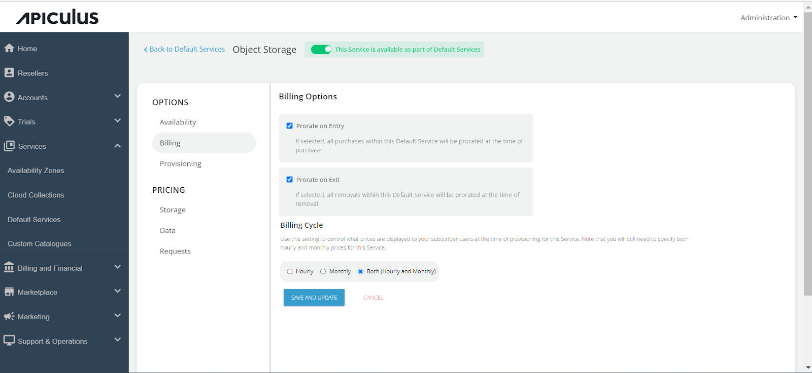

# Configuring Object Storage

In object storage, data is stored as discrete objects containing data, metadata, and a unique identifier. Apiculus delivers the service as an integration with **Cloudian HyperStore**. Admins can configure the Object storage from the **Services** section. To configure the **Object Storage** service, follow these steps:
1. Go to **Default Services** in the primary navigation menu.
2. Select **Object Storage** under the **Storage** section.
3. Enable the switch at the top, to make this service available as part of the default services. This will enable all associated sections.
4. Under the **Availability** section, select the **Availability Zones** where you want to offer the service. Then, click on **Save and Update**.
	
5. Under the **Billing** section, select the **Billing Options**.
	- **Prorate on Entry**: Purchases will be pro-rated at the time of purchase of services.
	- **Prorate on Exit**: Removals will be pro-rated at the time of removal of services.
6. Select the **Billing Cycle** to be displayed to the subscribers: **Hourly**, **Monthly**, or **Both**.
	
7. Click on the **Provisioning** section to offer the **Object Storage** service as approval based. Enable the **Approval Required** switch. Enabling the switch, you will get two more options, that is, **Custom Instructions** that you want to send to the end user upon approval; you can also attach a maximum of five files up to three MB. 
	
8. Click on the **Storage** under **Pricing**.
9. Click on the AZ, and specify the pricing in GB/hr. 
	
10. In the **Data** section, click on the **Availability Zone**, and specify the pricing in GB/hr for both Data Rate in and Data Rate out.
	
11. Click on the **Requests** section, select the availability zone, and specify the pricing for the following:
    1. HTTP requests GET/HEAD
    2. HTTP requests PUT/POST
    3. HTTP requests DELETE
	 Return to the Default Services and click on **PUBLISH DEFAULT CATALOGUE**.
	

