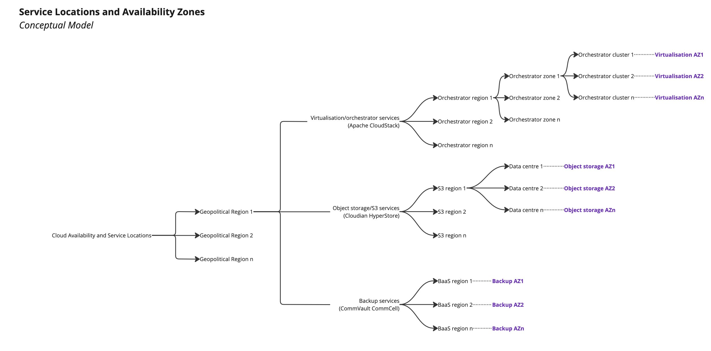
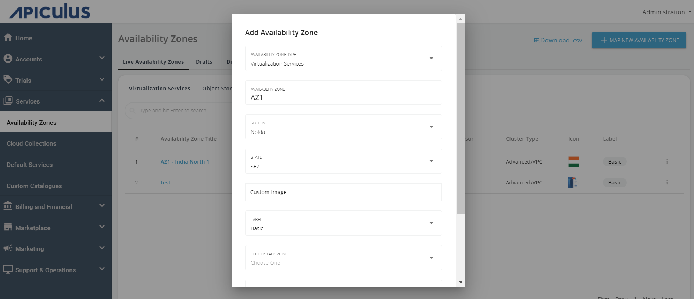

# Working with Availability Zones

Availability Zones (AZ) on Apiculus are a highly versatile and unique way of managing Service delivery and availability. Apiculus AZs are essentially control planes for underlying ISV, designed to handle a range of delivery scenarios. Apiculus AZs also take into account the limitations that an ISV may have (e.g., inability to manage multiple serviceable regions via a single management plane). In other words, Apiculus AZ can be seen as the 'delivery-level unification' of all underlying cloud services into a unified service topology.

The following is a description of AZ for each type of Service that uses AZ:

|Service|Availability Zone|
|---|---|
|Linux/Windows Instances|CloudStack-based|
|Block Volumes|
|Virtual Private Clouds|
|IPv4 Addresses|
|Kubernetes|
|Load Balancer Instances|
|Virtual Firewall Instances|
|Secondary Storage & Data Transfer|
|Metal Instances|MAAS-based|
|Object Storage|HyperStore-based|

## Mapping an Availability Zone

To map a new availability zone, navigate to **Services > Availability Zones** and click on the **+ MAP NEW AVAILABILITY ZONE** button. The following screen appears: 

In the add Availability Zone window, enter the following details:

- **AVAILABILITY ZONE** - The name you want to display or call this availability Zone.
- **REGION** - Choose any of the listed regions. Data for these regions will be displayed as configured on the ACS.
- **STATE** - Choose the state.
- **LABEL** - Choose any of the available labels. Currently, there are two labels present, i.e., Basic and Premium.
- **CLOUDSTACK ZONE** - Choose any of the listed zones.
- **HYPERVISOR** - Choose any of the available hypervisors in the list.
- **CLUSTER** - Choose any of the available clusters from the list.

Once you have filled in the details and made the selections, click on the **CREATE AVAILABILITY ZONE.**

If you want to save these created **Availability Zones** as a draft, click on the **SAVE AS DRAFT** button and cancel the action, click on the **CANCEL** button.

:::danger
Disabling or Deleting an AZ will cascade into all the Cloud Collections, Default Services and Custom Catalogues that use the AZ.
:::

:::note
Currently, only the option to map CloudStack-based AZs is available on the Apiculus Admin Console UI. Support for other types of AZs is being developed.
:::

