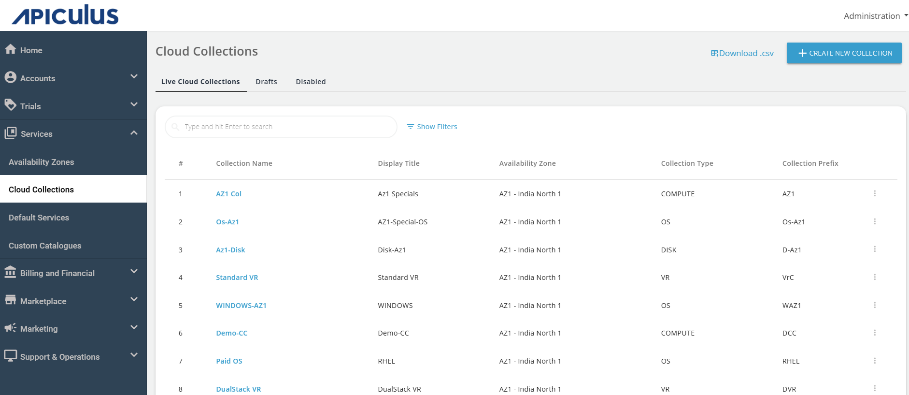
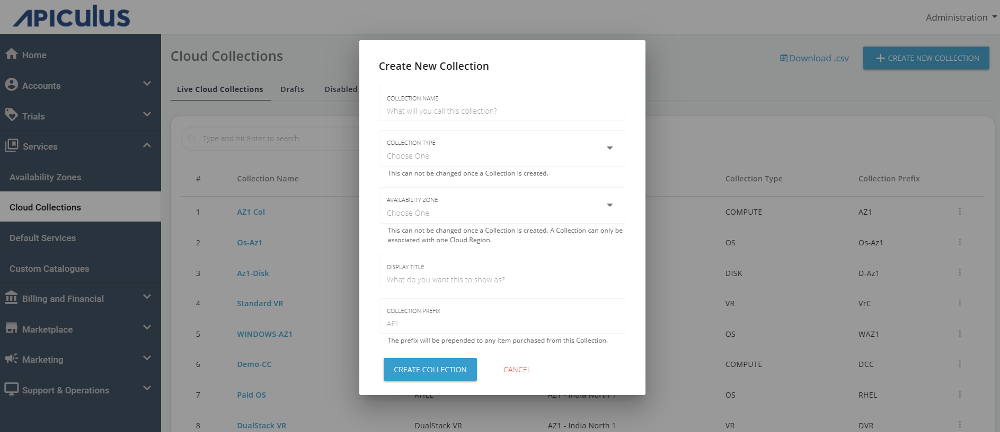

# Working with Cloud Collections

A Cloud Collection (CC) on Apiculus is a grouping of repeating components (called Collection Items) that can be published to offer options/configurations for the subscribers to choose from while purchasing a cloud resource. Apiculus CC can be based on a variety of factors, some examples of which are listed below:

|Type of Collection|Collection Title (Example)|Collection Items (Example)|
|---|---|---|
|Compute Packs|General Compute|Compute configurations with a vCPU:RAM ratio of 1:2 or 1:4, ranging from 1c2r to 8c32r|
|Memory Dense|Compute configurations with a vCPU:RAM ratio of 1:6 or 1:8, ranging from 2c12r to 8c64r|
|Operating Systems|Free Linux|All free Linux distros with multiple supported versions, e.g., Ubuntu 20.04, Ubuntu 22.04|
|Commercially Supported|Linux distros with commercial support, e.g, RHEL|
|Virtual Routers|Standard|VR configurations (1c2r, 2c4r etc.) with unlimited throughput|
|Limited|VR configurations (1c1r, 1c2r etc.) with restricted throughput|
|Disk Packs|High Performance|SSD options (25GB, 50GB etc.) with higher IOPS|
|Standard Performance|SSD options (25GB, 50GB etc.) with standard IOPS|

## Creating a New Collection

1. To create a new collection, navigate to **Services > Cloud collections**.
2. Click on the **+ CREATE NEW COLLECTION**.
3. Provide the following details:
	- **COLLECTION NAME** – The name you want to call this collection.
	- **COLLECTION TYPE** – Choose any one of the collection types. There are three major types of collection available, i.e., Operating Systems, Compute, and Disk.
	- **AVAILABILITY ZONE** – Choose any one of the availability zones available in the list.
	- **DISPLAY TITLE** – Describe the title by which you want to show this collection.
	- **COLLECTION PREFIX** – Specify the prefix here, which is prepended to any item purchased from this collection.
1. Click on the **CREATE COLLECTION** button to create the particular collection, and if you wish to cancel this action click on the **CANCEL** button.

Once the collection is created, the details will be shown, and you can update the details by clicking on **SAVE AND UPDATE**. Click the **CANCEL** button to cancel this action.

:::note
Cloud Collections are dependent on Availability Zones, which means that the same collection needs to be created for each AZ in order to make it available across multiple AZ.
:::

## Adding Collection Items

Once a Cloud Collection is created, you can add Collection Items by going into the collection's details and choosing from the upload options. Each collection 'type' has its own specific item types and the Apiculus admin console UI lists the sections accordingly. There are two ways of creating Collection Items:
- **Upload Using Template** – This option gives a way to bulk-upload Collection Items; useful for adding multiple items together, but prone to error as data entered manually to the spreadsheet/template is only validated at the time of upload.
- **Add Using UI** – This option gives a way to create Collection Items individually; useful as chances of misconfigurations are low since the UI shows a list of available options to choose from.
## Publishing and Managing Collections

Collections may be published after all required details and items have been added. Publishing a collection makes it available for use in catalogues. Below are some considerations while working with published Collections:

1. A Collection Item can be reverted to draft mode, which will keep it in the system but make it unavailable to all catalogues using it.
2. Any edits to Collection details and Collection Items need to be published, without which, the changes will not propagate to catalogues.
3. Deleting a Collection will remove it from all catalogues using it.
4. The Availability Zone - Cloud Collection mapping can not be modified after a collection is created.

:::note
If any resource in the underlying ISV is recreated, the corresponding Collection Item needs to be updated on Apiculus failing which, any resource purchase action that uses this Collection Item will  fail.
:::
