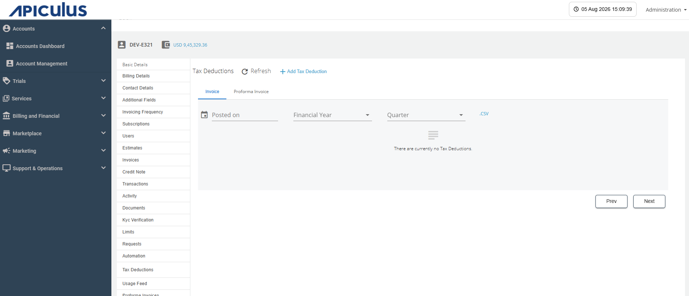
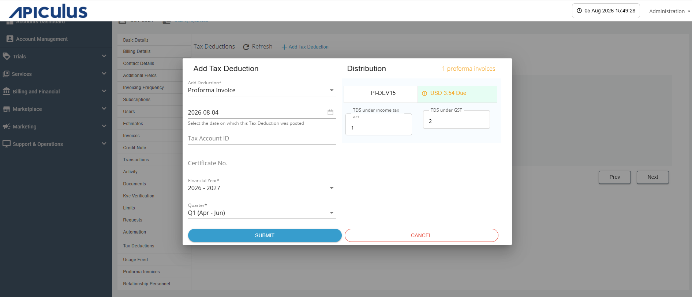

# Adding Tax Deduction

Tax Deducted at Source (TDS) is a statutory tax deducted from a payment by the payer before making the payment to the payee, as per applicable tax regulations. It helps ensure timely tax collection and compliance with government tax laws.

To add a TDS for a particular account, follow these steps:

1. Navigate to **Accounts > Accounts Management**. The following screen appears:
   
2. Click the **Edit** icon (highlighted in red) and navigate to the **Tax Deductions** tab. The following screen appears:
   
3. Click the **Add Tax Deduction** button. The following screen appears:
   
4. Provide the following details: 
	- **Proforma Invoice or Invoice** 
	- **Posting Date**
	- **Tax Account ID**
	- **Certificate No.**
	- **Financial year** 
	- **Quarter** 
	- **TDS under income tax act**
	- **TDS under GST**
5. Click the **Submit** button.