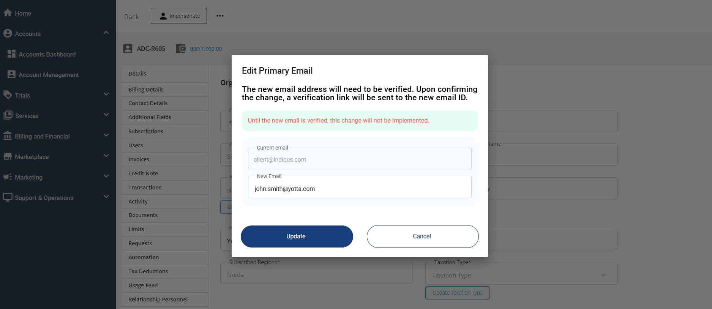
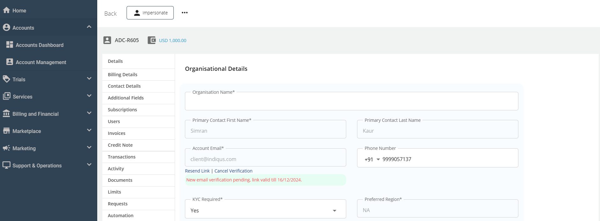

# Changing Subscriber’s Primary Email

The Apiculus Admin Console allows you to change the customer’s primary email ID. The Primary email ID can be updated anytime through simple and verifiable steps with the notification sent to both the new and old email IDs.
## Steps for Changing the Primary Email
1. Navigate to **Account Management** > **Select Account**> **Edit Account**.
2. Under the **Details** section, click on the **Change Primary Email** button.

3. Enter the new email ID, and click **Update**.
4. An email will be sent to the updated email IDs.

Admins can cancel this process by clicking the **Cancel Verification** link. This will cancel the email change process. Admin can also resend the verification link by clicking **Resend Link**.

The subscribers need to click the **link** or the **Confirm** button received in the new email ID and enter the **verification code** received in the email.

Once the email is successfully updated, end-users will be able to log in to the platform using the updated email ID and their existing password.

:::note
Once the primary email change is completed, an email will be sent to both the new and old email addresses.
:::
## Subscriber-initiated Primary Email Change

Subscriber admins can initiate this process from their [organisation/account profile section in Account Centre](/docs/Subscribers/AccountCentre/Organisation-AccountProfile).

