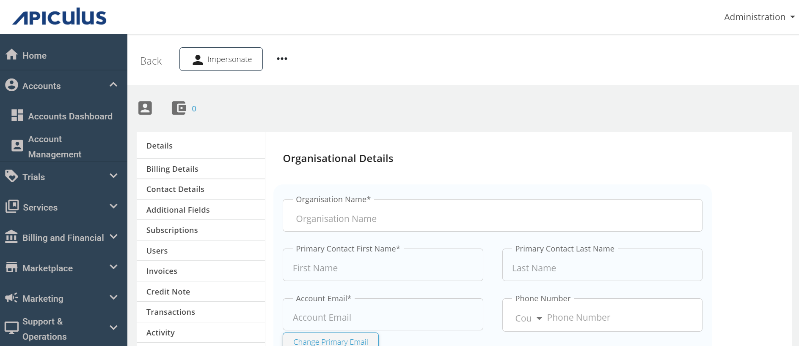
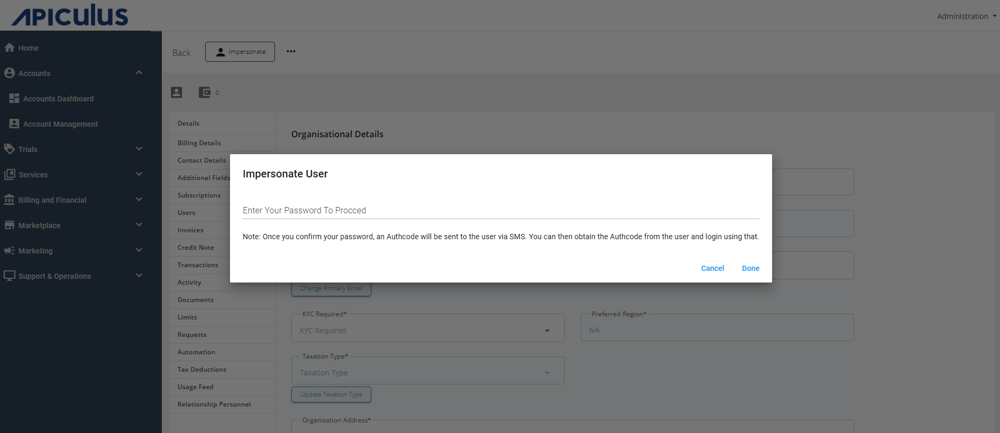

# Impersonating an Account

Apiculus provides a means for service provider support teams to login to a customer account and impersonate the subscriber. This is a useful tool for providing instant/on-call support.

To impersonate an account, follow these steps:

1. Navigate to the target account and enter its details view.
2. Click on the **IMPERSONATE** button at the top-left of the account details pane.
3. A prompt will appear requesting your password. Enter the password associated with your administrator account (the one you are currently logged in with).
4. A one-time password (OTP) will be sent to the subscriber's primary email ID. The support personnel can obtain this OTP from the customer.
	:::note
	This also acts as explicit consent from the customer for the support personnel to login into their account.
	:::
5. If SMS is enabled, the customer will receive the OTP on their registered mobile number as well.
6. A one-time session will be created for the support personnel, who can login using the customer's primary email ID and the OTP obtained as described above.
   
   :::note
	If the customer logs in while an impersonated session is active, the support personnel will be logged out and will need to generate and obtain the OTP again.
	:::

