# Managing Proforma Invoices and Transactions 

A Proforma Invoice (PI) is a preliminary invoice issued before the final invoice and is typically used to facilitate advance payments for added services. If you require specific services or resources, you can submit your requirements to the admin. 

Based on the requested services, estimated charges, and duration the admin generates a proforma invoice. While adding the advance payment, the transaction can be made against open Proforma Invoices. Admins can add transactions that have been made by the subscriber against a Proforma Invoice or multiple Proforma Invoices. 

This section covers the following topics: 
- [Generating a Proforma Invoice](#generating-a-proforma-invoice) 
- [Adding a Transaction](#adding-a-transaction)

## Generating a Proforma Invoice

To generate a Proforma Invoice for a particular account, follow these steps:

1. Navigate to **Accounts > Accounts Management**. The following screen appears: 
   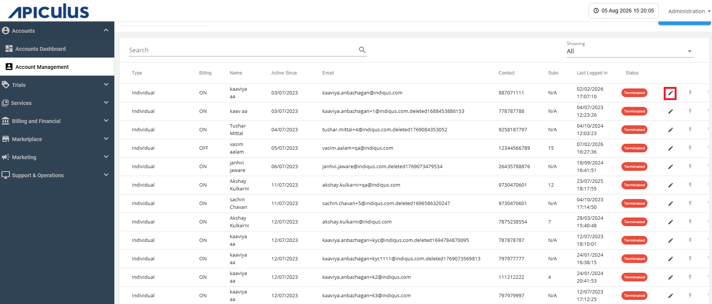
2. Click the **Edit** icon and navigate to **Proforma Invoice** tab. The following screen appears:
   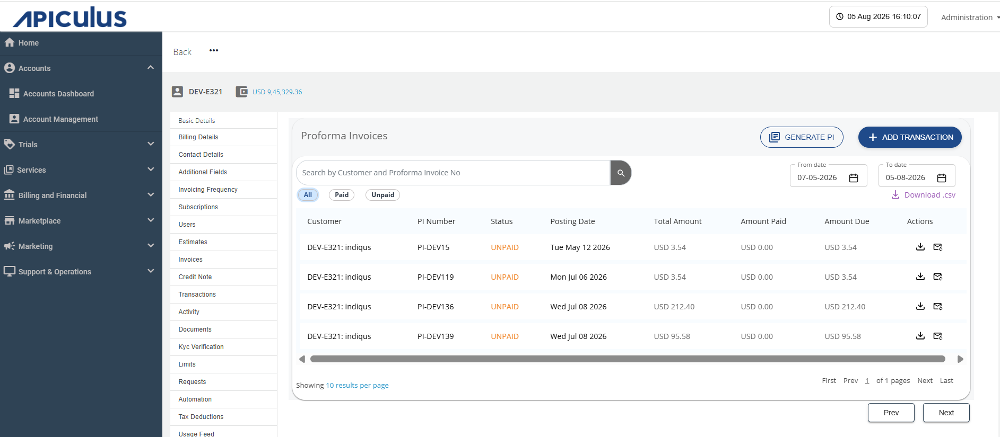
3. Click the **Generate PI** button. The following screen appears: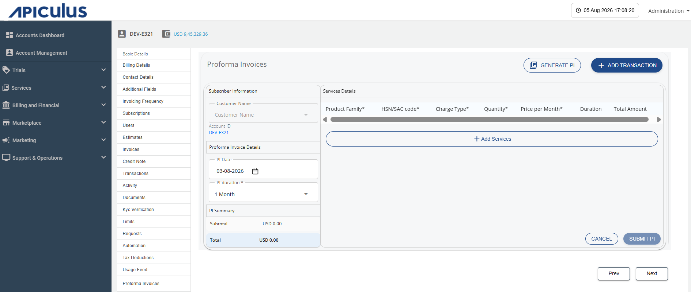
4. Provide the following details: 
	- Select the **Customer Name** from the dropdown menu. 
	- Select the **PI Date**.
	- Select the **PI Duration** from the dropdown menu (1 month, 3 months, 6 months, 9 months, and 12 months). 
5. Click the **Add Services** button. The following screen appears: 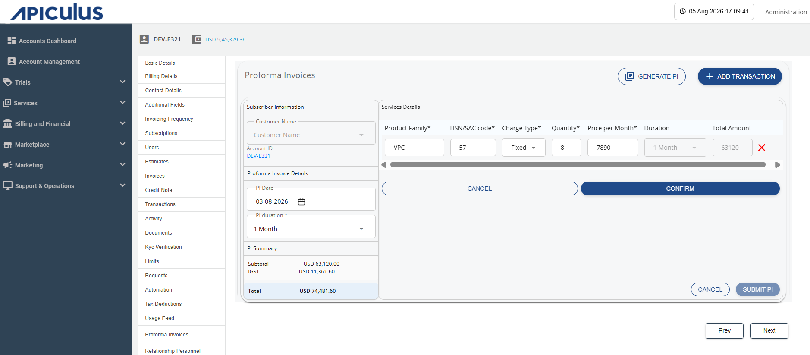
6. Provide the following details: 
	- Enter the **Product Family**.
	- Enter the **HSN/SAC Code**. 
	- Select the **Charge Type** (Fixed, Usage, or One-time). 
	- Enter the **Quantity**. 
	- Enter the **Monthly Price**. 
	:::note
	The duration is fixed and is applied uniformly to all the services included in the proforma invoice. It cannot be modified for individual services.
	:::
7. Click the **Confirm** button. After the confirmation, the details get added as shown in the following screen: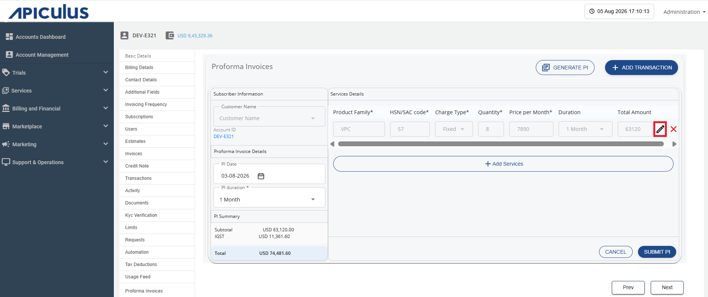
8. To add additional services to the proforma invoice, click **Add Services**. You can also modify an existing service by clicking the **Edit** icon (highlighted in red). 
9. Review the **PI Summary** and click the **Submit PI** button. The following screen appears: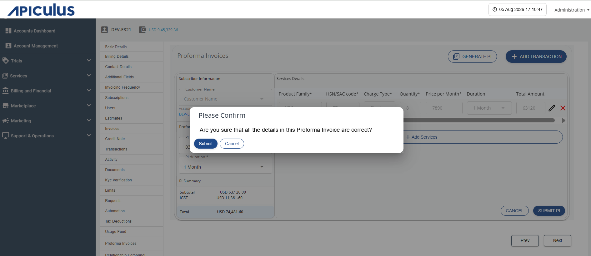
10. Click the **Submit** button.

### Downloading Proforma Invoice

To download the Proforma Invoice, click the **Download** icon (highlighted in red).

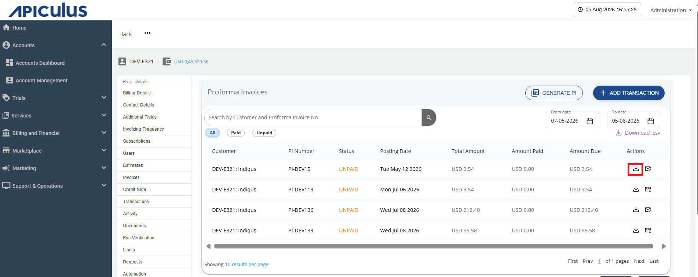

### Resending Proforma Invoice

To resend the Proforma Invoice, follow these steps: 

1. Click the **Resend proforma invoice** icon (highlighted in red). 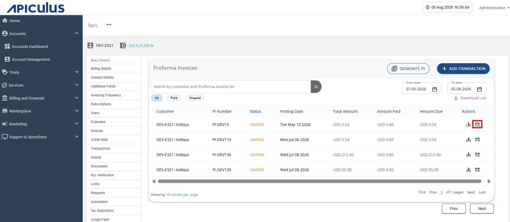
	The following screen appears: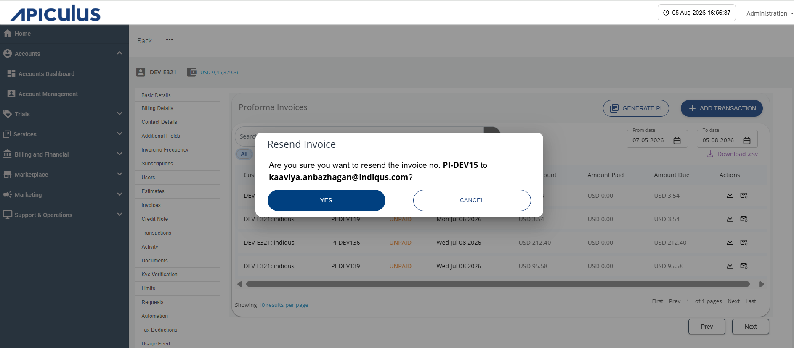
2. Click the **Yes** button.

## Adding a Transaction

You can add a transaction against a single or multiple Proforma Invoices in a single payment. To do this, follow these steps: 

1. Click the **Add Transaction** button. The following screen appears: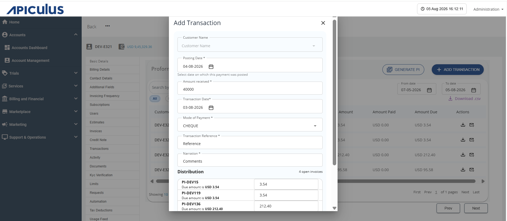
2. Provide the following details: 
	- Select the **Customer Name** from the dropdown menu. 
	- Select the **Posting Date.**
	- Enter the **Amount Received**. 
	- Select the **Transaction Date**. 
	- Select the **Payment Mode**.
	- Enter the **Transaction Reference**. 
	- Enter the **Narration**, if required.
3. An editable table is displayed, allowing you to modify the distribution of the received amount across one or more Proforma Invoices. 
4. If any amount remains undistributed after allocation to the Proforma Invoices, it is automatically recorded as an Advance Payment. 
	:::note
		If there are no pending Proforma Invoices then distributed table is not visible and you can add the entire amount to advance amount. 
	:::
5. Click the **Submit** button. The following screen appears: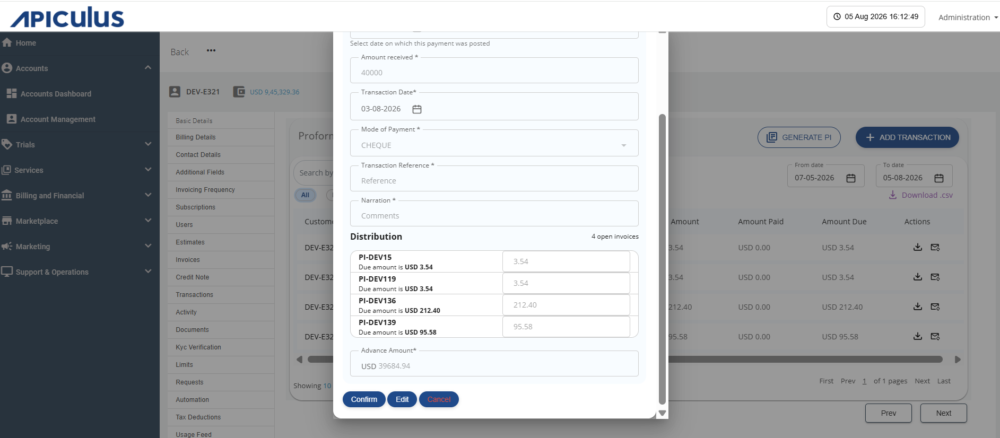
6. Click the **Confirm** button. 

The transaction is added successfully, and accordingly, the amount due column is updated for each respective Proforma Invoice.