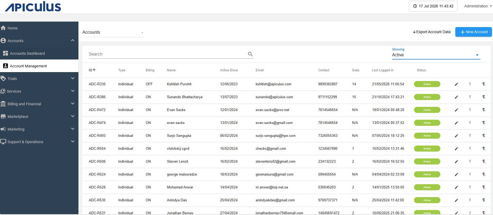
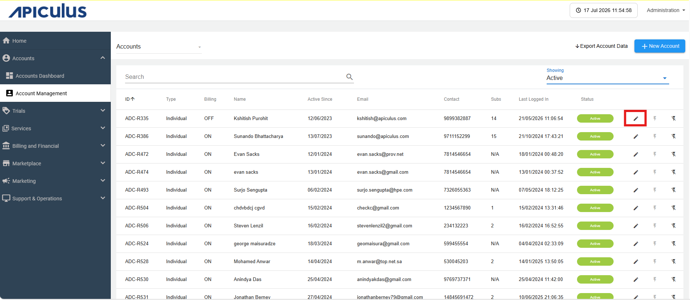
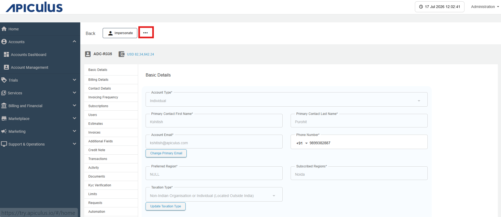
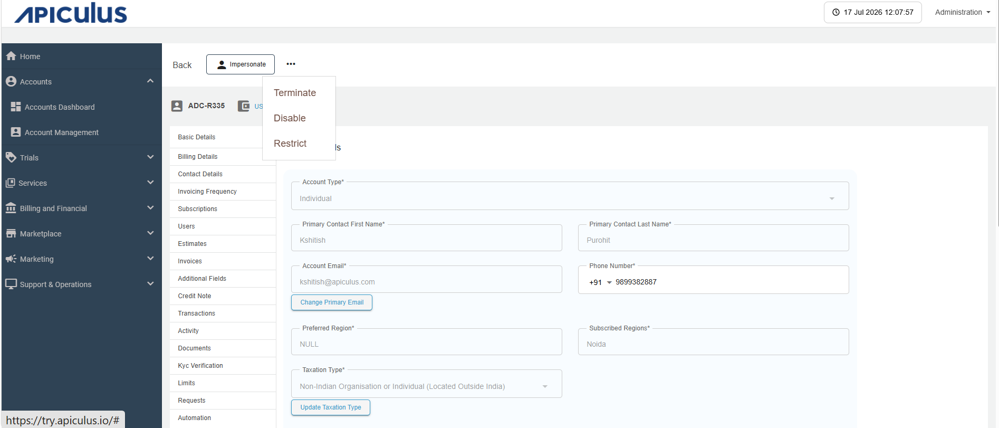
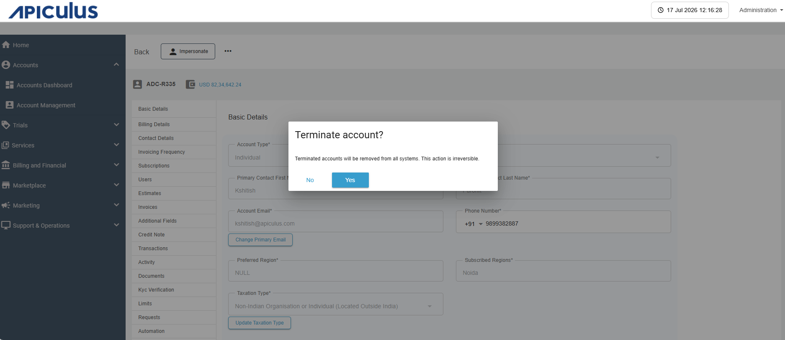

# Terminating an Account
Termination of an account refers to the **permanent closure or deactivation of an account**, after which the account can no longer be used.

To terminate an account, follow these steps:
1. Navigate to **Accounts** > **Account Management**.The following screen appears:
	
2. Click the **Edit** icon (highlighted in red).
	
3. Click on the **three dots** icon (highlighted in red).
	
	The following screen appears:
	
4. Select from the dropdown **(Terminate/Disable/Restrict)**.The following screen appears:
	
5. Click the **YES** button to terminate an account.