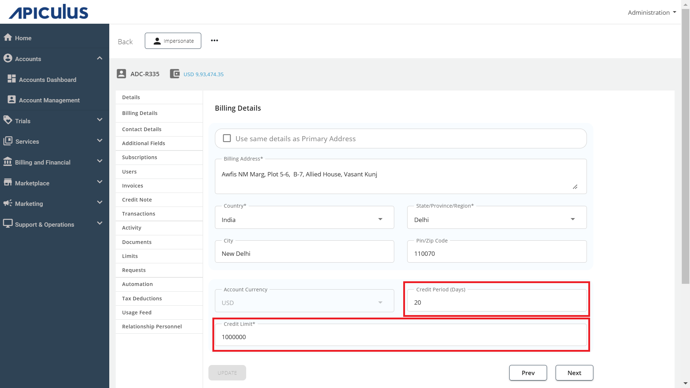

# Updating Credit Limit and Other Billing Information

Subscriber accounts' credit limits and other billing details can be updated from the Apiculus admin console.

- To update credit period and credit limit, navigate to account details and update the field under the **Billing Details** sub-section.
- To update billing contact, navigate to account details and update the field(s) under the **Contact Details** sub-section.

:::note
This article only applies to information update; all billing actions are available under their respective sections.
:::

